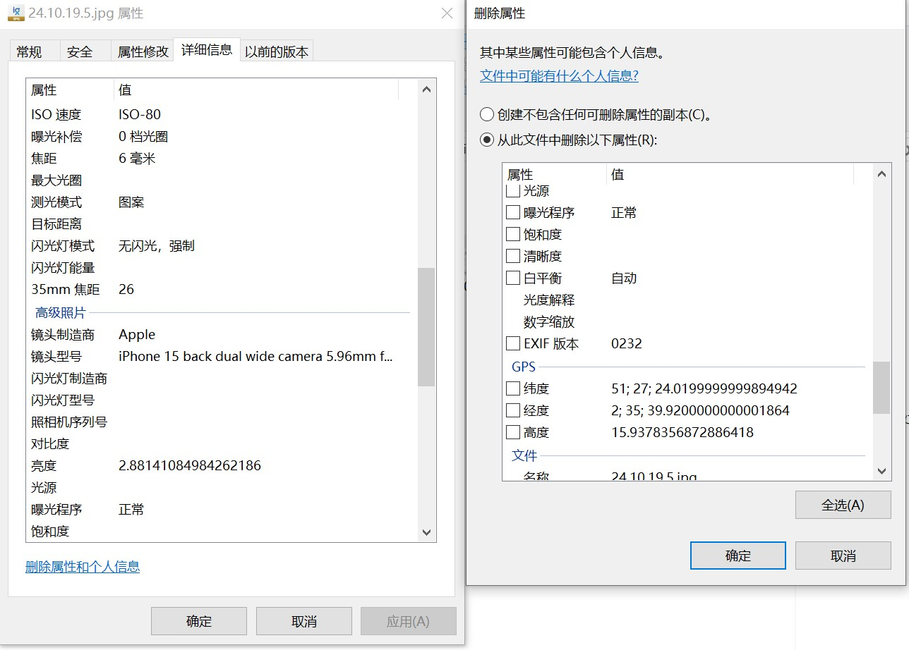

# 2024年10月

## 17日

### EACH

8：20 起床 感觉还是有点晚,明天正好早上9点有课，一鼓作气突破8点大关

全天没课，正好早上看了AWS的内容，ssh的匹配似乎有些问题，明天问问老师。
之后重新看了看数据结构，自从做开发之后算法水平直线下降，api调用太多了，基础还是要重点再看看，这也是之后weekend和readingweek的 主旋律。

中午凉皮  好吃

下午复习了Git的相关操作，看了看项目的Github仓库，发现写的真烂，但还是忍不住看了1个多小时，之后创建了一个新的秘钥，以前的密码忘了，正好也重新开始，但发现了一个问题：

<span style="color: green;">***已解决**</span>

由GitKraken创建的txt默认编码为UTF-16LE，而由Git创建的是正常的UTF-8，这会导致一个问题，merge的时候UTF-16LE会导致识别为二进制文件，进而无法正常编辑。应该是有解决办法的，周五去看看实在不行就全程由Git操作，毕竟使用GUI只是在合并的时候看着方便。

晚上请1/4天假，朋友过生日：夫妻肺片，豆花鱼，干锅土豆片以及海鲜煲 

<span style="color: red;">夫妻肺片竟然是凉菜</span>，我之前一直以为是水煮肉片的那种。


### Mandy

早上去上了seminar，讲了haskell的recursion，虽然我还没自己学到，但是用chatgpt辅助还是能学会写，能回答出TA的问题，感觉以后还是多去，可以锻炼英语，能学到东西。

上课结束后，去化学楼的图书馆继续自己学haskell，终于把chap.1的内容学完了，现在感觉能写一些题，感觉haskell的pattern matching和recursion很有意思，跟之前学的python这些不太一样，之前一直写不懂haskell学的没什么成就感，今天写完了一套题学的很开心，就是我专注力不太够有的时候，看着看着思绪就飘了，复制进chatgpt让他读这个方法还行，之后看不进去就让它读

下午学了一下数学，研究了一下之前课上quiz错的题，最后一题没注意变量错了，后面再继续看lecture note复习，让chatgpt出类似题写一下

晚上跟朋友打电话打的有点久，还有每次做饭感觉有点太拖沓了，每次花的时间太多了，但是做的拌面好吃😋，就是卖相不好，进修中...

## 18日

### EACH

早上有课起来的还算及时。真正有挑战的就是明天了，看能不能在8点起来。大数据来了个新讲师，告诉我们这学期已经到中点了，但我感觉一点也没学到，看来ReadingWeek得多关注一下。这种week还是第一次听说，蛮好的。
AWS应该是秘钥有问题，明天删除旧的，重新创建一下，还是更喜欢Azure，亚马逊跟阿里云一样乱。

中午回来跟父母打了电话，一切安好。
炒了猪肉白菜，上次卤完的八角盒子不见了，明天看看夹缝。没时间蒸米饭，还是用法棍。
中午多睡了一会儿，下午看了看Android 14的最新标准，有点太苹果化了，看社区也觉得毛玻璃滥用。
Github上找到了一个不错的项目，作者更了4年，最新一次也是一周前，可以考虑之后复现一下。
6点那会儿，之前的舍友说下周要来布里斯托，有些奇怪，很久都没联系了，还是去见面招待一下吧。

晚上的算法太枯燥了，8点草草了事，周五的晚上自带debuff，娱乐一下。
异度侵入昨天看完了，唐顿庄园是打算的，但也太长了，有点纠结是它还是西部世界。
虚幻引擎一直在推无限暖暖，实机看了有点期待，叠纸这么多项目，百面估计是停了。
烤红薯还是好吃。 

明天去公园晒晒太阳，把济州叫上，让他别往小树林钻了。
tylor说有个政府楼挂了国旗，前面有草坪，看看跟castle比哪个舒服。


### Mandy
今天学haskell学到2.2的部分，学到了pattern matching和Guard的结合用法，很有意思haskell中没有for，while循环，是用递归来实现循环的，pattern matching和Guard感觉和c中的switch case有点像，感觉这样写看着很清晰。

上午software tool课刚好是让和朋友创建一个github库练git命令，今天打开github震惊到，逸老师把这个库建设的特别好!!🥳 今天身体不太舒服下午lab提前跑路，之后复习CA的时候去学校lab写一下verilog，电路设计真的难懂，我物理基础太弱了，之前没选物理🥲两年没接触了，之前好不容易搞懂了在课上设计的时候又忘记了😠，好折磨

下午回来睡了一觉起来大扫除，搞完整个人累死，第一次一个人出来生活，搞卫生这些还是不够利落浪费太多时间🫠

大扫除完很晚了不知道明天能不能起得来，加油👏


## 19日

### Each

多天以后，面对完成还未过半的计划表，我将会回想起，微信打卡消息使我睁眼看到时间的那个惊骇的9点。  
起床计划面临巨大危机，周六的闹铃和于谦的小菜一样信不过。感觉还是得11点就睡，这意味着10点就得上床，所有的计划都得往前平移一个小时，今晚做个试点。  
9：10分晚起的后果是看到日上三竿的太阳就泄了气，去外面转了转，9:40左右学到12:30，这段时间倒是惊喜，注意力达到去年上半考试周的水平，复习了一下统计2,3的lab，贝叶斯的基础是挺简单，拓展看了看伯努利，和我印象中一致是流体力学用的多，不知道怎么拐过来的，二项分布和期望我记得概率论还是离散大学专门讲过，还没忘，线形加载和局部加权回归好说，但这广义性加载模型太抽象了       

<span style="color: red;">***待解决 ***</span>
问羊也不回，没灵感 做饭去了。 

中午西红柿鸡蛋面，还剩了点法棍，一齐吃了。 


中午也没必要睡了，1 点半学到5点，看了看flutter的绘制部分，这种小组件树的结构还是很有意思的，跟ovi探讨过他认为像python，我觉得设计还是更靠java一点，毕竟是从kotlin一脉相承过来的，Scaffold搭建项目确实快，但区分无状态/有状态的组件有些麻烦，虽然渲染性能确实好，但也导致写的时候要束手束脚的，性能好是一方面但体积也会增大，原生10mb，flutter能吃掉40，应该有解决方案，后面看看大佬的项目都是怎么实现的。
```dart
void main() {
  runApp(MyApp());
}

class MyApp extends StatelessWidget {
  MyApp({super.key});
}
```


动画效果应该是一大亮点，我没有见过这么丝滑性能好的组件了，到时候项目多来点，功能其实不重要，炫是一定要的，AnimatedContainer要多关注一些，这个后面和AnimatedSwitcher类搭配使用应该能形成良好的过渡。谷歌的调色盘审美依旧在线，[material](https://m3.material.io/styles)风格还是规范，顺便发现了一个[第三方调色盘](https://www.materialpalette.com/)，未来用这个设计配色。 

我一直觉得这世界上最没用的三个东西是：张伯伦的“一代人的和平”，比尔·盖茨的“疫苗自制课程”，以及官方的教程。但没想到Flutter团队的API文档确实事无巨细，在线模拟效果也挺多，想到之前学Java的苦日子，不禁泪目，感慨还是好团队多啊😊，扫了一眼旁边的推荐文章:《谷歌裁撤Flutter和Dart半数部门》。。。  
哭的更大声了😭。   
下午换脑子去外面走了走，有点冷，晒太阳还是得下午两点那会儿，济州还是坚持要钻小树林。   
回来跟着yu老师绘制完了大部分的布局，视频看到了第47节，不禁感叹封装的强大，之前自己写文本框都是手动padding和margin，现在一个card直接搞定，有种前人栽树的美。 要这样绘制3分钟就能搞定!对后面的功能实现更期待了。      

```dart
Card(
                margin: EdgeInsets.symmetric(vertical: 10.0, horizontal: 25.0),
                child: ListTile(
                  leading: Icon(
                    Icons.phone,
                    color: Colors.teal,
                    size: 40,
                  ),
                  title: Text(
                    '+44 07900477556',
                    style: TextStyle(
                        fontSize: 25,
                        fontFamily: 'SourceSans3',
                        fontWeight: FontWeight.bold,
                        color: Colors.teal.shade900),
                  ),
                )
              ),
```


哦，羊最后回消息了。


### Mandy
昨天睡的巨晚我感觉我凌晨三点半都还没完全睡着，但是我还是早上八点半起来了，算一下实际睡的时间居然才四五个小时，早上爬起来看国内晚上的比赛，本来我看上场比赛延后了一点还担心会不会打的太久影响我学习计划，但是此时我还不知道真正完全打翻了我计划的东西在后面🙃。出乎意料最后2:0了，我服了等比赛等一周看两把就打完根本看不过瘾🥲

按照计划开学！结果发现完全高估自己学习效率，我的天呐这个lab2真的难学死了，虽然但是我到现在还没原谅自己shell的特殊符号居然学了一个半小时，然鹅真正离谱的还在后面，这个lab2居然有4个exercise！！！比后面三个周加起来都多，那个permission一直报错，调了真的好久，最后重启解决了🙁，打开下一个exercise，直接天塌了而且它居然让我直接学shell脚本怎么写，而且不是浅浅的写一下是要我认真学，学文件操作、条件判断、循环和pipeline。想想我现在真的没有一个精通的语言，之前初高中学的python学了那么久感觉还是没入门，然后感觉现在几个月没写忘的差不多了🙃，haskell，c统统都在入门阶段，感觉学了这么久cs连门的每跨进去，然后现在又让我学个新的语言，我感觉这些东西的语法我都怕记串崩溃😡

为了防止我继续崩溃下去，我果断换lab3写，lab3主要就是俩命令grep和sed，对比起lab2简直算是太温和的了，但我真的好怕我明天直接就忘记了，明天安排个晚上复习

好好好晚饭直接也不吃了，吃个沙琪玛垫垫肚子，去做饭耗太多时间要学不完了。再次无比庆幸之前建了这个github练了git指令，我感觉我整个人都在学git的时候有底气了，但是还是有一些比如撤销指令，新建branch，这些要学，终于还是学完了，今天记录了整个学的过程，一看差不多有个七八个小时学习时长，🥳庆祝！这个学习时长是我理想的时间了，而且感觉整个状态都很专注，怎么说感觉学cs还是真的挺开心的，一报错我就开始激情投入，誓要把它改好，结果改了一万次，最后重启解决了🙃不过这之后学习整个进入状态了不错不错👏 shell就先放着等这个假期哪天提前完成任务学一下，我看老师那pdf根本看不懂，不是这是给零基础的人看的吗，你们不会都背着我偷偷学了吧🙃

今天中午做了一顿番茄意面结果意外的大成功！，再烤了个预制炸鸡，直接给我香晕了，好吃😋


## 20

### Each

> 致Mandy老师：   
>
> 写在前面,    
>
> 24.10.19.5.jpg 中有您的详细信息，手机型号，镜头焦距 以及位置信息，我也是在检查该图片为什么不能在md正常显示时发现的，任何Web明文存储隐私信息都有泄露风险，尽管追踪意义不大，但最好还是培养良好的安全意识，百利无一害😃。
>
> 针对这一问题：   
> windows：
> 属性->详细详细->删除属性和个人信息->从此文件中删除一下属性->GPS-> 确认
>
>
> Iphone：
> 1.点击“设置”中的“隐私与安 全 性”； 
> 2.点击“定位服务”； 
> 3.界面下滑直到找到"相机”； 4.点击“相机”； 
> 5.选择“永 不”。
>
> -来自 小红书 [炸炸金枕 🍎｜苹果关闭相机和照片定位](https://www.xiaohongshu.com/explore/6527f143000000001e03eb16?xsec_token=ABhuY0Bg5yLEgVJn_jSmHAxkr8vbzj5h8_S9DlJU99UJs=&xsec_source=pc_search&source=web_explore_feed)
>
> 我已删除了关于位置的信息并重新上传，至于无法显示的问题，我个人怀疑是苹果特殊的相册格式，例如“实况” 功能影响的，但我目前没有iphone设备，无法验证。
>
> Mandy老师，您可以使用 https://convertio.co/zh/ 网站将图片从苹果-jpg格式转换为 jpeg或png等格式，经过我的测试，转换完成的文件已经可以正常显示了。
>
> PS：看起来相当诱人，如果能有简要攻略就更好了，我也想试试。




———————————————————分割线：以下是自记录内容———————————————————

昨天晚上看了心心念念的《**海边的曼彻斯特：Manchester by the Sea》**，应该说我还未遇到如此绝望的境地，所以理想的觉得事已至此，无非是重振旗鼓罢了，我没有经历过这种痛，所以我对这类 “催情与自己和解的电影” 无法共情，但抱有极大的同情。未经他人苦，莫劝他人善，这句话倒是有点意思。
我的心路历程是：

名字很好听  ->  发现是一部文艺片，我就能装是个品味高雅的人  ->  曼彻斯特地方挺好，看一看风景  ->   
还是老老实实吃点细糠

从列入清单4年过去了，终于看了，装B的心气是没了，只剩曼彻斯特了，结果发现，说去new york结果到了新乡——这个曼彻斯特在美国，或者说 这是美国的一个城市，他就叫做“Manchester-by-the-sea”，字面意思的。

我破防了🤡。

今天早上8点10分起的床，是我前进的一大步，继续保持，起来后看了看新闻，我平生最讨厌的就是金融类的，不禁专业术语极多，黑话也不少，BBC一上来就是The UK Government Liabilities crisis，接连便是难懂的话，什么“Internal Rate of Return”，什么“Liquidity”之类，引得嘉宾都哄笑起来；演播室内外充满了**快活**的空气。

但确实学到了不少单词，有些还能直接用到统计的学习内容里，这东西应该直接是从金融里面精炼了一圈给我们学的。

出门去采购，发现袋子破了，什么质量，我讨厌Sainsbury，
走到lidl门口，发现和Tesco一样都没营业，才想起来是周天，返程发现Sainsbury竟然开着，我爱Sainsbury。

回到家学习了Lecture 12，主要讲解了常见数据类型：  
连续型数据 (Continuous)，离散型数据 (Discrete)，二元数据 (Binary)，有序数据 (Ordinal)。       

样本统计量也是老生常谈，但在中位数的基础上加了修剪均值，样本分位数和百分位数和样本中位数绝对偏差，研究了半天，才发现都是为了去除极端值，目前在我这里的作用微乎其微，箱线图倒是第一次接触，看着有点怪，不太符合我的审美，胖胖的。很多概念不说人话，不如直接看例子来得实在，平心而论就是高中内容，反过来起个名字再学一遍，总感觉不爽，我缺的学费在哪补啊。  

中午用买的牛肉做了水煮肉片，因为舍不得泡的香菇水，水量比预期多了两指，倒不是说味道有什么问题，就是泼了油后有些不敢搅动，怕溢出来,味道嚎急嘹！果然还是得火锅底料和花椒。红薯米饭，嚎赤🤓。


下午原本是打算看算法的，但状态有些不好，迟迟进入不到状态，索性想着还是明天去系统的看一看。去flutter官网刷了刷文档，发现了Expanded这个类相当不错，可以灵活的column，row和Flex的小组件里面使用，弹性的控制页面的布局，不用自己手动规定了。可以用flex的child直接去指定，非常nice，效率大大提高。

另一个特性就是**工厂构造函数 (Factory Constructors)**，这个是java所不具备的，这个允许在创建对象时控制实例的生成，可以直接返回一个现有的，不需要每次都创建新的object。java里倒是有类似的单利模式，但没有工厂构造函数方便。

```dart
class Car {
  String model;
  Car._internal(this.model); // 私有构造函数

  // 工厂方法
  factory Car.createSedan() {
    return Car._internal('Sedan');
  }

  factory Car.createSUV() {
    return Car._internal('SUV');
  }
}

```

直接封装了复杂的对象创建过程，更简洁了，总的来说就是提前预设好一些配置，把创建过程封装起来，直接调用，不需要每次都从头开始配置。

中间换了换脑子，想到Mandy老师勤快的大扫除，看看我的房间：   
**家居置地毫无英伦风情，书桌被褥颇具蒋匪遗风**，赶紧打扫打扫。

晚些时候又看了看计算机网络的知识，我倒是感觉有些浅了，看浙大郑铨老师的课程应该是够了，自顶向下还是更顺应我的思路。打算明天与算法一道，好好的琢磨一下。好无奈啊，既想多学点东西又想作息健康，时间不够用啊🤬，写日记倒始终是我放空回韵的方式了。

刚才看了Git上的plan，发现Mandy老师和我理解的reading week不一样，我以为明天是第一天，所以一直没动，还纳闷为什么周五这么早就开始规划的，给未来的我再提醒一下，我列计划从今年春改为今天定明天了，日记也从4月的周记改为日记了，4月以前一周一篇不是文件丢了。从3天前，日记分支从本地转为了Git，配合Mandy老师。

待会儿去改一下计划，电影没时间了，刷会儿b站运动洗漱去。

reading week，明天就是了（是吧？），要好好利用起来。