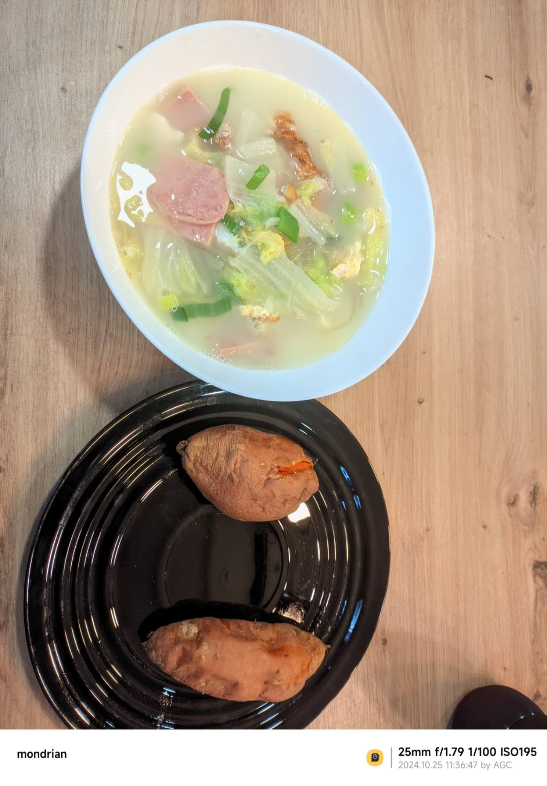
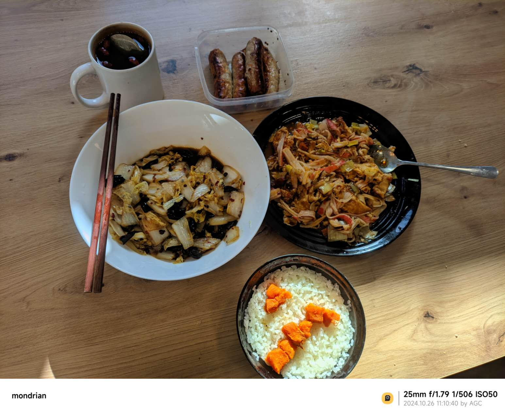
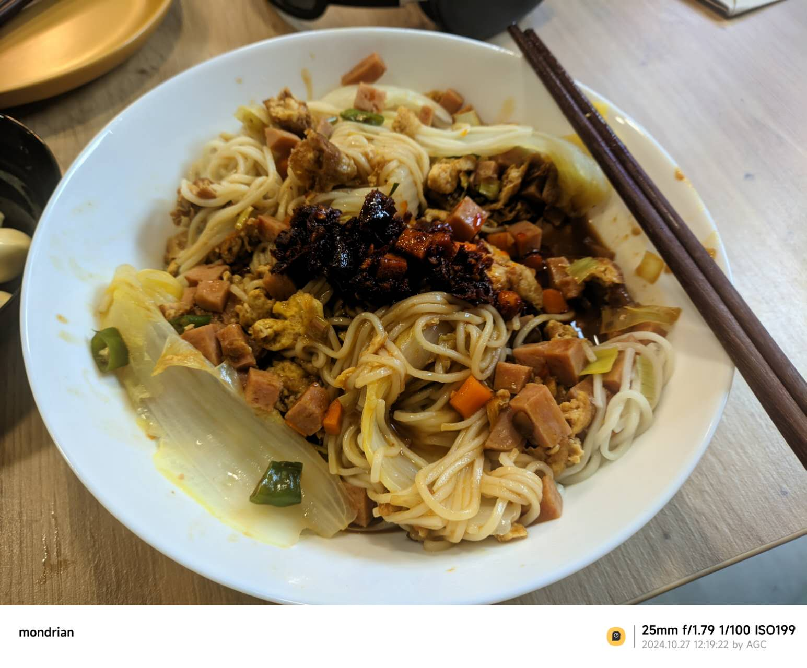
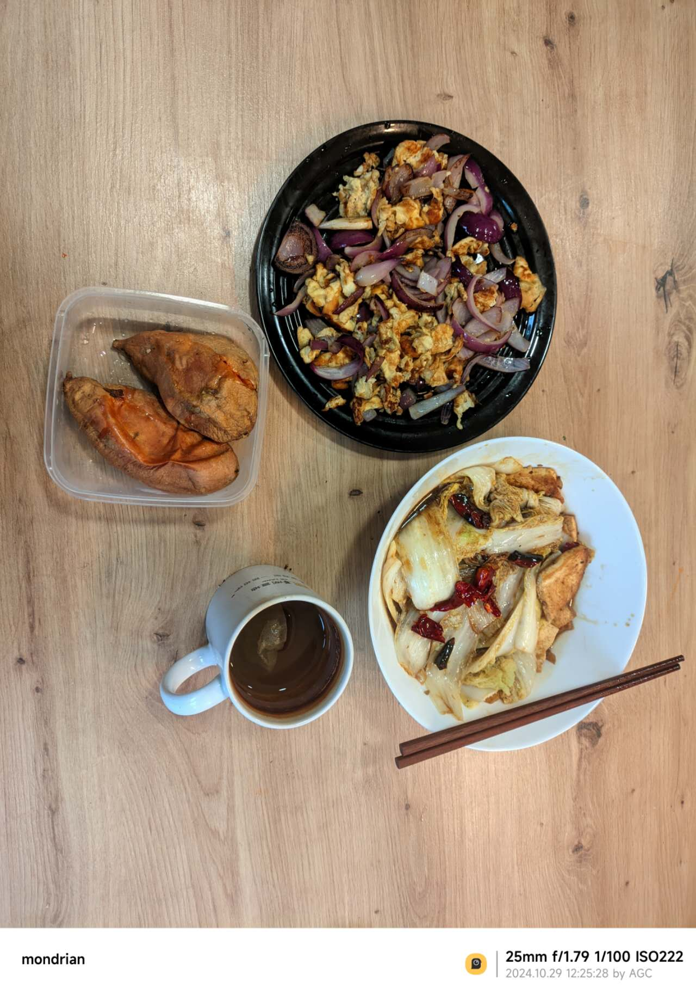

# 2024年10月

## 17日

### EACH

8：20 起床 感觉还是有点晚,明天正好早上9点有课，一鼓作气突破8点大关

全天没课，正好早上看了AWS的内容，ssh的匹配似乎有些问题，明天问问老师。
之后重新看了看数据结构，自从做开发之后算法水平直线下降，api调用太多了，基础还是要重点再看看，这也是之后weekend和readingweek的 主旋律。

中午凉皮  好吃

下午复习了Git的相关操作，看了看项目的Github仓库，发现写的真烂，但还是忍不住看了1个多小时，之后创建了一个新的秘钥，以前的密码忘了，正好也重新开始，但发现了一个问题：

<span style="color: green;">***已解决**</span>

由GitKraken创建的txt默认编码为UTF-16LE，而由Git创建的是正常的UTF-8，这会导致一个问题，merge的时候UTF-16LE会导致识别为二进制文件，进而无法正常编辑。应该是有解决办法的，周五去看看实在不行就全程由Git操作，毕竟使用GUI只是在合并的时候看着方便。

晚上请1/4天假，朋友过生日：夫妻肺片，豆花鱼，干锅土豆片以及海鲜煲 

<span style="color: red;">夫妻肺片竟然是凉菜</span>，我之前一直以为是水煮肉片的那种。


### Mandy

早上去上了seminar，讲了haskell的recursion，虽然我还没自己学到，但是用chatgpt辅助还是能学会写，能回答出TA的问题，感觉以后还是多去，可以锻炼英语，能学到东西。

上课结束后，去化学楼的图书馆继续自己学haskell，终于把chap.1的内容学完了，现在感觉能写一些题，感觉haskell的pattern matching和recursion很有意思，跟之前学的python这些不太一样，之前一直写不懂haskell学的没什么成就感，今天写完了一套题学的很开心，就是我专注力不太够有的时候，看着看着思绪就飘了，复制进chatgpt让他读这个方法还行，之后看不进去就让它读

下午学了一下数学，研究了一下之前课上quiz错的题，最后一题没注意变量错了，后面再继续看lecture note复习，让chatgpt出类似题写一下

晚上跟朋友打电话打的有点久，还有每次做饭感觉有点太拖沓了，每次花的时间太多了，但是做的拌面好吃😋，就是卖相不好，进修中...

## 18日

### EACH

早上有课起来的还算及时。真正有挑战的就是明天了，看能不能在8点起来。大数据来了个新讲师，告诉我们这学期已经到中点了，但我感觉一点也没学到，看来ReadingWeek得多关注一下。这种week还是第一次听说，蛮好的。
AWS应该是秘钥有问题，明天删除旧的，重新创建一下，还是更喜欢Azure，亚马逊跟阿里云一样乱。

中午回来跟父母打了电话，一切安好。
炒了猪肉白菜，上次卤完的八角盒子不见了，明天看看夹缝。没时间蒸米饭，还是用法棍。
中午多睡了一会儿，下午看了看Android 14的最新标准，有点太苹果化了，看社区也觉得毛玻璃滥用。
Github上找到了一个不错的项目，作者更了4年，最新一次也是一周前，可以考虑之后复现一下。
6点那会儿，之前的舍友说下周要来布里斯托，有些奇怪，很久都没联系了，还是去见面招待一下吧。

晚上的算法太枯燥了，8点草草了事，周五的晚上自带debuff，娱乐一下。
异度侵入昨天看完了，唐顿庄园是打算的，但也太长了，有点纠结是它还是西部世界。
虚幻引擎一直在推无限暖暖，实机看了有点期待，叠纸这么多项目，百面估计是停了。
烤红薯还是好吃。 

明天去公园晒晒太阳，把济州叫上，让他别往小树林钻了。
tylor说有个政府楼挂了国旗，前面有草坪，看看跟castle比哪个舒服。


### Mandy
今天学haskell学到2.2的部分，学到了pattern matching和Guard的结合用法，很有意思haskell中没有for，while循环，是用递归来实现循环的，pattern matching和Guard感觉和c中的switch case有点像，感觉这样写看着很清晰。

上午software tool课刚好是让和朋友创建一个github库练git命令，今天打开github震惊到，逸老师把这个库建设的特别好!!🥳 今天身体不太舒服下午lab提前跑路，之后复习CA的时候去学校lab写一下verilog，电路设计真的难懂，我物理基础太弱了，之前没选物理🥲两年没接触了，之前好不容易搞懂了在课上设计的时候又忘记了😠，好折磨

下午回来睡了一觉起来大扫除，搞完整个人累死，第一次一个人出来生活，搞卫生这些还是不够利落浪费太多时间🫠

大扫除完很晚了不知道明天能不能起得来，加油👏


## 19日

### Each

多天以后，面对完成还未过半的计划表，我将会回想起，微信打卡消息使我睁眼看到时间的那个惊骇的9点。  
起床计划面临巨大危机，周六的闹铃和于谦的小菜一样信不过。感觉还是得11点就睡，这意味着10点就得上床，所有的计划都得往前平移一个小时，今晚做个试点。  
9：10分晚起的后果是看到日上三竿的太阳就泄了气，去外面转了转，9:40左右学到12:30，这段时间倒是惊喜，注意力达到去年上半考试周的水平，复习了一下统计2,3的lab，贝叶斯的基础是挺简单，拓展看了看伯努利，和我印象中一致是流体力学用的多，不知道怎么拐过来的，二项分布和期望我记得概率论还是离散大学专门讲过，还没忘，线形加载和局部加权回归好说，但这广义性加载模型太抽象了       

<span style="color: red;">***待解决 ***</span>
问羊也不回，没灵感 做饭去了。 

中午西红柿鸡蛋面，还剩了点法棍，一齐吃了。 


中午也没必要睡了，1 点半学到5点，看了看flutter的绘制部分，这种小组件树的结构还是很有意思的，跟ovi探讨过他认为像python，我觉得设计还是更靠java一点，毕竟是从kotlin一脉相承过来的，Scaffold搭建项目确实快，但区分无状态/有状态的组件有些麻烦，虽然渲染性能确实好，但也导致写的时候要束手束脚的，性能好是一方面但体积也会增大，原生10mb，flutter能吃掉40，应该有解决方案，后面看看大佬的项目都是怎么实现的。
```dart
void main() {
  runApp(MyApp());
}

class MyApp extends StatelessWidget {
  MyApp({super.key});
}
```


动画效果应该是一大亮点，我没有见过这么丝滑性能好的组件了，到时候项目多来点，功能其实不重要，炫是一定要的，AnimatedContainer要多关注一些，这个后面和AnimatedSwitcher类搭配使用应该能形成良好的过渡。谷歌的调色盘审美依旧在线，[material](https://m3.material.io/styles)风格还是规范，顺便发现了一个[第三方调色盘](https://www.materialpalette.com/)，未来用这个设计配色。 

我一直觉得这世界上最没用的三个东西是：张伯伦的“一代人的和平”，比尔·盖茨的“疫苗自制课程”，以及官方的教程。但没想到Flutter团队的API文档确实事无巨细，在线模拟效果也挺多，想到之前学Java的苦日子，不禁泪目，感慨还是好团队多啊😊，扫了一眼旁边的推荐文章:《谷歌裁撤Flutter和Dart半数部门》。。。  
哭的更大声了😭。   
下午换脑子去外面走了走，有点冷，晒太阳还是得下午两点那会儿，济州还是坚持要钻小树林。   
回来跟着yu老师绘制完了大部分的布局，视频看到了第47节，不禁感叹封装的强大，之前自己写文本框都是手动padding和margin，现在一个card直接搞定，有种前人栽树的美。 要这样绘制3分钟就能搞定!对后面的功能实现更期待了。      

```dart
Card(
                margin: EdgeInsets.symmetric(vertical: 10.0, horizontal: 25.0),
                child: ListTile(
                  leading: Icon(
                    Icons.phone,
                    color: Colors.teal,
                    size: 40,
                  ),
                  title: Text(
                    '+44 07900477556',
                    style: TextStyle(
                        fontSize: 25,
                        fontFamily: 'SourceSans3',
                        fontWeight: FontWeight.bold,
                        color: Colors.teal.shade900),
                  ),
                )
              ),
```


哦，羊最后回消息了。


### Mandy
昨天睡的巨晚我感觉我凌晨三点半都还没完全睡着，但是我还是早上八点半起来了，算一下实际睡的时间居然才四五个小时，早上爬起来看国内晚上的比赛，本来我看上场比赛延后了一点还担心会不会打的太久影响我学习计划，但是此时我还不知道真正完全打翻了我计划的东西在后面🙃。出乎意料最后2:0了，我服了等比赛等一周看两把就打完根本看不过瘾🥲

按照计划开学！结果发现完全高估自己学习效率，我的天呐这个lab2真的难学死了，虽然但是我到现在还没原谅自己shell的特殊符号居然学了一个半小时，然鹅真正离谱的还在后面，这个lab2居然有4个exercise！！！比后面三个周加起来都多，那个permission一直报错，调了真的好久，最后重启解决了🙁，打开下一个exercise，直接天塌了而且它居然让我直接学shell脚本怎么写，而且不是浅浅的写一下是要我认真学，学文件操作、条件判断、循环和pipeline。想想我现在真的没有一个精通的语言，之前初高中学的python学了那么久感觉还是没入门，然后感觉现在几个月没写忘的差不多了🙃，haskell，c统统都在入门阶段，感觉学了这么久cs连门的每跨进去，然后现在又让我学个新的语言，我感觉这些东西的语法我都怕记串崩溃😡

为了防止我继续崩溃下去，我果断换lab3写，lab3主要就是俩命令grep和sed，对比起lab2简直算是太温和的了，但我真的好怕我明天直接就忘记了，明天安排个晚上复习

好好好晚饭直接也不吃了，吃个沙琪玛垫垫肚子，去做饭耗太多时间要学不完了。再次无比庆幸之前建了这个github练了git指令，我感觉我整个人都在学git的时候有底气了，但是还是有一些比如撤销指令，新建branch，这些要学，终于还是学完了，今天记录了整个学的过程，一看差不多有个七八个小时学习时长，🥳庆祝！这个学习时长是我理想的时间了，而且感觉整个状态都很专注，怎么说感觉学cs还是真的挺开心的，一报错我就开始激情投入，誓要把它改好，结果改了一万次，最后重启解决了🙃不过这之后学习整个进入状态了不错不错👏 shell就先放着等这个假期哪天提前完成任务学一下，我看老师那pdf根本看不懂，不是这是给零基础的人看的吗，你们不会都背着我偷偷学了吧🙃

今天中午做了一顿番茄意面结果意外的大成功！，再烤了个预制炸鸡，直接给我香晕了，好吃😋


## 20日

### Each

> 致Mandy老师：   
>
> 写在前面,    
>
> 24.10.19.5.jpg 中有您的详细信息，手机型号，镜头焦距 以及位置信息，我也是在检查该图片为什么不能在md正常显示时发现的，任何Web明文存储隐私信息都有泄露风险，尽管追踪意义不大，但最好还是培养良好的安全意识，百利无一害😃。
>
> 针对这一问题：   
> windows：
> 属性->详细详细->删除属性和个人信息->从此文件中删除一下属性->GPS-> 确认
>
>
> Iphone：
> 1.点击“设置”中的“隐私与安 全 性”； 
> 2.点击“定位服务”； 
> 3.界面下滑直到找到"相机”； 4.点击“相机”； 
> 5.选择“永 不”。
>
> -来自 小红书 [炸炸金枕 🍎｜苹果关闭相机和照片定位](https://www.xiaohongshu.com/explore/6527f143000000001e03eb16?xsec_token=ABhuY0Bg5yLEgVJn_jSmHAxkr8vbzj5h8_S9DlJU99UJs=&xsec_source=pc_search&source=web_explore_feed)
>
> 我已删除了关于位置的信息并重新上传，至于无法显示的问题，我个人怀疑是苹果特殊的相册格式，例如“实况” 功能影响的，但我目前没有iphone设备，无法验证。
>
> Mandy老师，您可以使用 https://convertio.co/zh/ 网站将图片从苹果-jpg格式转换为 jpeg或png等格式，经过我的测试，转换完成的文件已经可以正常显示了。
>
> PS：看起来相当诱人，如果能有简要攻略就更好了，我也想试试。


———————————————————分割线：以下是自记录内容———————————————————

昨天晚上看了心心念念的《**海边的曼彻斯特：Manchester by the Sea》**，应该说我还未遇到如此绝望的境地，所以理想的觉得事已至此，无非是重振旗鼓罢了，我没有经历过这种痛，所以我对这类 “催情与自己和解的电影” 无法共情，但抱有极大的同情。未经他人苦，莫劝他人善，这句话倒是有点意思。
我的心路历程是：

名字很好听  ->  发现是一部文艺片，我就能装是个品味高雅的人  ->  曼彻斯特地方挺好，看一看风景  ->   
还是老老实实吃点细糠

从列入清单4年过去了，终于看了，装B的心气是没了，只剩曼彻斯特了，结果发现，说去new york结果到了新乡——这个曼彻斯特在美国，或者说 这是美国的一个城市，他就叫做“Manchester-by-the-sea”，字面意思的。

我破防了🤡。

今天早上8点10分起的床，是我前进的一大步，继续保持，起来后看了看新闻，我平生最讨厌的就是金融类的，不禁专业术语极多，黑话也不少，BBC一上来就是The UK Government Liabilities crisis，接连便是难懂的话，什么“Internal Rate of Return”，什么“Liquidity”之类，引得嘉宾都哄笑起来；演播室内外充满了**快活**的空气。

但确实学到了不少单词，有些还能直接用到统计的学习内容里，这东西应该直接是从金融里面精炼了一圈给我们学的。

出门去采购，发现袋子破了，什么质量，我讨厌Sainsbury，
走到lidl门口，发现和Tesco一样都没营业，才想起来是周天，返程发现Sainsbury竟然开着，我爱Sainsbury。

回到家学习了Lecture 12，主要讲解了常见数据类型：  
连续型数据 (Continuous)，离散型数据 (Discrete)，二元数据 (Binary)，有序数据 (Ordinal)。       

样本统计量也是老生常谈，但在中位数的基础上加了修剪均值，样本分位数和百分位数和样本中位数绝对偏差，研究了半天，才发现都是为了去除极端值，目前在我这里的作用微乎其微，箱线图倒是第一次接触，看着有点怪，不太符合我的审美，胖胖的。很多概念不说人话，不如直接看例子来得实在，平心而论就是高中内容，反过来起个名字再学一遍，总感觉不爽，我缺的学费在哪补啊。  

中午用买的牛肉做了水煮肉片，因为舍不得泡的香菇水，水量比预期多了两指，倒不是说味道有什么问题，就是泼了油后有些不敢搅动，怕溢出来,味道嚎急嘹！果然还是得火锅底料和花椒。红薯米饭，嚎赤🤓。


下午原本是打算看算法的，但状态有些不好，迟迟进入不到状态，索性想着还是明天去系统的看一看。去flutter官网刷了刷文档，发现了Expanded这个类相当不错，可以灵活的column，row和Flex的小组件里面使用，弹性的控制页面的布局，不用自己手动规定了。可以用flex的child直接去指定，非常nice，效率大大提高。

另一个特性就是**工厂构造函数 (Factory Constructors)**，这个是java所不具备的，这个允许在创建对象时控制实例的生成，可以直接返回一个现有的，不需要每次都创建新的object。java里倒是有类似的单利模式，但没有工厂构造函数方便。

```dart
class Car {
  String model;
  Car._internal(this.model); // 私有构造函数

  // 工厂方法
  factory Car.createSedan() {
    return Car._internal('Sedan');
  }

  factory Car.createSUV() {
    return Car._internal('SUV');
  }
}

```

直接封装了复杂的对象创建过程，更简洁了，总的来说就是提前预设好一些配置，把创建过程封装起来，直接调用，不需要每次都从头开始配置。

中间换了换脑子，想到Mandy老师勤快的大扫除，看看我的房间：   
**家居置地毫无英伦风情，书桌被褥颇具蒋匪遗风**，赶紧打扫打扫。

晚些时候又看了看计算机网络的知识，我倒是感觉有些浅了，看浙大郑铨老师的课程应该是够了，自顶向下还是更顺应我的思路。打算明天与算法一道，好好的琢磨一下。好无奈啊，既想多学点东西又想作息健康，时间不够用啊🤬，写日记倒始终是我放空回韵的方式了。

刚才看了Git上的plan，发现Mandy老师和我理解的reading week不一样，我以为明天是第一天，所以一直没动，还纳闷为什么周五这么早就开始规划的，给未来的我再提醒一下，我列计划从今年春改为今天定明天了，日记也从4月的周记改为日记了，4月以前一周一篇不是文件丢了。从3天前，日记分支从本地转为了Git，配合Mandy老师。

待会儿去改一下计划，电影没时间了，刷会儿b站运动洗漱去。

reading week，明天就是了（是吧？），要好好利用起来。

### Mandy
> 谢谢逸老师的提醒！！平时我根本没注意过照片信息的问题，虽然之前隐约听说过iphone拍照会显示所有个人信息，但我当时看完就忘，整个信息泄露安全意识太差了，ok现在立马关掉。

> （当初高中申请大学我们counseling老师说大学要查所有社交软件网络信息，我当时就在想完蛋了，平时从来不注意信息保护，到时候我干过啥别人都能从网上看到，还怕大学查到什么不录我☹️）

> 我确实把这个周末也算作假期了，没太注意到下周其实才算放假，不好意思没写清楚。不过我有四门课要学，算周末9天假期，抽一天出门放松，其他每两天一门课正好。而且这两天写了这个计划学的格外认真，如果算作平常周末，又得在床上瘫一天比如上周🫠，欺骗一下自己有益自律（bushi

> PS：我来这里以后才开始做饭，昨天加了番茄火锅底料才意外的香，不如逸老师做的色香味俱全

今天起晚了，起来一看比赛结束了，主队输了。。幸亏睡过头了没看，不然看直播要心梗了
今天学习状态也很好，记录了一下时间学了7小时，c语言学到了指针，虽然我现在还没真正领悟到指针的作用，不过chatgpt老师说等到写大项目的时候就很有用了。
先不写了，因为已经凌晨1:00了，我看着我timetable上写的23:00睡觉陷入沉思，为什么学习变自律了，但是睡觉时间一直没办法自律呢🤔

## 21日

### Each

> 写在前面
>
> Mandy老师,我倒是没听过有所谓的信息审查,如果有,那我将罄竹难书☹️,但我能出现在这里,那看起来还好.          
>
> 倒是意面实在不像是新手,我有限的理解只集中于中餐,西餐我做过一两次------如果煎培根也算的话.
>
> 番茄火锅,没来英国前,我可能要发起异教徒审判,但化腐朽为神奇,能开宗立派,倒是我该跨出舒适圈了,以后的食谱是挺有潜力多交流的,我从来没想到过可以这么做,想一想确实符合咱们的习惯.
>
> 指针确实难理解,但也是精华所在,你可曾仰望过图灵的星空,困惑为什么大型游戏没有用java和python开发?,事实上java游戏从功能机开始就有了,但在第五世代之后就逐渐被淘汰了.归根结底就是C在底层有着极其强大的自定义能力,以小见大,java的jvm(虚拟机)就有着完善的 **垃圾回收机制** 自动化管理了"指针",但这一"完善的机制"也导致性能的释放不能由开发者高效的操纵.
>
> 在面对大型游戏的性能存储释放时,C++的优化优势就极为重要了,你可以让人物走过一条桥后删除来时的路,进而优化内存空间,减小设备的压力. 
>
> 当然这只是举了一个不恰当的例子来帮助你理解手动指针的优势,总之我的虚幻引擎开发之旅就曾以内存泄漏,电脑蓝屏而胎死腹中,希望你能幸免于难.(bushi  其实是我学艺不精,跟c和ue没关系)

今天8点15起的床,已经很满意了,这两天入睡基本都奔着凌晨1点半走了,感觉还是奇怪,是暖气太热了?今晚试着关了 开窗睡.

起来后简单看了看统计的Assignment,第一章节还是很简单的,一些对lecture的应用而已,比较顺畅.但没想到闫阿姨发了消息,她女儿有一些关于数模和python的问题, 我第一次知道有信息专业大类,上到计算机,下到自动化,说了点自己的经验.这一来二去直接到11点了,利用距离吃饭的时间看了点Google的文档,越来越觉得需要一个纯血安卓,但最新的pixel 8 得400多磅,怎么这么贵!那还是模拟器吧.

午饭是昨天的水煮牛肉,切了点午餐肉进去.整理了一下发现食材不多了,正好朗御在做活动,明天去买一点火鸡面,大白菜和豆腐. 去Tesco买点鸡蛋. 日历提醒学费快交了,截止24号,今年只有飞汇,3%真坑,还是用本地卡交划算,才扣20磅.

12月还是去一趟贝法吧,英镑太离谱了,正好James也邀请我去转转,档期尽量和圣诞节错开.    
回到房间想着快点搞完看大数据,就不睡午觉了,正好也能积累点睡意早点睡觉.

殊不知,一场屠杀就此展开

而我,则是被突突的那个

我没有料到进入第二章节难度陡增,或者说第二章节结合了前4周的应用,一上来就给了我一个闷棍,你这知识是讲线性上升的,怎么难度不是线性的?

模拟实验中,数据生成本来就麻烦,创建加清晰,写的眼花缭乱,R也不够智能,不断重复转变长格式,我都不知道哪个是哪个?让我产生了自我怀疑,是我lecture不够勤奋吗?不能吧...      

豁 

想想其实也有可能😊...

各个映射也是关公战秦琼,上一题的对下一道,好在geom_boxplot可以自动匹配aes美学,不然真够乱的.   
协方差和相关系数后面都来了,要写推导过程,阿一西巴,但确实学到了: 线性变换不会改变相关系数,只会影响协方差,这我倒是没注意,那个时候的我在干什么?应该在揪前桌的衣领吧,反正完全没有印象.

常用的相关系数:皮尔逊相关系数,斯皮尔曼等级相关系数,还有一个肯德基相关系数...,是肯德尔相关系数    
这时候我的脑子已经有点沉了.至于 概率空间与随机变量,yes !😎 easy,但随后就是5000个样本糊到了脸上.做到快8点,绊绊磕磕,阿巴阿巴到了3.2,还有一个章节,实在是罢工了.困意也上来了,洗漱洗漱就准备睡觉,借此天赐良机正好游入清梦.

总的来说是个极其无聊的一天,死磕一项是我的缺点,但我不觉得这是个缺陷,不解决完像是会永久的丧失心气,惴惴不安, 这一次解决了大部,之后再复习心态就会好很多. 有时候还得有这么一股劲.

收拾收拾,早早就睡,不要把明天过的这么无聊,着实太无趣了.

### Mandy
> 番茄火锅对我这样的不吃辣的人来说是一种福音，虽然一开始我也不理解，但是去吃过海底捞以后就吃上了
>谢谢逸老师的例子，虽然我只是一个还未入门的初学者并不理解实际怎样操作，但是更深刻的理解了指针的优点。以后慢慢来学，希望能在今年尝试找点c的小项目写写或者克隆一个项目，这样或许才能真正领悟

今天按时起来了，但是我精神并不是很足，感觉是这几天睡太晚孽力回馈了。

大概是前两天过的太顺，今天的运气格外的差，去lidl买东西在结账的时候反复折腾，结果发现他们系统坏掉了检测不了优惠券。😩即没有省到钱，又耗费了时间，然后我就拖着我的大行李箱去tesco搬水。虽然超市里我公寓非常近，但是我也累的半死，我这周都不想出门了😭 

中午处理食材处理了很久，晚上朋友来吃了一顿饭，很感谢她，要不是在这里认识了她我大概也会变成社媒上那种没有归属感的抑郁症的人了。这也是今天做的不好的地方，学习的时间被大大压缩了，下午就写了俩小时c的题目。我现在反思感觉自己还有好多东西要学，但是既然已经这样了，就明天继续努力吧，把今天少的补回来，加油👏

今天12:30睡进步半小时，明天12:00睡慢慢把作息调回来吧。

## 22日

### Each

昨天早早就收拾睡了,早上7点就醒了,南波湾,运动了20min,早上起来还是舒服,煎了一个鸡蛋,4片培根.    
差不多8点,处理了一些邮件,给lan老师写了一封信,告诉他我的近况,我曾经在lan老师的课上听过胡教授为自己的企业宣传,没想到时过境迁,他竟然来到了布里斯托大学担任讲师,据他说是太累了,目前是tylor的导师,lan教授想必一定很惊喜吧.然后把学费交了.

处理完就开始看AWS的内容,讲了Iaas Paas和Saas的介绍即基础设施即服务(Iaas),平台即服务(Paas),软件即服务(Saas).这一点在之前的云原生的课程上就了解过了,再往远的说,大三的计算机网络里面也有.IaaS就是开发、测试环境、网站托管,PaaS则负责Web 应用开发、API 服务、微服务架构,SaaS就是我们常说的办公软件、电子邮件、项目管理.

亚马逊倒是大书特书了Cloud Hybrid（混合云） 和 On-Demand（按需服务）,也就是两个不同的云计算概念.第一单元很简单.

然后就出去采购,冰箱已经弹尽粮绝,先去朗御买了两个大白菜,我最近想重新开启午餐肉白菜的计划,不同的是这次可以加些粉条,不那么单调,健康且摄入平衡.豆腐也买了一块,把鸡蛋放进去煲汤会变得乳白,又有口感又能驱寒.   
每次看朗御的中超都觉得竟然有了些许性价比,有很多打折的活动.再买了一包炸酱面和酸辣粉换换口味,只是这炸酱面怎么是韩国的,虽然用汉字写了北京,但阿一西巴.不能忍.      

我印象里好像方便面版的老北京炸酱面做的不多?莫非是北京的地道不能飘扬过海跨越物理的束缚🤔?要真这么解释倒也说得通,毕竟在北京吃才真是地道😊

会来的时候发现小小的city centre竟然卧龙凤雏,有足足3个Tesco express,我还以为只有跟lidl相对的大express.新奇就就进了中间的,发现竟然有spam,大express都没有,什么道理..不过没有鸡蛋,或者说2.5磅6个 --对我而言那就是没有,真的有人会买这么贵的鸡蛋吗🤨?那个最贵的黑包装看着还以为是汉堡包,没法子,还得去大express买了15个/2.3磅的,舒服了.

一次购物花费了太多的时间,来回就得1个小时,时间都去哪了. 所以还是要一次性就买好,但就算这样,一个大袋子和书包还没买完,苹果汁拿不上了.

中午炒了蟹柳鸡蛋和玉米胡萝卜,要是放点葱花就更漂亮了,加了两根红薯,好吃.中午睡了会.


下午起来接着看第二部分,这时候我本来应该再写我的随机模块,但没办法,总得看完吧,只好硬着头皮看下去.第二部分就麻烦多了,探讨了很多云计算经济效益方面的,令我印象比较深刻的是:

>  在 AWS 中，有四种官方的支持计划：

> 1. **Basic** - 免费支持，适合一般用户。
> 2. **Developer** - 适合开发者，提供更高级的技术支持。
> 3. **Business** - 适合中小型企业，提供全天候的技术支持。
> 4. **Enterprise** - 面向大型企业，提供最高级别的支持，包括专属的技术账户经理。

总之又耗费了2个小时,其实本身是不难的,但新的系统第一次接触加上,早期的debuff上来了,效率着实不太高.     
末了收到了tylor的消息,他从伦敦回来了,我还没去伦敦转过,事实上我并不喜欢伦敦,这个城市放大了冷漠和利己,是经济之都天然的相性.我在最现代机场的体验,真是糟糕. 不过听到他说大英博物馆的门票免费,又有些心动,立马理直气壮起来了,这不应该的么. 说实话还得正儿八经转一转的,毕竟这以后回去问起来:伦敦咋样?支支吾吾吐出些诸如"大本钟""伦敦之眼"等家喻户晓之流, 未免自己也觉得可惜.要是离得远还好,但布里斯托这么近还是有些去的理由. 但随后tylor给我泼了一盆冷水,酒店1晚 300磅,我知道会很贵,但也没想到会这么贵,一晚相当于我两周的房租, 三周的打工. 还是之后拉个人去找民俗或者青旅平摊一下吧,把羊的学生卡抢过来也是个办法,晚上暂住ic的图书馆,计划通.

后面看了看Flutter的文档,写了些onpress,发现flatbutton方法再flutter2.0就被弃用了,现在是textbutton,不过还行,凑合着用,最终归宿还是要转image解决.

```dart
return TextButton(
      onPressed:(){},
    );
```

里面挺简单的,就是这个匿名函数我给记不太清了,或者整个lamda都得复习一下,我只记得java里面是函数型接口过来的,kotlin应该也继承了这个写法.还发现了通过outlier可以直接添加widget,amazing,一整个飞起,接触到这个功能时我像个孩子一样好奇,倒不是说有多新奇.alt+enter其实更方便,只是觉得之前开发真是苦日子,而且这个功能也不是完全没用,这种组件树这么添加,其实逻辑挺清晰的.


明天翻翻文档吧,事实上我还在文档里找到了不少好东西,果然是google,啥都有,不缺钱,但一想到团队被裁,更生气了.

晚上看新闻发现爱尔兰也有饺子,原文是:In Ireland they’re soaked in Guinness gravy,天哪🤯,guinness本来就哭,画面不敢想.问了james,他还没回,要是真有的话肯定早告诉我了.然后就是本岛,Probably the most famous British dumplings, suet dumplings, are cooked on top of a chicken or beef stew. They’re made from suet
suet...画面太美果然不敢想象,这都什么跟什么啊,英国美食果然药丸 :pill:

本来这一整天效率没有很满意,毕竟早上难得起的早,但刷到朋友拿到字节的offer,瞠目结舌,不免有些苦涩.

问君何能尔？心似飞鸟，惊逐寒星. 自己的失败固然可怕,但朋友的成功更令人揪心. 

无论如何自己也该好好想想其中缘由了.

今天差强人意,起床很满意,遗憾就是采购花了太长时间,今天也早点睡,迎接光明的未来.

## 23日

### Each

果然有高峰就会有低谷，今天起来就是8点半了。很难想象已经是reading week的第三天了,但回望过去的,虽说不上那么充实但也没有虚度,看来决策是起效果了.赶紧醒了醒就起来,看到lan教授的回信,很高兴能听到一切皆好.

复习AWS第三节，第三节还好，第二周的还剩下了第九节，明天需要花时间解决一下。第三节的内容说实话挺少的,主要也就是全球分布的网络问题,在边缘建立数据中心有利于解决延迟和降低成本,北美是最多的,欧洲也差不多,其他地方也就是东亚了,日韩都有大型数据中心,国内是在香港,但是北京和宁夏也有,其中特别说了,在中国的服务器有着严格的限制,只能访问北京和宁夏,实际上我感觉这么做才合理,中国的信息肯定不能流通到外部.当然自由派应该不这么想,但无所谓,国内多数人选择的应该是腾讯云和阿里云,实际上之前的课程里老师就有讲过这两个的例子,总之大数据在国内的发展也不遑多让.

中午吃了汉堡和火鸡面没时间做饭了,简单睡了一会儿,大概2点快三点继续学习了,主要就是学习了相应,这个和java的很像,就只要回调,简单得多,还有就是知道了dart作为静态语言,也具有像JavaScript的特性------即可以动态定义变量.

```dart
var a; //此时 a 可以是int double String
dynamic a; //同上
```

这个很神奇,但作为保守派以及受过严格的训练,我是很反对且警惕这种命名方式的,尽管dart团队的初心是好的,我依然觉得静态语言需要一套规范来限制变量的边界,以防发生混淆.

最终onpress是不够的,后面还需要加上 setState 才能发生变化,且继承State,与StatefulWidget

```dart
child: TextButton(
                onPressed: () {
                  setState(() {
                    leftDiceNumber = 3;
                  });
                }
```

以小组件为基础的Stateless是负责静态页面,不参与动态变化,如果有数值等变量,则是需要在Stateful里构构.

正当我高高兴兴的在组件的世界里遨游时,陈总给我发了消息,他到了.事实上一开始我有点懵,过了一会儿才知道他的意思是来布里斯托了,约着去吃个饭,坤坤,博钧,济州,大爷都在,那就必须得去了,实际上就是陈总单枪匹马也得见一面,上次一别,大有"不到黄泉,终不见"的架势,这次是在Spit fire barbecue,收到消息就得立马出发,可惜我又一次让计划毁约了.

临近,发现路被封了,好像有人在拍电影,绕了点,一靠近就看到了陈总和博钧外面在等我,寒暄过后大家都很高兴,真好啊,每个人可以暂时放下手头的事情,聚在一起回忆过去,畅谈当下,玩笑未来. 已经快三个月没有这般了,我一向是很讨厌无用甚至部分有用的社交,权把维系关系作为优先准则.聊到兴起,不免推杯换盏,但一杯下肚,就有点杯影绰绰,酒量也就到这了,感觉怎么这么像纯生,度数应该是3度,对我来说有点高了.

是barbecue那必然是bbq,大爷在德国十年,对菜品多有研究,今天的点餐由他全权负责,6扇猪肉,一个汉堡,听着很少,但端上桌来,都倒吸气一口气,汉堡是双层的招牌牛肉,配着薯条,猪肉不仅是一长条,还有薯条和手撕的猪肉坐落在两旁,量是真的大,济州饭前豪言壮志,但到第三口就不再言传.我心想:坏了. 这家猪肉还不错,如果只是看价格确实贵,但配上分量,性价比可以.就是最近口腔溃疡,酸黄瓜太刺激了,汉堡中等水平,不如fiveguys,薯条就更不用多说,但大家能聚在一起,这已经远超一切了.


末了拍了合照,我能看到的是每个人脸上写满了久别重逢.

接踵而至的Hasson,之前提到过他计划也过来,但我没想到今天晚上他就落地布里斯托了,这让我非常为难,一方面我是在饭桌上冷不丁收到的消息,另一方面他并没有提前告诉我行程,这种事情不应该是提前至少一天吗? 我有些无奈,但人家跨越大海来到这里,给足了面子,我只好与他相约明天见面. 

我一向不吝啬请客吃饭的,尽管不喜过多社交,但始终相信朋友的价值远胜于碎银几两,实际上,我平日里宁愿少买些荤腥也要攒下钱来外出,请客.自来这里,可乐零食更是奢望.但我很讨厌突如其来的计划改变,这个月本身就支出颇多,这已经是我第六次更改支出计划了,或许我要让Serra再给我一些兼职了,但这势必会占用周末时间,AWS测试迫在眉睫,统计也不甚明朗,再一想到学费和AWS的考试费用,压力真是颇大, 偏偏这碎银几两，能解慌张. 我始终在庆幸,没有为雅思支出而烦恼,找到了便宜的房子,正好不坐公交. 但现在仔细想想,这都是些小恩小惠, 一纸3万学费的offer就能把我打回原形,父母的经济压力已经很大了. 

这不能怪Hasson,完全且百分百是自己协调不好的问题, 明天结束我应当仔细捋一捋的,把10月账单小票都重新登记一遍,超出的部分,用往后各月的额度补上,或者再去兼职. 

现在能做的就是用最好的精神面貌与Hasson会面,多倾听他的故事,少说些自己的话. 

自我内耗也不是我的风格,现在是24年10月23日,Boss直聘看了许多,可能是最近求职压力有些大吧,不免牢骚与资金相关的问题,我现在应该做的就是明天处理完后,好好继续下去,一等困难,但不是毫无希望.

我希望未来的我看到这里,能轻蔑的一笑:多大点事啊.

### Mandy
虽然两天没有写，但是这件事也非我所愿，实在是这两天突然发生了太多事，让我难以应对，也涨了很多教训。
周二的时候本来学的好好的，隔壁上周搬来的中国室友突然找上门来，希望我帮他存钱到我的银行卡上再转给她，理由是她需要交学费，但是金额太大怕去柜台存的次数太多柜员认出她来，虽然我几番表明这并没有关系，柜员不会管这些的除非系统判定有风险，以此来推拒，但是我直接就被拉走了，也怪我自己态度不强硬☹️...这大概是我这两天做的最后悔的事，当时如果我硬气一点就不会有这么多麻烦事。之前这位舍友给我的印象一直还不错，所以当时她说想请我帮忙的时候我还是答应了，结果没想到是涉及到钱的事，我还没想明白我人已经到了银行，帮她存完的钱，回去在转给她，我以为这件事已经告一段落。但是后面我转钱给她之后，她迟迟没有收到这笔钱，无奈我只能打电话给银行的人进行沟通，当时客服说一切正常，钱款会在当天结束钱汇进她账户。但是直到第二天，她都没有收到钱，于是我又只能一个人打电话和银行客服进行了一小时的全英文battle终于才把事情了解。这件事的麻烦程度远超出了我的想象，其中的过程的复杂程度仅用文字难以表述，最重要的事我的心理压力也很大，因为这件事涉及到了钱，她一直没收到就意味着我一直有风险。钱没汇出，是我账户的问题，因此只能由我来打电话和客服沟通，本身电话的噪声非常大，客服还都是口音比较重的外国人，我整个当时情绪都很崩溃，幸亏最后这件事解决了，同时我的这位舍友也因为不满意宿舍大小搬出去了，真是不幸中的万幸。这次我真是狠狠涨了教训，以后这种钱款相关的事我再也不会帮任何人，而且以后如果我不想答应的事一定要说不，不要在态度不强硬了😭

这件事不光是浪费了我下午学习的时间，同时由于我当时很焦虑隔一会就要看一下手机查看钱的动向，导致后面的学习也被耽误，最后被迫提前睡觉，但是晚上又被外面激烈的警笛声吵醒，再也睡不着。于是我想着反正也睡不着爬起来继续学，最后浑浑噩噩学了整个通宵，非常的没有效率以后我再也不干这事了。最要命的是我和我朋友约好周三是要出去吃一顿然后去博物馆参观最后去蹭free披萨吃，所以最后补眠了两个小时就出门了。

不过周三这天相对还是比较幸运的，中午慕名去吃了一家很有名的中餐馆，确实很好吃。后面去的博物馆也很有意思，一楼是埃及展厅，展出主题是Death，里面确实很有很氛围。楼上还有恐龙化石（应该是复刻的），和很多栩栩如生的动物标本，整个博物馆很大，很可惜我一个常年宅家的人体力并不是很好，所以还有一些地方没逛，最后去了数学大楼休息等待晚上su的活动。


其实为什么把周三定为休息日就是因为周三有这个su的活动，可以有免费披萨吃。和朋友打了一会的牌，处理了银行的事情（和客服battle），挂完电话回来一看桌上多了俩人，（当时其实准备挂完电话就走）大家继续一起玩到了八点，但是那位新认识的外国人还意犹未尽，提出来我们宿舍接着玩，此时我的另外一位同宿舍朋友同意了，我也就没说什么。最后大家玩累了，那位外国朋友还邀请我们去她宿舍参观，但是当时都已经十点了喂？！所以我直接疯狂婉拒，总之周三晚上的经历也是非常奇妙。但是有银行这件事在先，怎么样也都觉得能接受了。以及我有一位课友因为她宿舍和那个外国人顺路外国友人请她去宿舍参观，但是说实话她也要多爬一段路，但她自己答应了，我能做的也只是跟她说到家报个平安，不过之后我给她打电话确认安全她又说要去一个什么塔那里，我看看时间已然晚上十一点，提醒了她注意安全早点回去，但她去意已决，我能做的只有这些了。

经历这么多只有一个大写的后悔，以后再也不随便答应别人帮忙，也尽量早点回宿舍（当时八点到宿舍也已经算是很晚了，外面整个天都黑了）。

## 24日

### Each

很高兴,拥抱了九点的太阳,我差点被吓得神魂破散,好在Hasson还在享用他最喜欢的酒店早餐,酒店就在火车站,过去15分钟左右,我记得闹铃是定在了7点,可能是昨晚吃了晚饭的缘故吧.简单洗漱一下就动身. 我还从未来过这边,尽管身边都是它的传说,当然不怎么正面就是了.

 9点40 与Hasson顺利见面,他还是那么的高. 这次尤为明显,下榻的酒店也很舒服,看起来精神面貌真不错. 他执意要去一家咖啡店,他总是那么的体面. 然后在咖啡店里点了一杯茶,好吧,很难琢磨透就是了,不然也不会突然到访. 他告诉我Mona即将毕业,会继续读硕士然后接着phd,新来了一位印度人,也很不错,马来西亚的梁小姐还在忙毕业的事情,希望她这次不要再延毕了. 随后告诉我他是下午2点的飞机去伦敦,这也出乎我的意料,时间上是没法请他吃饭了,让我很愧疚,除了道歉也说不出别的话了,他倒是一直在说easy,easy.

 时间不多,就去我的住处坐了坐,谈到住处,我还很疑惑他能继续在Patric住下去,结果告诉我,他是研究型硕士,两年. 我竟然不知道这个事情,现在新交了女朋友,是本地人,在提到这茬时脸上满是幸福.我也跟着笑了起了,我尽量克制且面带笑意,扭曲的那种.  又聊了聊我在中国的生活,讨论了未来的发展后,时间就差不多了,送他去坐大巴,一路上都又聊了聊贝法,得出一致的结论-----远超布里斯托.,当然这对布里斯托并不公平,我承认现在是觉得无聊,但我们都没有足够的时间探索这个城市. 目送他登上大巴,离去,行注目礼,忙完已经12点了,走在回家的路上,只感觉秋风更萧瑟了.

回去煮了炸酱面思密达,把昨天打包的猪肉热了一下,开了个黄桃罐头,可惜我没开罐器,只好用小刀划开了,最近上火,嗓子有些不舒服,但东北人的秘方应该有作用.

回到房间,一股睡意袭来,休息了半小时.

下午起来先处理一部份邮件,不知道华威的招生团队是什么策略,到现在还在给我发邀请的消息,已经开学了啊.早知道就用别的邮箱注册了,然后看了会儿资讯,看到个国风的造景游戏,东方：平野孤鸿,至于品质,嗯,西山居的,难说.

然后就该学习了,今天把随即模块弄完,其实就是很简单的功能,自己定个数组随机切就行了,只是考虑到新语言的一些特性再加上看文档,难免要花费大量的时间,果然有共同的math包,random和java的用法一样,都是从0开始算

```dart
 leftDiceNumber = Random().nextInt(6) + 1;
```

想要达成1,2,3,4,5,6 加1即可

然后为了让骰子同时显示,yu老师给的方案是

```dart
Expanded(
            child: TextButton(
                onPressed: () {
                   leftDiceNumber = Random().nextInt(6) + 1;
      			   rightDiceNumber = Random().nextInt(6) + 1;
                },
                child: Image.asset('images/dice$leftDiceNumber.png')),
          ),
          Expanded(
              child: TextButton(
                  onPressed: () {
                     leftDiceNumber = Random().nextInt(6) + 1;
      				 rightDiceNumber = Random().nextInt(6) + 1;
                  },
                  child: Image.asset('images/dice$rightDiceNumber.png')))
```

添柴!

看笑了,不过考虑到为了新手也能理解,写的时候抽出来就行,很久没有看这种0基础的课程了,好欢乐.

```dart
void changeDiceFace(){
    setState(() {
      leftDiceNumber = Random().nextInt(6) + 1;
      rightDiceNumber = Random().nextInt(6) + 1;
    });
  }
```

extract,不过dart似乎并没有专门的快捷方式,无所谓.

晚上打扫了一下厨房,虫子挺多的,不过庭院原生态也能理解.待会儿去做一下帐,然后把房间再收拾一下,刷一下b站,运动一下.

对了,James回消息了,他说guniness的饺子他从来没听过,写这篇报告的人是骗子,我松了一口气.但紧接着说:"Guinness gravy is for pie and Roast dinners",额,好吧,爱尔兰人的厨艺也比英国人好不到哪去,说实话.至于suet,这类羊脂更多是用来润锅的,饺子里放没听过,我又松了一口气.随后它给我推荐了Gnocchoi,这个饺子里面的馅是土豆的.(被狗james气晕)

Ovi倒是精神状态还行,他住在Tsukuba,一个离东京大约2小时的小镇,目前是软件工程师,他说他很enjoy,说实话我不信,那么崇尚大城市的人在山沟沟里绝对不爽,难道它的boss也是黄磊老师那种进行服从性测试的人?但愿刺身能做成熟的,别吃中毒了,晚上在酒吧里喝着核污染的beer,多是件美逝啊. 不过我也喝着核泄漏的带嘤冰泉,半斤八两.

读完所有消息,感觉大家都好开心,这两天跌宕起伏,借着这个契机也挺好.放松一下,才能有动力,现在更加期待明天了.


## 25日

### Each

短暂的放松确实可以缓解压力,但今朝醉,明日愁.现在迟迟进入不到状态,昨晚太亢奋,无法入睡,一闭眼就是闪回,索性起来刷会儿手机,到快凌晨一点才有睡意.果不其然,再一睁眼就是9点.今天特地没有睡午觉,现在敲键盘的我手指都不利索,困意是一阵一阵的,这是好事.

话回当下,今天是个相当无趣一天,9点起来后就去看了AWS9,主要就是6大支柱:
```dart
卓越运营（Operational Excellence）
安全性（Security）
可靠性（Reliability）
性能效率（Performance Efficiency）
成本优化（Cost Optimization）
可持续性（Sustainability）
```

卓越运营关注的部分是操作和监控系统还有持续改进流程和程序。发生问题的响应能力,安全性自不必多说,核心就是数据保护和身份访问管理.可靠性,这个倒是有点意思,我原本以为AWS会信誓旦旦的说自己会努力保证运行稳定,不shut down,结果资料上说,99%运行时间属于优秀,也就是说一年中断3天也是正常.挺诚实的还,可能他们自己也搞不定,服务器维护确实重要,最后也确实说了像银行这种,一年应该是要做到中断5秒以内,嗯,interesting.

性能效率则是关注于拓展领域,监控和调整系统的资源配置.成本优化与之类似,使用可扩展的计费和使用模型,监控数据,避免不必要的费用并控制成本,根据实际需求调整资源配置.可持续性名字有些迷惑性,不知道的人还以为是绿色环保,其实重点是是通过高效利用计算资源来减少能源消耗,环境保护也提了,但不在第一时间说出来,以外国的道德标准说明这还是个以高盈利为导向的项目.

70页的文档看着头疼,到最后感觉满脑子都是阿尔法贝塔, 还是不能适应英文文档的阅读节奏.做了一下测试,90分,还行.难得就是明天的实验了,好在这门课在下周五,我的时间还算充裕.中午吃了白菜午餐肉汤,热了两个红薯,红薯快没了,这两台还得去一趟tesco,买点苹果汁和红薯,有牛排也买一个, 试着做一下,毕竟不能只逮着中餐薅.要健康饮食还得看白人饭,起码少油少盐.现在饮食也得重视,偶尔穿插着清淡些的菜品,今天里面只有盐,如果有白胡椒粉就更好了.



下午则是打算完成音乐模块,结果没想到clone了项目后发现了无数的问题,无论是版本还是语言特性,在修改完后还是报错,果然,这种小众语言很容易因为大更新而导致依赖失效.无果,只好自建项目,结果发现改了半天自己反而没法创建了,看了日志,应该是没有license,现在中文真不行了,这玩意儿咋翻译:执照?资质证明,算了还是说license吧,反正就是要跟谷歌签一些合同,然后才能开发,可是我记得之前都是可以的,很奇怪,之后再去谷歌认证了一下,开发者账号6美元就行了.苹果是真的离谱,150,开发者贷款上班,我还是永远喜欢开源社区.事实上解决这些事情花费了远超我预期的时间和精力,一看时间都5点了,赶忙去看算法.

算法从上周计划,到现在,总是因为各种原因被拖延,昨天说不做完是狗,我可没有当狗的爱好,火速看了看,上一次都是7月了,时间有点长,花了一半时间复习,然后把二分算法改进了一下,还剩下一个左平衡.另一半时间看了看数据结构,由于我同时在看python,java,kotlin,dart,JavaScript,导致一时间脑子有点不够用,索性重新梳理一下.就这还没弄完,所以明天算法将是重点,leetcode也可以开始了,主要是这一做就是1小时,再一优化,2小时恍惚之间,我打算到时候紧接着7月的进度,然后再Github上去更新一下.

到差不多8点,也该休息了,本身效率就不高,就当今天是冷启动了,是我现在意志力太不坚定了`,还是客观上这两天的活动有点突然?总之没按计划完成还是不爽.

日常逛了逛Steam,对马岛还是不打折,索尼罪恶滔天,弄得百姓怨声载道.这都什么时候了,独占早已经盈利,半价卖,怎么都是赚.真不知道索尼的策略是什么.我知道圣诞节肯定要打折,淘宝上都找到260的CDK,但一想到这个月的支出,赶紧退了.关于最近头疼的支出,有一个好消息和一个坏消息,坏消息是花销确实多,好消息是目前只花了快400,这可是买显示器+请tylor过生日+团建的账单,光这部分就要200磅.我感觉应该有什么还没记录上,但90%的小票我都收集起来了,大额更是第一时间记录,这个月结束应该会在450左右,是正常月的两倍.还好不算特别特别离谱,今天姐问我要不要兼职,我婉拒了,开玩笑,要是这周末再去,缺的课业去哪里补.

对马岛买不了,我最近打算再把地平线4下回来,每天可以玩一个小时,因为最近我正打算把午休取消,亦如今天这般,挤出这部分时间来调剂正好也能心安理得了一些,把语言调为英文,更理算当然了.

Ovi明天要去参加cosplay,咒术回战的 Nanami,我也没看过,就知道个出圈的五条悟.因为他还特地注册了ins,我其实更喜欢小红书一点,但看到他在ins分享自己的照片从16年到现在,有点心动,要是能一直记录其实挺好的.朋友们一关注就能看到,自己也可以当作树洞.Ins不喜欢但推荐机制不错,不加tag大多能推给身边的朋友,小红书则更束缚,不过但考虑到小红书社区氛围,敢露面的大多是颜值博主,而且别哪次跟人意见有待商榷给我开盒了.思来想去灵光乍现-----我是不是可以去领英开个专栏. 祝Ovi成功.

早上运动了一会儿,索性待会儿就直接睡觉,现在困意已经止不住了,看点吃播和教程然后安然入睡.我感觉一旦7点起了,这一整天都有动力了.总之今天是非常无聊,非常非常无聊,期待明天效率爆表,走上正轨,复现周一的辉煌.

## 26

### Each

今天进步一点点,8点20起床,状态能回升一点,但还得继续往前提,不能太好高骛远,今天打算把计划重新做一下,一些安排和时间节点不合理,明天就只reading week的最后一天了.

起床后也没有胃口,直接去学习,上午对AWS9进行了复习,但由于内容量有些太大,直至中午决定先放一下,在今明两天重点把flutter的内容先攻克一下,正如前文所说,AWS是在周五,时间尚还宽裕,待到周一再收拾.

中午将仅剩的红薯用了,但总吃红薯身体是健康了,心理怕是难了,又蒸了一量杯米饭,炒了蟹柳鸡蛋和醋溜白菜,煸辣椒的时候回了个消息,花椒和辣椒段差点过火了,赶忙下了白菜,淋上生抽和醋就出锅,虽然看着是...状态是差了点,但其实没有影响,嘴硬的说 要是再过两秒就有影响了.考了香肠,本来是打算午餐肉的,之前还有一半没有吃完,想了想明天该吃面了,切点进去.

生抽快没了,大概还有三道菜的量,正好周一去一买,朗御自然是更好的,但太远了点,鼎城有点贵,而且满5英镑才能刷卡,买小东西还是上完课去坡上店吧.



下午就在看Flutter,音乐模块也是完成了,TextButton做按钮还是不舒服,后面看materialButton的拓展性更强一点,之后的项目就多用自定义的.yu老师地教程看到87了,相当一部分是给小白的,但我过了一遍发现竟然也有收获,一些例子具象的勾勒出我先前的想法,验证了我的理解,收获不小,国内的课程更多在于应用,而大多数社区作者更多聚焦于思路的分享,这一点非常认同.

yu老师提取了一部分内容,但我觉得还是非常臃肿,就全部抽取出来了.

```dart
@override
  Widget build(BuildContext context) {
    return MaterialApp(
      home: Scaffold(
        body: SafeArea(
          child: Column(
            children: 
               TextButton(
                style: TextButton.styleFrom(
                  enableFeedback: false,
                  backgroundColor: Colors.red,
                ),
                onPressed: () async {
                  final player = AudioPlayer();
                  await player.play(AssetSource('note1.wav'));
                },
                child: Text('ri'),
              ),
              TextButton(
                style: TextButton.styleFrom(
                  enableFeedback: false,
                  backgroundColor: Colors.orange,
                ),
                onPressed: () async {
                  final player = AudioPlayer();
                  await player.play(AssetSource('note2.wav'));
                },
                child: Text('ri'),
              ),
              TextButton(
                style: TextButton.styleFrom(
                  enableFeedback: false,
                  backgroundColor: Colors.yellow,
                ),
                onPressed: () async {
                  final player = AudioPlayer();
                  await player.play(AssetSource('note3.wav'));
                },
                child: Text('me'),
              ),
              TextButton(
                style: TextButton.styleFrom(
                  enableFeedback: false,
                  backgroundColor: Colors.green,
                ),
                onPressed: () async {
                  final player = AudioPlayer();
                  await player.play(AssetSource('note4.wav'));
                },
                child: Text('fa'),
              ),
              TextButton(
                style: TextButton.styleFrom(
                  enableFeedback: false,
                  backgroundColor: Colors.teal,
                ),
                onPressed: () async {
                  final player = AudioPlayer();
                  await player.play(AssetSource('note5.wav'));
                },
                child: Text('sol'),
              ),
              TextButton(
                style: TextButton.styleFrom(
                  enableFeedback: false,
                  backgroundColor: Colors.blue,
                ),
                onPressed: () async {
                  final player = AudioPlayer();
                  await player.play(AssetSource('note6.wav'));
                },
                child: Text('la'),
              ),
              TextButton(
                style: TextButton.styleFrom(
                  enableFeedback: false,
                  backgroundColor: Colors.purple,
                ),
                onPressed: () async {
                  final player = AudioPlayer();
                  await player.play(AssetSource('note7.wav'));
                },
                child: Text('si'),
              ),
            ],
          ),
        ),
      ),
    );
  }
}
```

```dart
//抽出 更为简洁
Widget  soundButton(MaterialColor color,int soundNumber,String tone){
    return Expanded(
      child: TextButton(
        style: TextButton.styleFrom(
          enableFeedback: false,
          backgroundColor: color,
          shape:RoundedRectangleBorder(
            borderRadius: BorderRadius.zero
          )
        ),
        onPressed: () async {
          final player = AudioPlayer();
          player.play(AssetSource('note$soundNumber.wav'));
        },
        child: Text('$tone'),
      ),
    );
  }

  @override
  Widget build(BuildContext context) {
    return MaterialApp(
      home: Scaffold(
        backgroundColor: Colors.black,
        body: SafeArea(
          child: Column(
            crossAxisAlignment: CrossAxisAlignment.stretch,
            children: [
              soundButton(Colors.red, 1,'do'),
              soundButton(Colors.orange, 2,'re'),
              soundButton(Colors.yellow, 3,'mi'),
              soundButton(Colors.green, 4,'fa'),
              soundButton(Colors.teal, 5,'sol'),
              soundButton(Colors.blue, 6,'la'),
              soundButton(Colors.purple, 7,'si')
            ]
          ),
        ),
      ),
    );
  }
```

这倒是提醒了我所有的落点都在Widget,flutter和dart基于状态/无状态 构建的理论很重要,但我总是受java的影响忽视这一点,我不能把他当作java来学习,思维惯性需要发生改变.

另外我没想到,为了实现按钮的默认音效取消,和改变默认形状,需要在层层里style修改,我理解规设计的目的和必要性,但是官方在这一部分的文档极为敷衍,且架构有些混乱,至少我是看到stackflow上有不少人疑惑,很多名词为了避免与原生重复,改变了许多,大可不必.

另外为什么安卓的默认是圆角,苹果的默认是方角,大写的疑惑,搁着发展了10年,互相换家了,都成了对方的摸样.而解决办法也是简单粗暴--将边缘半径设置为0

```dart
shape:RoundedRectangleBorder(
            borderRadius: BorderRadius.zero
          )


```

嗯,可把我恶心坏了,就不能把这个特性单独拿出来封装吗?我不敢想象除了pixel和三星的团队外,其他的开发团队得有多迷惑.

看完文档后头真大,下一个学习模块是对话,这倒是让我感兴趣了,现在google和微软的ai都有不错的开发者api,未来我也可以嵌入一个在app里? 既好实现又有价值,只不过不能大面积使用,还得付点钱.是个好想法,在这里记下来.

关掉项目发现已经挺晚了,我感觉算法就是一个flag,除非我第一个做他,轮到他时不是有事就是精神力陡降,今天又完成不了了,不过考虑到明天没了AWS,应该有时间吧...应该把? 立个flag,但我真没当:dog:的爱好,只能心理上动力了.

末了看到了ovi发的照片,cos是穿着公司的制服,我可对cos圈无感,这两年也乱象频出,当年和我一起去拍的长安也不知道怎样了,最后一次听说是入职大疆了,嘿,倒是找了个对口.当年大包小包带了足足三个灯,跑40公里去免费拍,也不知哪来的动力,他少言寡语,嘴也不甜,容貌也平庸,自然难觅惊艳的模特,作品点赞自然欠佳.

认知有限,感觉很多真正喜欢cos的女孩子反而容貌非常平庸,女王那次让我印象很深,coser属于进人海就找不到的那种,但聊了聊才知道,芙芙的衣服是她自己做的,据她说都是热爱,门票和餐食大老远父亲开车送过来,最后也没几个人合照,后来看她社媒,还出了明日香和花火.细看衣服,果不其然还是粗糙的走线.美女倒不是没有,但众星捧月在一群摄影师中间,埋没于蜜语之中,原著涉猎有限.客观来讲,也确实没有批判的理由,这样只会显得我站在道德制高点上自命不凡,只是看到太多的平凡同好在破圈后的迷茫与无助,有点闲操心.四个小时,跟她合影的不过5个人,只记得离开时看到她跟他爸爸在一起,向我挥手,他父亲宠溺的看着她.

回忆拉过来,扯远了,像他这种就穿了个西服,头发颜色都不对算cos吗?以前的我说不是,现在的我觉得,只要看过原著的,就已经击败大部分了.不过毕竟在日本,文化鼎盛环境不同,况且欧洲人的面容在东亚肯定不多见,估计也没有人会有所指摘罢了.

邻居Sam给我回了礼物,是两个杯垫和一个蜡烛,但图案都是彩虹,有点Lgbt ptsd了,应该只是单纯的风景,希望没有别的意思,我用无所谓,让别人看到我用就麻烦了.他这性取向正常啊,有女朋友的,应该是我多想了.博钧去了白崖,聊了半天发现牛头不对马嘴,仔细一问才发现有不下3处白崖,我就说我怎么完全没印象他说的景点,他这么忙竟然有时间出去玩.

效率在回升,我还需要点时间,期待手感火热的一天,还有这网易云是不是看我会员快到期了,推的乱七八糟的,打字完全没有节奏,总的来说差强人意,大体完成,还是早早睡罢.

## 27

### Each

今天是redding_week的最后一天,冬令时会在今天转换,今天也有可能是这个项目的最后一天,前景不太明朗.

先从早上说起,还是8点半起床,状态还行,看了看flutter,但没想到一些方法已经弃用了,就比如MaterialStateProperty,本意是替换textButton的字体颜色和背景颜色,但是改用了style.form,不过改的好,这样架构就能清晰一点了,尽管我现在还没彻底搞懂,widget树真的有些眼花缭乱.

```dart
TextButton(
       style: TextButton.styleFrom(
       backgroundColor: Colors.red,
              )
```

然后进行到了动态数据部分,认识了列表,这里吧arrylist模糊化成了list,区别不大,至少现在没有发现什么新特性.

然后要注意的是,在动态小组件中,一定不要使用`const`,`const` 构造器要求所有传递给它的参数都必须是编译时常量，而 像今天的`questions[0]` 不是常量，它的值会在运行时根据状态变化。所以没法直接将 `questions[0]` 用在 `const` 构造器中。

在 flutter 中，`Expanded` 小部件的 `flex` 属性用于控制子部件在 `Column` 或 `Row` 中如何分配可用空间。具体来说，`flex` 定义了每个 `Expanded` 小部件相对于其他 `Expanded` 小部件占据的比例。

下面是学习了**`Expanded`** 和 **`flex`** 的工作原理

- `flex: 5` 的设置: 在今天的代码中，第一个 `Expanded` 组件的 `flex` 设置为 `5`。这意味着它会占用可用空间的 5 份。
- 其他两个 `Expanded` 没有设置 `flex`: 就意味着是没有显式设置 `flex` ，此时默认值是 `1`。其他两个按钮会分别占用 1 份可用空间。

这个还是很清晰的感觉,然后还发现dart里的文件命名很有意思,之前创建新项目,必须全部小写,只能下划线`_`不能`-`,在单个文件的命名上,文件命名遵循小写字母和下划线的惯例,类名通常使用大驼峰命名法,文件名通常使用小写和下划线分隔.官方倒是管的挺宽的,不过也好,标准化谁不爱呢?

中午吃面,一个大白菜竟然能吃快四次,今天是第三顿,下了点,酱料如果只是担担面的酱太咸了,而且我感觉这不是传统的担担面酱,非西南做法,更接近沿海的.无所谓我会出手,炒了鸡蛋,午餐肉切丁,大葱分片,再来点胡萝卜和小葱,配料就是担担面酱,老干妈,辣黄豆酱,生抽和老抽,淀粉一和,咕嘟3分钟,简直完美.唯一失算就是蒜放的有点多,导致半下午口腔粘膜还在刺激,不过倒也消耗完了.



下午则是继续,马上就能看到100集了,重点是用到了构造函数的初始化,看文档由于dart在2.12引入了非空安全特性,，所有的非空字段必须在构造对象时初始化，否则编译器会报错。因此初始化的时候报错了,目前有三种写法:

```dart
//使用构造函数初始化
class Question {
  String questionText;
  String questionIndex;

  Question({required this.questionText, required this.questionIndex});
}

```

```dart
//将字段设置为可空类型（如果允许这些字段为空）
class Question {
  String? questionText;
  String? questionIndex;
}

```

```dart
//使用 late 关键字（延迟初始化，但要确保在使用之前初始化）
class Question {
  late String questionText;
  late String questionIndex;
}

```

官方推荐使用第一种方法，因为构造函数明确要求在创建 `Question` 对象时提供必要的值,所以听人劝吃饱饭,我也照此推进下去了.

接着又看了一下午的文档,没有什么大发现,都是老生常谈,感觉学完动态数据之后也没必要再看教程了,直接上手就行,顺利的话,这周末应该就可以,不过考虑到AWS的进展,我还是不要把话说得太满,一步一步来吧.晚上看了一些明天的课程,由于阅读周前一次课TIBS没有上,可能一次性要上2单元的内容,简直折磨.我都不知道这门课的意义是什么,现在看更像是打发我们的,我宁愿多来一些硬菜也不愿意在这种水课上浪费时间.至于统计,明早精神的时候再看看,明天的课程是下午1点开始,如果能7点起来,运动,吃早饭,看看统计再把TIBS看完就再好不过了.

末了tylor喊我打游戏,本想拒绝,但从上周一直邀我到现在,正好最后一日,权且偷得浮生1/12日闲,如果我没记错的话,上半句是:因过竹院逢僧话,下半句:偷得浮生半日闲.有的时候我感觉去记一些热门诗词的冷门前后序是一件很有趣的事,之前是说出来看到别人恍然有种成就感,现在倒是觉得往往前后序也挺不凡,或者说能铺垫出绝句的自有可取之处,正如:凭君莫话封侯事，一将功成万骨枯.

结局很惨淡,君熟练度本当上手,奈何战不过时间,三连跪差点心态崩了,好在最后一把10-3结束.打游戏真痛苦啊,但这是社交的一部分,也不能总去种田.之前的东方:平野孤鸿倒是很便宜,首发9.9震惊到了我,不过有人说这是家园的底子凑出来的,那也不奇怪,网友MMO很喜欢这类,朋友圈不少朋友都在云养女儿,游戏里的大豪斯不乏多人竞拍.我本想入手的,但一看要求是32G内存 1080 还是看看远方的对马岛吧家人们.真是一点也没优化啊,怪不得这么便宜.但凡素质尚佳卖7,80都合理.明天顺便去买两节电池,我才发现由于要邮寄,害怕过不了安检,xbox里的电池被我扔了,嗯,5号电池也不便宜,要不要买个锂电池?有些犹豫,还是先买两节玩玩吧,往后事情还多呢.

坤坤又去了剑桥,羡慕他的无忧无虑生活,我的阅读周倒也不算特别差,至少比之前好得多,不再是一觉睡醒天昏地暗,毫无斗志,现在起码是有了些许目标,不知道Mandy老师近况如何,plan里的计划还停留在之前,她才刚来这边,一上来就用力过猛也不是什么好事,反而不利于之后的发展,待会儿去问问她后续的安排,如果想放弃的话能理解,我这是苦行僧式的无趣.

美丽的阅读周就此结束,但今晚转冬令时将会多一个小时,害害,找了一下去年的日记,记起来lan老师的误会,笑嘻了,当时以为天都塌了,结果还不是迈过来了,江头未是风波恶，别有人间行路难。早点睡吧,下周就不是那么自由了,任务又重了起来,加油,奥利给(btw,坤坤买的奥利奥可乐还行).

## 28

### Each

今天下雨,头发被淋了,有点不舒服,今明两天未来合在一起.

## 28+29

### Each

28:

昨天是新的一周,课程是统计和TIBS,早上8点16起的床,还行,稳步推进,早上看了看lecture,阿一西巴,头有点大,仔细评估后感觉还是要重建知识体系,现在太杂太乱毫无章法,概率论与数理统计完全是一团乱麻.柯教授的课程也很气奇怪,1个小时的lecture,一开始是庆幸的,但是现在看来简直吝啬,不知道为什么不设置成2小时的内容,本身课程量就大再加上口音问题,我勒个去,根本听不懂,最难受的就是每次要花半个小时的时间去复习,我服了,半小时讲90页ppt的内容量,这门课程本身就是快速过了基础就上了专业课,现在这么搞,完全自学了.文档的难度曲线也是陡增,翻开后各种概念铺面而来,管你看没看懂就直接灌输到脑子里,Amazing.

TIBS,逃了,因为tylor要去boots,济州要去注册NHS,但之后不能再这么干了,买了很多东西,两袋红薯,苹果汁,罐头,3份炸物,3for6,还是难受周围没有iceland,好奇怪啊,为什么没有,一次40磅才能免运费送过来,但是热量太高了,而且冰箱放不下...给手柄买了电池,2磅 16节,好便宜,之前我还在纠结要不要买个锂电池的,结果这2磅就能用到我毕业.

回去的路上下雨,淋了有点不舒服,回去简单看了会儿flutter就睡了.

29:

早上7点半,感觉好起来了,昨天买了饼,热一热,煎了一个鸡蛋,三个培根,抹点辣豆瓣酱,安逸. 然后就8点半开始看统计,现在写日记才发现,早上的时间太浪费了,早饭应该20分钟结束,起床就要利索一点,争取30-40分钟就解决完就开始学习,今天的状态一点也不好,写的快红温了,统计实验什么都不会,磕磕绊绊到11点半才把基础概念看完,我发现冷启动就是要快,越快效率越高.当然这个客观上知识体系不完整造成了很大的debuff.

中午和老妈通了电话,一切安好.

然后做了白菜豆腐,嚎吃(╹ڡ╹ ),豆腐煎一下,辣椒很重要,对于白菜出汤,老抽是灵魂,我原来淀粉是爱多放的,现在克制了不少,毕竟不配米饭,出些不那么浑厚的汤为好,接着把最后的洋葱跟鸡蛋炒了,鸡蛋还剩下一盒,周五去买,顺便买点牛排.今天的主食是红薯.

也发觉中午的午休有点太长了,需要优化,2点半至少要开始学习,综合阅读周完整一周的评估,发现还是不要好高骛远,一上来就那么精细,给自己放宽一些时间,不要太执着于精确的时间,倘若好不容易进入状态,结果还为了安排,打断而进行下一步有些得不偿失,目的是最高效率的学习而不是机器人.待会儿把计划做的松散一些,专注关键节点,而模糊细节,以提升效率为目标.

另外可能是学习痛苦的统计把我搞红温了,我感觉反倒是有人一起学习为好,跟坤坤连麦,反而不错,有人陪伴学习不难么容易暴躁,且不想看手机.像编程这种舒适区的内容,自己一个人学习状态是最好的,下笔如有神,键盘声不断,如同天上降图灵 真是英伦贝多芬. 最近去图书馆看看,统计也不需要屏幕,带着pad就行.不过我记得计算机没有图书馆,除了化学别的也没去过,去小红书看看.

下午重点看了看dart的思想,面向对象与其他语言无疑,抽象,封装,继承,多态.只是私有变量`_`是通过下划线命名的,啊,我死了,怎么这么别扭啊.另外get方法也是通过`get`来命名的,好吧.至于强制final,let我都不想多说,怎么这么别扭呢,无解,只能适应.

明天9点去上lab,还是商人楼好,化学院每次去都得爬,早点去,然后把中留服认证一弄,心里也踏实.总的来说对效率还是不满意,希望图书馆能让我有些突破吧,拉tylor和坤坤都不去,我时常在想:跟这群虫豸在一起,怎么能够搞好学习呢?(bushi)

希望明天会更好.

## 30

### Each

今天是周三,昨天虽然晚上看到一个MC up主打造的星露谷小镇,50分钟,看入迷了,但好在早上7点半就起了.吃了卷饼,把培根全部煎了.上统计的lab,也没什么说法,主要就是看flutter的文档,结果中途新来的讲师跟我聊天,问了问进度,我就实话实话我的图画的有点丑,结果我的表达和他的理解都有歧义,他以为我要上强度,给我推荐了

[graph-gallery]: https://r-graph-gallery.com/	","

这王者和echarts差不多,都能绘制出很多美观,进阶的图标,而且最厉害的是完全使用ggplot2,在此之前我没想到ggplot2这个包能这么强悍,厉害的.这位讲师看着有些严肃,但交流起来还是颇为细致.

接着继续去看我的文档,目前跟着<<Flutter实战:第二版>>学习,接触了一个新的特性`mixin`,简单来说:Dart 是不支持多继承的，但是它支持 mixy额就是 mixin 可以 “组合” 多个类，例如.

```dart
class Person {
  say() {
    print('say');
  }
}

mixin Eat {
  eat() {
    print('eat');
  }
}

mixin Walk {
  walk() {
    print('walk');
  }
}

mixin Code {
  code() {
    print('key');
  }
}

class Dog with Eat, Walk{}
class Man extends Person with Eat, Walk, Code{}
```

我定义了几个 mixin，然后通过 with 关键字将它们组合成不同的类。有一点需要注意：如果多个mixin 中有同名方法，with 时，会默认使用最后面的 mixin 的，mixin 方法中可以通过 super 关键字调用之前 mixin 或类中的方法。

同时还有一个很重要很重要的内容:**异步支持**

Dart类库有非常多的返回`Future`或者`Stream`对象的函数。这就是异步函数：它们只会在设置好一些耗时操作之后返回，比如像 IO操作。而不是等到这个操作完成。

`async`和`await`关键词支持了异步编程，会让写出的和同步代码很像的异步代码。

里面的`Future`与JavaScript中的`Promise`非常相似，表示一个异步操作的最终完成（或失败）及其结果值的表示。简单来说，它就是用于处理异步操作的，异步处理成功了就执行成功的操作，异步处理失败了就捕获错误或者停止后续操作。一个Future只会对应一个结果，要么成功，要么失败。

非常棒的与1点就是`Future` 的所有API的返回值仍然是一个`Future`对象，所以可以很方便的进行链式调用。

举个例子:
```dart
Future.delayed(Duration(seconds: 2),(){
   //return "hi world!";
   throw AssertionError("Error");
}).then((data){
   //执行成功会走到这里 
   print(data);
}).catchError((e){
   //执行失败会走到这里   
   print(e);
}).whenComplete((){
   //无论成功或失败都会走到这里
});
```

再进阶一点:有些时候，可能需要等待多个异步任务都执行结束后才进行一些操作，比如有一个界面，需要先分别从两个网络接口获取数据，获取成功后，需要将两个接口数据进行特定的处理后再显示到UI界面,诶🤓☝️Future.wait就可以，它接受一个`Future`数组参数，只有数组中所有`Future`都执行成功后，才会触发`then`的成功回调，只要有一个`Future`执行失败，就会触发错误回调。通过模拟`Future.delayed` 来模拟两个数据获取的异步任务，等两个异步任务都执行成功时，将两个异步任务的结果拼接打印出来，代码如下：

```dart
Future.wait([
  // 2秒后返回结果  
  Future.delayed(Duration(seconds: 2), () {
    return "hello";
  }),
  // 4秒后返回结果  
  Future.delayed(Duration(seconds: 4), () {
    return " world";
  })
]).then((results){
  print(results[0]+results[1]);
}).catchError((e){
  print(e);
});
```

最终就会在4秒后,于控制台中看到“hello world” `async/await`到时候周五再看.

中午去168买了两包火鸡面,2fore3,然后烤了点雪鱼和剩下的鸡腿,辣死我了💀,其实是哪个鸡腿辣,直到最后我得通过火鸡面解辣,火鸡面这时候入口反而有些清爽,实在受不了,开了瓶珍贵的冰红茶(苹果汁喝完了,剩下的都是热水).

下午就是AWS,主要内容IAM,用户权限分组,没有啥,就是概念多,亚马逊好像要撇清责任似的,云的安全他们提供,云中由用户提供,其实倒也合理,毕竟他们提供ddos防御.测试满昏,哈哈哈. lab实验页很简单,说是40分钟,5分钟就能做完,也许是这样的原因40分我只得了30,似乎漏了ec2 support支持的部分,清理要5分钟,干脆就结束了,明天接着做,重新做一遍.明天需要把week3 下半 week4 week5 昨晚,也就是4个内容,应该能做完吧😟?

刷到了一个小游戏,有点像是之前那个叠塔的,但是更田园一些,设计拓扑网,也就是自适应匹配,玩家在一面墙上安门会自适应铺出道路.有点意思,可以观望一下.

明天的service,时间紧,任务中,赶紧休息,明天早起,然后做完,一周很快又要过去了,今天的效率还不错,周五上万aws去图书馆看看,问了一下,计院往上爬一点就有图书馆或者bacon的自习室也行,去那里学习一下.

Sam和他女朋友去曼彻斯特两天,设计一些音乐会,希望他们一路顺风,浴室的地漏还是堵,尝试修理,太深了,无果,明天交房租我再去问一下.

## 31

### Each

8点起来的,意料之外情理之中,果然长期7点还有一段很长的登神长阶.早上热了tesco的卷饼,煎一个鸡蛋,开新的培根,这次辣黄豆酱少抹了一些,很可以.不过还是应该买一瓶烤鸭酱.

从9点开始学习,早上把Lab 2重新做完了,满昏,果然是没有尝试删除实例,脚本就判空了.然后就是看Module 6,我之前还疑惑为什么就第四周只有一个Module 6,是放松的吗?答案显然意见,多的一. 80页ppt给我看出幻觉来了,主要内容是computing,云计算核心中的核心,全是考点没有日常,慢慢推进,看了15页,这就2小时快过去了,一看时间中午,趁做饭赶紧换换脑子.期间跟子扬通了电话,聊了聊近况,他们所现在也是没钱,一股脑all in 大模型,但懂的都懂,根本没有什么实质性的产出,于我一般.我现在越上越迷糊了,这出来能干什么?数据分析理应是一个技能,而非一个专业.但为什么大厂都在招而且薪资颇高,是顶尖的太少还是需要好看的财报让投资人满意.我的理解是,数据分析不是一个创造生产力的岗位,他能做的无非就是拾人牙慧,在海量别人的基础上进行"模糊"的产出.但我应该理解有问题,现在还没有接触数分的核心模块,搞不懂,头疼.

子扬最近在忙雅思,香港是他唯一的目标,我也帮不了什么,甚至连雅思的意见都提不了.希望他11号成功,期间还聊了朋友的近况,高老师还是没能在长沙留下了,可能是工资太低了?现在在成都,至于是否网安,没人知道.上次回国可惜没见面,实在是遗憾,他是我们走的颇远的,至少目前来说.张龙为了女朋友去了电信,工资听说不多,但胜在稳定事少,也是个好去处. 豆腐拆开了不能放,赶紧煎了一下与白菜粉条一烩.热两个红薯,嚎吃😋.

住的远就是个问题,一次拿不了太多食材,永远都缺,偏偏我还爱吃白菜,得绕远路去朗御,阿一西巴.苦行僧的日子忍不了了,周五下了课打算去买点牛肉,再做一次水煮肉片,至于吃不吃米饭,还在犹豫中.

下午接着看,但很遗憾,状态是越看越差,很多知识点比较细碎,散布在计网和计组当中,flutter没时间看,只能放在周末了.明天是week7,有Module 2和Lab 6,先跟着听吧,好烦.只能周五完成剩下的Lab3,然后周末统计+flutter.剩余内容再放在下周,感觉是恶性循环啊,周二我得想个办法解套.

晚上实在得换换脑子了,直播了会儿对马岛,推一推主线,我打算到时候利用娱乐时间把英文流剪出来,发到b站上,应该挺有意思的.但这估计是个长期工程,也可以适当打算下一个游戏,毕竟对马岛通了4次,推完castle kenada换换口味,是中土世界还是巫师比较纠结,中土跟对马岛有点像,那个还更罐头一些,巫师3之前打了快8个小时吧,神奇的是我都忘了当时为什么卸载了.这两个到时候都可以直播玩玩,反正要学英语,看电影反馈不如直接玩来的印象深刻.而且对马岛有太多日式英文.

末了又看了看AWS的新手指导,没什么可说的,全是广告,很无聊.刚才看到Mandy老师久违的更新了,看来有所调整.

今天又是一个无聊的一天,太困了,待会儿看能不能早点睡,明天7点起来?健身然后洗漱,吃个饭,希望flag能实现.

城中桃李愁风雨，秋在锌居落柳絮。明天见。

