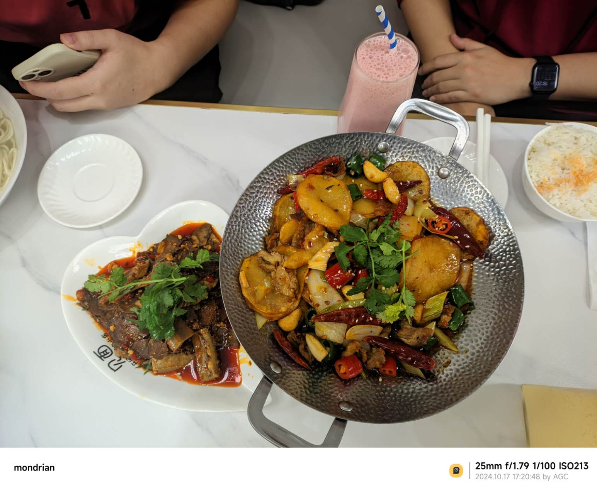
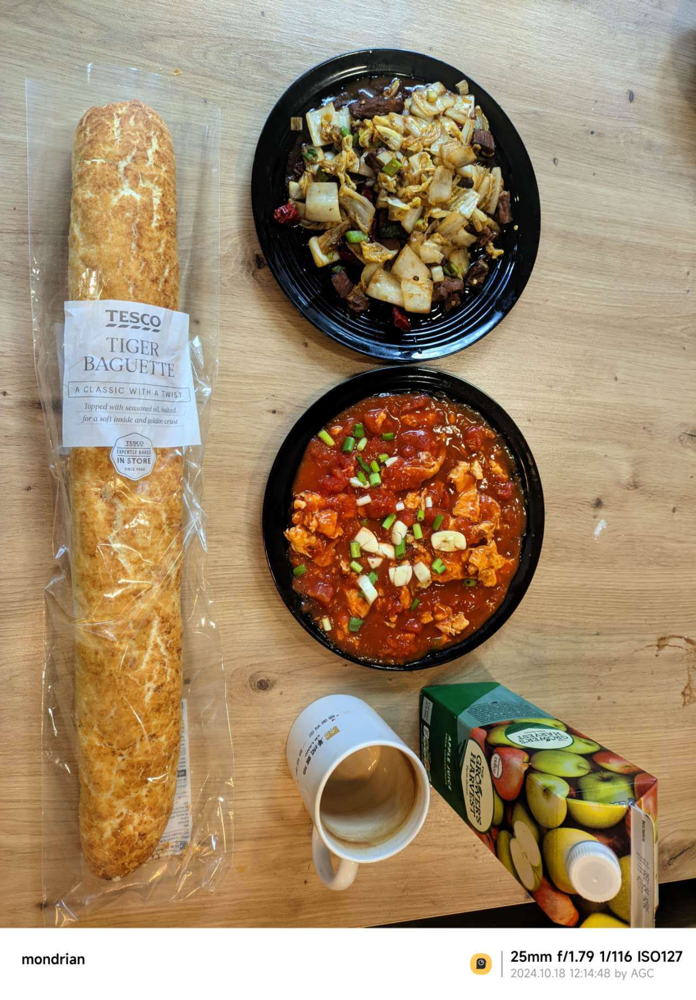
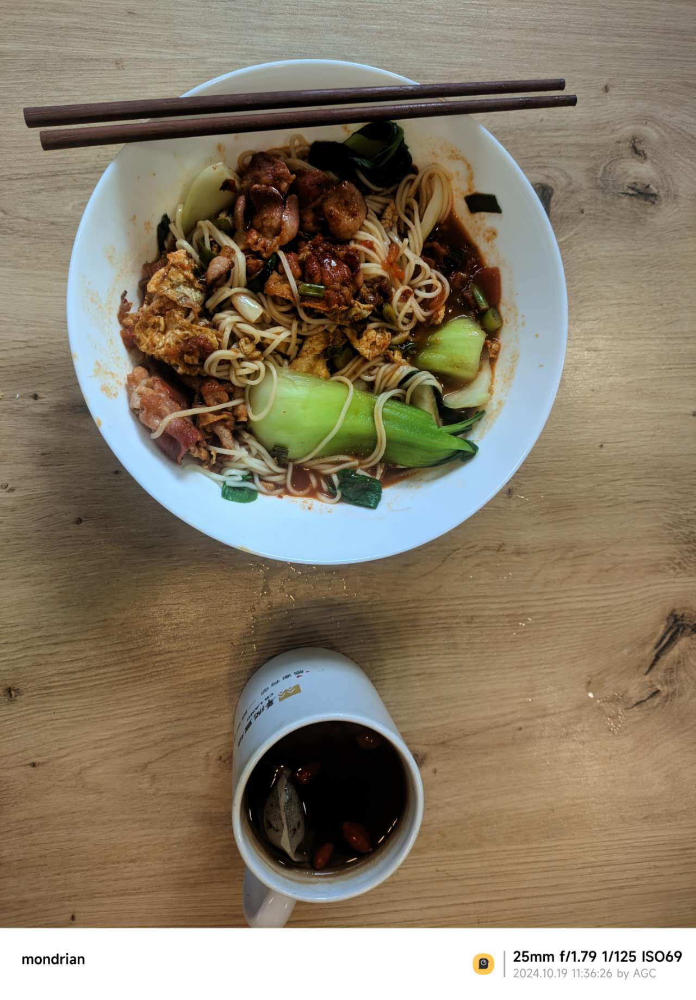
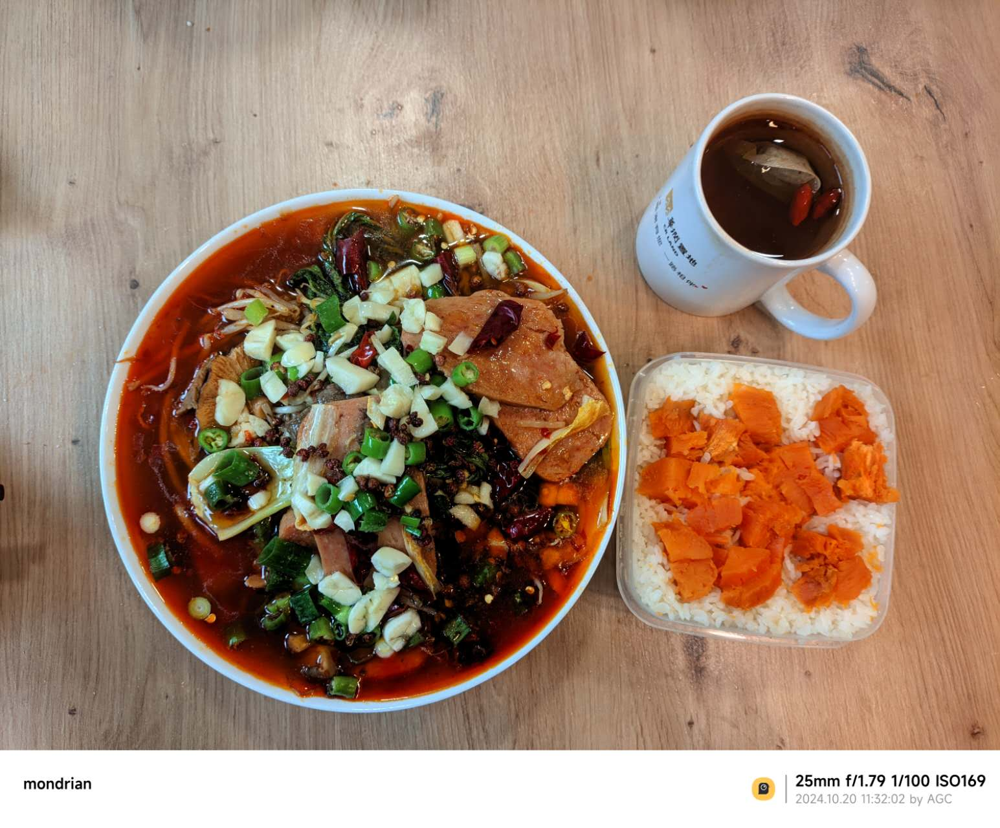
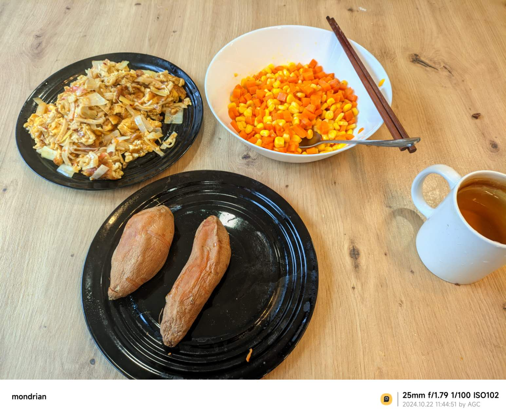
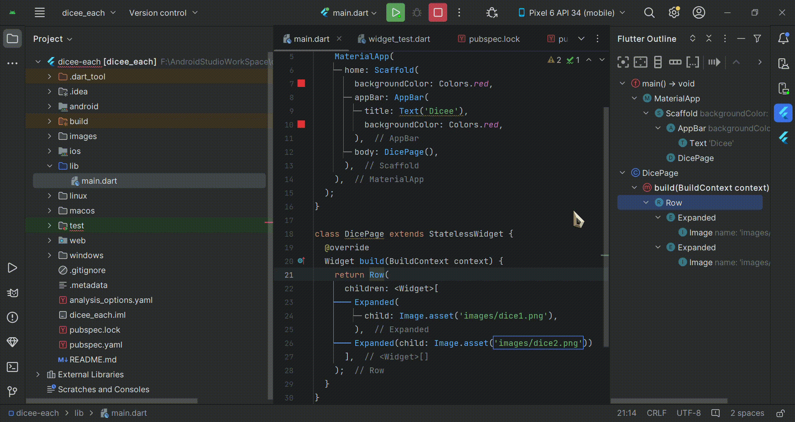
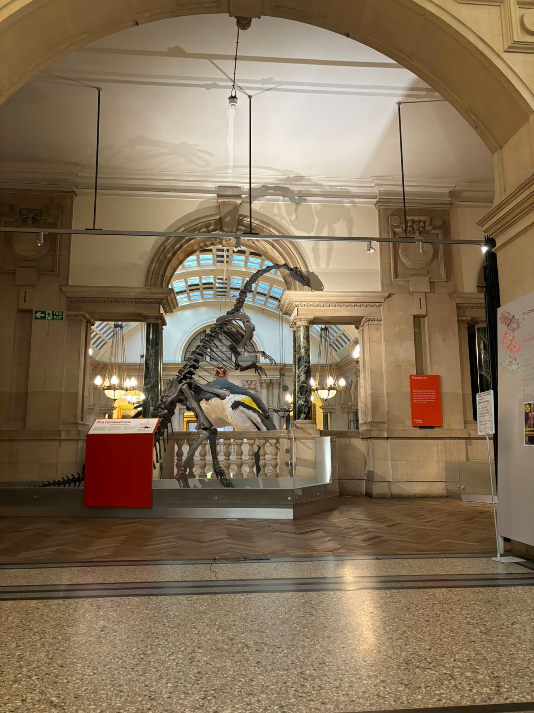
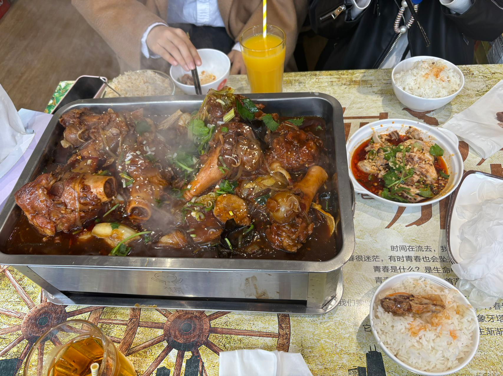

# 2024年10月

## 17日

### EACH

8：20 起床 感觉还是有点晚,明天正好早上9点有课，一鼓作气突破8点大关

全天没课，正好早上看了AWS的内容，ssh的匹配似乎有些问题，明天问问老师。
之后重新看了看数据结构，自从做开发之后算法水平直线下降，api调用太多了，基础还是要重点再看看，这也是之后weekend和readingweek的 主旋律。

中午凉皮  好吃

下午复习了Git的相关操作，看了看项目的Github仓库，发现写的真烂，但还是忍不住看了1个多小时，之后创建了一个新的秘钥，以前的密码忘了，正好也重新开始，但发现了一个问题：

<span style="color: green;">***已解决**</span>

由GitKraken创建的txt默认编码为UTF-16LE，而由Git创建的是正常的UTF-8，这会导致一个问题，merge的时候UTF-16LE会导致识别为二进制文件，进而无法正常编辑。应该是有解决办法的，周五去看看实在不行就全程由Git操作，毕竟使用GUI只是在合并的时候看着方便。

晚上请1/4天假，朋友过生日：夫妻肺片，豆花鱼，干锅土豆片以及海鲜煲 

<span style="color: red;">夫妻肺片竟然是凉菜</span>，我之前一直以为是水煮肉片的那种。




### Mandy

早上去上了seminar，讲了haskell的recursion，虽然我还没自己学到，但是用chatgpt辅助还是能学会写，能回答出TA的问题，感觉以后还是多去，可以锻炼英语，能学到东西。

上课结束后，去化学楼的图书馆继续自己学haskell，终于把chap.1的内容学完了，现在感觉能写一些题，感觉haskell的pattern matching和recursion很有意思，跟之前学的python这些不太一样，之前一直写不懂haskell学的没什么成就感，今天写完了一套题学的很开心，就是我专注力不太够有的时候，看着看着思绪就飘了，复制进chatgpt让他读这个方法还行，之后看不进去就让它读

下午学了一下数学，研究了一下之前课上quiz错的题，最后一题没注意变量错了，后面再继续看lecture note复习，让chatgpt出类似题写一下

晚上跟朋友打电话打的有点久，还有每次做饭感觉有点太拖沓了，每次花的时间太多了，但是做的拌面好吃😋，就是卖相不好，进修中...

## 18日

### EACH

早上有课起来的还算及时。真正有挑战的就是明天了，看能不能在8点起来。大数据来了个新讲师，告诉我们这学期已经到中点了，但我感觉一点也没学到，看来ReadingWeek得多关注一下。这种week还是第一次听说，蛮好的。
AWS应该是秘钥有问题，明天删除旧的，重新创建一下，还是更喜欢Azure，亚马逊跟阿里云一样乱。

中午回来跟父母打了电话，一切安好。
炒了猪肉白菜，上次卤完的八角盒子不见了，明天看看夹缝。没时间蒸米饭，还是用法棍。
中午多睡了一会儿，下午看了看Android 14的最新标准，有点太苹果化了，看社区也觉得毛玻璃滥用。
Github上找到了一个不错的项目，作者更了4年，最新一次也是一周前，可以考虑之后复现一下。
6点那会儿，之前的舍友说下周要来布里斯托，有些奇怪，很久都没联系了，还是去见面招待一下吧。

晚上的算法太枯燥了，8点草草了事，周五的晚上自带debuff，娱乐一下。
异度侵入昨天看完了，唐顿庄园是打算的，但也太长了，有点纠结是它还是西部世界。
虚幻引擎一直在推无限暖暖，实机看了有点期待，叠纸这么多项目，百面估计是停了。
烤红薯还是好吃。 

明天去公园晒晒太阳，把济州叫上，让他别往小树林钻了。
tylor说有个政府楼挂了国旗，前面有草坪，看看跟castle比哪个舒服。



### Mandy
今天学haskell学到2.2的部分，学到了pattern matching和Guard的结合用法，很有意思haskell中没有for，while循环，是用递归来实现循环的，pattern matching和Guard感觉和c中的switch case有点像，感觉这样写看着很清晰。

上午software tool课刚好是让和朋友创建一个github库练git命令，今天打开github震惊到，逸老师把这个库建设的特别好!!🥳 今天身体不太舒服下午lab提前跑路，之后复习CA的时候去学校lab写一下verilog，电路设计真的难懂，我物理基础太弱了，之前没选物理🥲两年没接触了，之前好不容易搞懂了在课上设计的时候又忘记了😠，好折磨

下午回来睡了一觉起来大扫除，搞完整个人累死，第一次一个人出来生活，搞卫生这些还是不够利落浪费太多时间🫠

大扫除完很晚了不知道明天能不能起得来，加油👏


## 19日

### Each

多天以后，面对完成还未过半的计划表，我将会回想起，微信打卡消息使我睁眼看到时间的那个惊骇的9点。  
起床计划面临巨大危机，周六的闹铃和于谦的小菜一样信不过。感觉还是得11点就睡，这意味着10点就得上床，所有的计划都得往前平移一个小时，今晚做个试点。  
9：10分晚起的后果是看到日上三竿的太阳就泄了气，去外面转了转，9:40左右学到12:30，这段时间倒是惊喜，注意力达到去年上半考试周的水平，复习了一下统计2,3的lab，贝叶斯的基础是挺简单，拓展看了看伯努利，和我印象中一致是流体力学用的多，不知道怎么拐过来的，二项分布和期望我记得概率论还是离散大学专门讲过，还没忘，线形加载和局部加权回归好说，但这广义性加载模型太抽象了       

<span style="color: red;">***待解决 ***</span>
问羊也不回，没灵感 做饭去了。 

中午西红柿鸡蛋面，还剩了点法棍，一齐吃了。 


中午也没必要睡了，1 点半学到5点，看了看flutter的绘制部分，这种小组件树的结构还是很有意思的，跟ovi探讨过他认为像python，我觉得设计还是更靠java一点，毕竟是从kotlin一脉相承过来的，Scaffold搭建项目确实快，但区分无状态/有状态的组件有些麻烦，虽然渲染性能确实好，但也导致写的时候要束手束脚的，性能好是一方面但体积也会增大，原生10mb，flutter能吃掉40，应该有解决方案，后面看看大佬的项目都是怎么实现的。
```dart
void main() {
  runApp(MyApp());
}

class MyApp extends StatelessWidget {
  MyApp({super.key});
}
```


动画效果应该是一大亮点，我没有见过这么丝滑性能好的组件了，到时候项目多来点，功能其实不重要，炫是一定要的，AnimatedContainer要多关注一些，这个后面和AnimatedSwitcher类搭配使用应该能形成良好的过渡。谷歌的调色盘审美依旧在线，[material](https://m3.material.io/styles)风格还是规范，顺便发现了一个[第三方调色盘](https://www.materialpalette.com/)，未来用这个设计配色。 

我一直觉得这世界上最没用的三个东西是：张伯伦的“一代人的和平”，比尔·盖茨的“疫苗自制课程”，以及官方的教程。但没想到Flutter团队的API文档确实事无巨细，在线模拟效果也挺多，想到之前学Java的苦日子，不禁泪目，感慨还是好团队多啊😊，扫了一眼旁边的推荐文章:《谷歌裁撤Flutter和Dart半数部门》。。。  
哭的更大声了😭。   
下午换脑子去外面走了走，有点冷，晒太阳还是得下午两点那会儿，济州还是坚持要钻小树林。   
回来跟着yu老师绘制完了大部分的布局，视频看到了第47节，不禁感叹封装的强大，之前自己写文本框都是手动padding和margin，现在一个card直接搞定，有种前人栽树的美。 要这样绘制3分钟就能搞定!对后面的功能实现更期待了。      

```dart
Card(
                margin: EdgeInsets.symmetric(vertical: 10.0, horizontal: 25.0),
                child: ListTile(
                  leading: Icon(
                    Icons.phone,
                    color: Colors.teal,
                    size: 40,
                  ),
                  title: Text(
                    '+44 07900477556',
                    style: TextStyle(
                        fontSize: 25,
                        fontFamily: 'SourceSans3',
                        fontWeight: FontWeight.bold,
                        color: Colors.teal.shade900),
                  ),
                )
              ),
```


哦，羊最后回消息了。


### Mandy
昨天睡的巨晚我感觉我凌晨三点半都还没完全睡着，但是我还是早上八点半起来了，算一下实际睡的时间居然才四五个小时，早上爬起来看国内晚上的比赛，本来我看上场比赛延后了一点还担心会不会打的太久影响我学习计划，但是此时我还不知道真正完全打翻了我计划的东西在后面🙃。出乎意料最后2:0了，我服了等比赛等一周看两把就打完根本看不过瘾🥲

按照计划开学！结果发现完全高估自己学习效率，我的天呐这个lab2真的难学死了，虽然但是我到现在还没原谅自己shell的特殊符号居然学了一个半小时，然鹅真正离谱的还在后面，这个lab2居然有4个exercise！！！比后面三个周加起来都多，那个permission一直报错，调了真的好久，最后重启解决了🙁，打开下一个exercise，直接天塌了而且它居然让我直接学shell脚本怎么写，而且不是浅浅的写一下是要我认真学，学文件操作、条件判断、循环和pipeline。想想我现在真的没有一个精通的语言，之前初高中学的python学了那么久感觉还是没入门，然后感觉现在几个月没写忘的差不多了🙃，haskell，c统统都在入门阶段，感觉学了这么久cs连门的每跨进去，然后现在又让我学个新的语言，我感觉这些东西的语法我都怕记串崩溃😡

为了防止我继续崩溃下去，我果断换lab3写，lab3主要就是俩命令grep和sed，对比起lab2简直算是太温和的了，但我真的好怕我明天直接就忘记了，明天安排个晚上复习

好好好晚饭直接也不吃了，吃个沙琪玛垫垫肚子，去做饭耗太多时间要学不完了。再次无比庆幸之前建了这个github练了git指令，我感觉我整个人都在学git的时候有底气了，但是还是有一些比如撤销指令，新建branch，这些要学，终于还是学完了，今天记录了整个学的过程，一看差不多有个七八个小时学习时长，🥳庆祝！这个学习时长是我理想的时间了，而且感觉整个状态都很专注，怎么说感觉学cs还是真的挺开心的，一报错我就开始激情投入，誓要把它改好，结果改了一万次，最后重启解决了🙃不过这之后学习整个进入状态了不错不错👏 shell就先放着等这个假期哪天提前完成任务学一下，我看老师那pdf根本看不懂，不是这是给零基础的人看的吗，你们不会都背着我偷偷学了吧🙃

今天中午做了一顿番茄意面结果意外的大成功！，再烤了个预制炸鸡，直接给我香晕了，好吃😋


## 20日

### Each

> 致Mandy老师：   
>
> 写在前面,    
>
> 24.10.19.5.jpg 中有您的详细信息，手机型号，镜头焦距 以及位置信息，我也是在检查该图片为什么不能在md正常显示时发现的，任何Web明文存储隐私信息都有泄露风险，尽管追踪意义不大，但最好还是培养良好的安全意识，百利无一害😃。
>
> 针对这一问题：   
> windows：
> 属性->详细详细->删除属性和个人信息->从此文件中删除一下属性->GPS-> 确认
>
>
> Iphone：
> 1.点击“设置”中的“隐私与安 全 性”； 
> 2.点击“定位服务”； 
> 3.界面下滑直到找到"相机”； 4.点击“相机”； 
> 5.选择“永 不”。
>
> -来自 小红书 [炸炸金枕 🍎｜苹果关闭相机和照片定位](https://www.xiaohongshu.com/explore/6527f143000000001e03eb16?xsec_token=ABhuY0Bg5yLEgVJn_jSmHAxkr8vbzj5h8_S9DlJU99UJs=&xsec_source=pc_search&source=web_explore_feed)
>
> 我已删除了关于位置的信息并重新上传，至于无法显示的问题，我个人怀疑是苹果特殊的相册格式，例如“实况” 功能影响的，但我目前没有iphone设备，无法验证。
>
> Mandy老师，您可以使用 https://convertio.co/zh/ 网站将图片从苹果-jpg格式转换为 jpeg或png等格式，经过我的测试，转换完成的文件已经可以正常显示了。
>
> PS：看起来相当诱人，如果能有简要攻略就更好了，我也想试试。


———————————————————分割线：以下是自记录内容———————————————————

昨天晚上看了心心念念的《**海边的曼彻斯特：Manchester by the Sea》**，应该说我还未遇到如此绝望的境地，所以理想的觉得事已至此，无非是重振旗鼓罢了，我没有经历过这种痛，所以我对这类 “催情与自己和解的电影” 无法共情，但抱有极大的同情。未经他人苦，莫劝他人善，这句话倒是有点意思。
我的心路历程是：

名字很好听  ->  发现是一部文艺片，我就能装是个品味高雅的人  ->  曼彻斯特地方挺好，看一看风景  ->   
还是老老实实吃点细糠

从列入清单4年过去了，终于看了，装B的心气是没了，只剩曼彻斯特了，结果发现，说去new york结果到了新乡——这个曼彻斯特在美国，或者说 这是美国的一个城市，他就叫做“Manchester-by-the-sea”，字面意思的。

我破防了🤡。

今天早上8点10分起的床，是我前进的一大步，继续保持，起来后看了看新闻，我平生最讨厌的就是金融类的，不禁专业术语极多，黑话也不少，BBC一上来就是The UK Government Liabilities crisis，接连便是难懂的话，什么“Internal Rate of Return”，什么“Liquidity”之类，引得嘉宾都哄笑起来；演播室内外充满了**快活**的空气。

但确实学到了不少单词，有些还能直接用到统计的学习内容里，这东西应该直接是从金融里面精炼了一圈给我们学的。

出门去采购，发现袋子破了，什么质量，我讨厌Sainsbury，
走到lidl门口，发现和Tesco一样都没营业，才想起来是周天，返程发现Sainsbury竟然开着，我爱Sainsbury。

回到家学习了Lecture 12，主要讲解了常见数据类型：  
连续型数据 (Continuous)，离散型数据 (Discrete)，二元数据 (Binary)，有序数据 (Ordinal)。       

样本统计量也是老生常谈，但在中位数的基础上加了修剪均值，样本分位数和百分位数和样本中位数绝对偏差，研究了半天，才发现都是为了去除极端值，目前在我这里的作用微乎其微，箱线图倒是第一次接触，看着有点怪，不太符合我的审美，胖胖的。很多概念不说人话，不如直接看例子来得实在，平心而论就是高中内容，反过来起个名字再学一遍，总感觉不爽，我缺的学费在哪补啊。  

中午用买的牛肉做了水煮肉片，因为舍不得泡的香菇水，水量比预期多了两指，倒不是说味道有什么问题，就是泼了油后有些不敢搅动，怕溢出来,味道嚎急嘹！果然还是得火锅底料和花椒。红薯米饭，嚎赤🤓。



下午原本是打算看算法的，但状态有些不好，迟迟进入不到状态，索性想着还是明天去系统的看一看。去flutter官网刷了刷文档，发现了Expanded这个类相当不错，可以灵活的column，row和Flex的小组件里面使用，弹性的控制页面的布局，不用自己手动规定了。可以用flex的child直接去指定，非常nice，效率大大提高。

另一个特性就是**工厂构造函数 (Factory Constructors)**，这个是java所不具备的，这个允许在创建对象时控制实例的生成，可以直接返回一个现有的，不需要每次都创建新的object。java里倒是有类似的单利模式，但没有工厂构造函数方便。

```dart
class Car {
  String model;
  Car._internal(this.model); // 私有构造函数

  // 工厂方法
  factory Car.createSedan() {
    return Car._internal('Sedan');
  }

  factory Car.createSUV() {
    return Car._internal('SUV');
  }
}

```

直接封装了复杂的对象创建过程，更简洁了，总的来说就是提前预设好一些配置，把创建过程封装起来，直接调用，不需要每次都从头开始配置。

中间换了换脑子，想到Mandy老师勤快的大扫除，看看我的房间：   
**家居置地毫无英伦风情，书桌被褥颇具蒋匪遗风**，赶紧打扫打扫。

晚些时候又看了看计算机网络的知识，我倒是感觉有些浅了，看浙大郑铨老师的课程应该是够了，自顶向下还是更顺应我的思路。打算明天与算法一道，好好的琢磨一下。好无奈啊，既想多学点东西又想作息健康，时间不够用啊🤬，写日记倒始终是我放空回韵的方式了。

刚才看了Git上的plan，发现Mandy老师和我理解的reading week不一样，我以为明天是第一天，所以一直没动，还纳闷为什么周五这么早就开始规划的，给未来的我再提醒一下，我列计划从今年春改为今天定明天了，日记也从4月的周记改为日记了，4月以前一周一篇不是文件丢了。从3天前，日记分支从本地转为了Git，配合Mandy老师。

待会儿去改一下计划，电影没时间了，刷会儿b站运动洗漱去。

reading week，明天就是了（是吧？），要好好利用起来。

### Mandy
> 谢谢逸老师的提醒！！平时我根本没注意过照片信息的问题，虽然之前隐约听说过iphone拍照会显示所有个人信息，但我当时看完就忘，整个信息泄露安全意识太差了，ok现在立马关掉。

> （当初高中申请大学我们counseling老师说大学要查所有社交软件网络信息，我当时就在想完蛋了，平时从来不注意信息保护，到时候我干过啥别人都能从网上看到，还怕大学查到什么不录我☹️）

> 我确实把这个周末也算作假期了，没太注意到下周其实才算放假，不好意思没写清楚。不过我有四门课要学，算周末9天假期，抽一天出门放松，其他每两天一门课正好。而且这两天写了这个计划学的格外认真，如果算作平常周末，又得在床上瘫一天比如上周🫠，欺骗一下自己有益自律（bushi

> PS：我来这里以后才开始做饭，昨天加了番茄火锅底料才意外的香，不如逸老师做的色香味俱全

今天起晚了，起来一看比赛结束了，主队输了。。幸亏睡过头了没看，不然看直播要心梗了
今天学习状态也很好，记录了一下时间学了7小时，c语言学到了指针，虽然我现在还没真正领悟到指针的作用，不过chatgpt老师说等到写大项目的时候就很有用了。
先不写了，因为已经凌晨1:00了，我看着我timetable上写的23:00睡觉陷入沉思，为什么学习变自律了，但是睡觉时间一直没办法自律呢🤔

## 21日

### Each

> 写在前面
>
> Mandy老师,我倒是没听过有所谓的信息审查,如果有,那我将罄竹难书☹️,但我能出现在这里,那看起来还好.          
>
> 倒是意面实在不像是新手,我有限的理解只集中于中餐,西餐我做过一两次------如果煎培根也算的话.
>
> 番茄火锅,没来英国前,我可能要发起异教徒审判,但化腐朽为神奇,能开宗立派,倒是我该跨出舒适圈了,以后的食谱是挺有潜力多交流的,我从来没想到过可以这么做,想一想确实符合咱们的习惯.
>
> 指针确实难理解,但也是精华所在,你可曾仰望过图灵的星空,困惑为什么大型游戏没有用java和python开发?,事实上java游戏从功能机开始就有了,但在第五世代之后就逐渐被淘汰了.归根结底就是C在底层有着极其强大的自定义能力,以小见大,java的jvm(虚拟机)就有着完善的 **垃圾回收机制** 自动化管理了"指针",但这一"完善的机制"也导致性能的释放不能由开发者高效的操纵.
>
> 在面对大型游戏的性能存储释放时,C++的优化优势就极为重要了,你可以让人物走过一条桥后删除来时的路,进而优化内存空间,减小设备的压力. 
>
> 当然这只是举了一个不恰当的例子来帮助你理解手动指针的优势,总之我的虚幻引擎开发之旅就曾以内存泄漏,电脑蓝屏而胎死腹中,希望你能幸免于难.(bushi  其实是我学艺不精,跟c和ue没关系)

今天8点15起的床,已经很满意了,这两天入睡基本都奔着凌晨1点半走了,感觉还是奇怪,是暖气太热了?今晚试着关了 开窗睡.

起来后简单看了看统计的Assignment,第一章节还是很简单的,一些对lecture的应用而已,比较顺畅.但没想到闫阿姨发了消息,她女儿有一些关于数模和python的问题, 我第一次知道有信息专业大类,上到计算机,下到自动化,说了点自己的经验.这一来二去直接到11点了,利用距离吃饭的时间看了点Google的文档,越来越觉得需要一个纯血安卓,但最新的pixel 8 得400多磅,怎么这么贵!那还是模拟器吧.

午饭是昨天的水煮牛肉,切了点午餐肉进去.整理了一下发现食材不多了,正好朗御在做活动,明天去买一点火鸡面,大白菜和豆腐. 去Tesco买点鸡蛋. 日历提醒学费快交了,截止24号,今年只有飞汇,3%真坑,还是用本地卡交划算,才扣20磅.

12月还是去一趟贝法吧,英镑太离谱了,正好James也邀请我去转转,档期尽量和圣诞节错开.    
回到房间想着快点搞完看大数据,就不睡午觉了,正好也能积累点睡意早点睡觉.

殊不知,一场屠杀就此展开

而我,则是被突突的那个

我没有料到进入第二章节难度陡增,或者说第二章节结合了前4周的应用,一上来就给了我一个闷棍,你这知识是讲线性上升的,怎么难度不是线性的?

模拟实验中,数据生成本来就麻烦,创建加清晰,写的眼花缭乱,R也不够智能,不断重复转变长格式,我都不知道哪个是哪个?让我产生了自我怀疑,是我lecture不够勤奋吗?不能吧...      

豁 

想想其实也有可能😊...

各个映射也是关公战秦琼,上一题的对下一道,好在geom_boxplot可以自动匹配aes美学,不然真够乱的.   
协方差和相关系数后面都来了,要写推导过程,阿一西巴,但确实学到了: 线性变换不会改变相关系数,只会影响协方差,这我倒是没注意,那个时候的我在干什么?应该在揪前桌的衣领吧,反正完全没有印象.

常用的相关系数:皮尔逊相关系数,斯皮尔曼等级相关系数,还有一个肯德基相关系数...,是肯德尔相关系数    
这时候我的脑子已经有点沉了.至于 概率空间与随机变量,yes !😎 easy,但随后就是5000个样本糊到了脸上.做到快8点,绊绊磕磕,阿巴阿巴到了3.2,还有一个章节,实在是罢工了.困意也上来了,洗漱洗漱就准备睡觉,借此天赐良机正好游入清梦.

总的来说是个极其无聊的一天,死磕一项是我的缺点,但我不觉得这是个缺陷,不解决完像是会永久的丧失心气,惴惴不安, 这一次解决了大部,之后再复习心态就会好很多. 有时候还得有这么一股劲.

收拾收拾,早早就睡,不要把明天过的这么无聊,着实太无趣了.

### Mandy
> 番茄火锅对我这样的不吃辣的人来说是一种福音，虽然一开始我也不理解，但是去吃过海底捞以后就吃上了
>谢谢逸老师的例子，虽然我只是一个还未入门的初学者并不理解实际怎样操作，但是更深刻的理解了指针的优点。以后慢慢来学，希望能在今年尝试找点c的小项目写写或者克隆一个项目，这样或许才能真正领悟

今天按时起来了，但是我精神并不是很足，感觉是这几天睡太晚孽力回馈了。

大概是前两天过的太顺，今天的运气格外的差，去lidl买东西在结账的时候反复折腾，结果发现他们系统坏掉了检测不了优惠券。😩即没有省到钱，又耗费了时间，然后我就拖着我的大行李箱去tesco搬水。虽然超市里我公寓非常近，但是我也累的半死，我这周都不想出门了😭 

中午处理食材处理了很久，晚上朋友来吃了一顿饭，很感谢她，要不是在这里认识了她我大概也会变成社媒上那种没有归属感的抑郁症的人了。这也是今天做的不好的地方，学习的时间被大大压缩了，下午就写了俩小时c的题目。我现在反思感觉自己还有好多东西要学，但是既然已经这样了，就明天继续努力吧，把今天少的补回来，加油👏

今天12:30睡进步半小时，明天12:00睡慢慢把作息调回来吧。

## 22日

### Each

昨天早早就收拾睡了,早上7点就醒了,南波湾,运动了20min,早上起来还是舒服,煎了一个鸡蛋,4片培根.    
差不多8点,处理了一些邮件,给lan老师写了一封信,告诉他我的近况,我曾经在lan老师的课上听过胡教授为自己的企业宣传,没想到时过境迁,他竟然来到了布里斯托大学担任讲师,据他说是太累了,目前是tylor的导师,lan教授想必一定很惊喜吧.然后把学费交了.

处理完就开始看AWS的内容,讲了Iaas Paas和Saas的介绍即基础设施即服务(Iaas),平台即服务(Paas),软件即服务(Saas).这一点在之前的云原生的课程上就了解过了,再往远的说,大三的计算机网络里面也有.IaaS就是开发、测试环境、网站托管,PaaS则负责Web 应用开发、API 服务、微服务架构,SaaS就是我们常说的办公软件、电子邮件、项目管理.

亚马逊倒是大书特书了Cloud Hybrid（混合云） 和 On-Demand（按需服务）,也就是两个不同的云计算概念.第一单元很简单.

然后就出去采购,冰箱已经弹尽粮绝,先去朗御买了两个大白菜,我最近想重新开启午餐肉白菜的计划,不同的是这次可以加些粉条,不那么单调,健康且摄入平衡.豆腐也买了一块,把鸡蛋放进去煲汤会变得乳白,又有口感又能驱寒.   
每次看朗御的中超都觉得竟然有了些许性价比,有很多打折的活动.再买了一包炸酱面和酸辣粉换换口味,只是这炸酱面怎么是韩国的,虽然用汉字写了北京,但阿一西巴.不能忍.      

我印象里好像方便面版的老北京炸酱面做的不多?莫非是北京的地道不能飘扬过海跨越物理的束缚🤔?要真这么解释倒也说得通,毕竟在北京吃才真是地道😊

会来的时候发现小小的city centre竟然卧龙凤雏,有足足3个Tesco express,我还以为只有跟lidl相对的大express.新奇就就进了中间的,发现竟然有spam,大express都没有,什么道理..不过没有鸡蛋,或者说2.5磅6个 --对我而言那就是没有,真的有人会买这么贵的鸡蛋吗🤨?那个最贵的黑包装看着还以为是汉堡包,没法子,还得去大express买了15个/2.3磅的,舒服了.

一次购物花费了太多的时间,来回就得1个小时,时间都去哪了. 所以还是要一次性就买好,但就算这样,一个大袋子和书包还没买完,苹果汁拿不上了.

中午炒了蟹柳鸡蛋和玉米胡萝卜,要是放点葱花就更漂亮了,加了两根红薯,好吃.中午睡了会.



下午起来接着看第二部分,这时候我本来应该再写我的随机模块,但没办法,总得看完吧,只好硬着头皮看下去.第二部分就麻烦多了,探讨了很多云计算经济效益方面的,令我印象比较深刻的是:

>  在 AWS 中，有四种官方的支持计划：

> 1. **Basic** - 免费支持，适合一般用户。
> 2. **Developer** - 适合开发者，提供更高级的技术支持。
> 3. **Business** - 适合中小型企业，提供全天候的技术支持。
> 4. **Enterprise** - 面向大型企业，提供最高级别的支持，包括专属的技术账户经理。

总之又耗费了2个小时,其实本身是不难的,但新的系统第一次接触加上,早期的debuff上来了,效率着实不太高.     
末了收到了tylor的消息,他从伦敦回来了,我还没去伦敦转过,事实上我并不喜欢伦敦,这个城市放大了冷漠和利己,是经济之都天然的相性.我在最现代机场的体验,真是糟糕. 不过听到他说大英博物馆的门票免费,又有些心动,立马理直气壮起来了,这不应该的么. 说实话还得正儿八经转一转的,毕竟这以后回去问起来:伦敦咋样?支支吾吾吐出些诸如"大本钟""伦敦之眼"等家喻户晓之流, 未免自己也觉得可惜.要是离得远还好,但布里斯托这么近还是有些去的理由. 但随后tylor给我泼了一盆冷水,酒店1晚 300磅,我知道会很贵,但也没想到会这么贵,一晚相当于我两周的房租, 三周的打工. 还是之后拉个人去找民俗或者青旅平摊一下吧,把羊的学生卡抢过来也是个办法,晚上暂住ic的图书馆,计划通.

后面看了看Flutter的文档,写了些onpress,发现flatbutton方法再flutter2.0就被弃用了,现在是textbutton,不过还行,凑合着用,最终归宿还是要转image解决.

```dart
return TextButton(
      onPressed:(){},
    );
```

里面挺简单的,就是这个匿名函数我给记不太清了,或者整个lamda都得复习一下,我只记得java里面是函数型接口过来的,kotlin应该也继承了这个写法.还发现了通过outlier可以直接添加widget,amazing,一整个飞起,接触到这个功能时我像个孩子一样好奇,倒不是说有多新奇.alt+enter其实更方便,只是觉得之前开发真是苦日子,而且这个功能也不是完全没用,这种组件树这么添加,其实逻辑挺清晰的.



明天翻翻文档吧,事实上我还在文档里找到了不少好东西,果然是google,啥都有,不缺钱,但一想到团队被裁,更生气了.

晚上看新闻发现爱尔兰也有饺子,原文是:In Ireland they’re soaked in Guinness gravy,天哪🤯,guinness本来就哭,画面不敢想.问了james,他还没回,要是真有的话肯定早告诉我了.然后就是本岛,Probably the most famous British dumplings, suet dumplings, are cooked on top of a chicken or beef stew. They’re made from suet
suet...画面太美果然不敢想象,这都什么跟什么啊,英国美食果然药丸 :pill:

本来这一整天效率没有很满意,毕竟早上难得起的早,但刷到朋友拿到字节的offer,瞠目结舌,不免有些苦涩.

问君何能尔？心似飞鸟，惊逐寒星. 自己的失败固然可怕,但朋友的成功更令人揪心. 

无论如何自己也该好好想想其中缘由了.

今天差强人意,起床很满意,遗憾就是采购花了太长时间,今天也早点睡,迎接光明的未来.

## 23日

### Each

果然有高峰就会有低谷，今天起来就是8点半了。很难想象已经是reading week的第三天了,但回望过去的,虽说不上那么充实但也没有虚度,看来决策是起效果了.赶紧醒了醒就起来,看到lan教授的回信,很高兴能听到一切皆好.

复习AWS第三节，第三节还好，第二周的还剩下了第九节，明天需要花时间解决一下。第三节的内容说实话挺少的,主要也就是全球分布的网络问题,在边缘建立数据中心有利于解决延迟和降低成本,北美是最多的,欧洲也差不多,其他地方也就是东亚了,日韩都有大型数据中心,国内是在香港,但是北京和宁夏也有,其中特别说了,在中国的服务器有着严格的限制,只能访问北京和宁夏,实际上我感觉这么做才合理,中国的信息肯定不能流通到外部.当然自由派应该不这么想,但无所谓,国内多数人选择的应该是腾讯云和阿里云,实际上之前的课程里老师就有讲过这两个的例子,总之大数据在国内的发展也不遑多让.

中午吃了汉堡和火鸡面没时间做饭了,简单睡了一会儿,大概2点快三点继续学习了,主要就是学习了相应,这个和java的很像,就只要回调,简单得多,还有就是知道了dart作为静态语言,也具有像JavaScript的特性------即可以动态定义变量.

```dart
var a; //此时 a 可以是int double String
dynamic a; //同上
```

这个很神奇,但作为保守派以及受过严格的训练,我是很反对且警惕这种命名方式的,尽管dart团队的初心是好的,我依然觉得静态语言需要一套规范来限制变量的边界,以防发生混淆.

最终onpress是不够的,后面还需要加上 setState 才能发生变化,且继承State,与StatefulWidget

```dart
child: TextButton(
                onPressed: () {
                  setState(() {
                    leftDiceNumber = 3;
                  });
                }
```

以小组件为基础的Stateless是负责静态页面,不参与动态变化,如果有数值等变量,则是需要在Stateful里构构.

正当我高高兴兴的在组件的世界里遨游时,陈总给我发了消息,他到了.事实上一开始我有点懵,过了一会儿才知道他的意思是来布里斯托了,约着去吃个饭,坤坤,博钧,济州,大爷都在,那就必须得去了,实际上就是陈总单枪匹马也得见一面,上次一别,大有"不到黄泉,终不见"的架势,这次是在Spit fire barbecue,收到消息就得立马出发,可惜我又一次让计划毁约了.

临近,发现路被封了,好像有人在拍电影,绕了点,一靠近就看到了陈总和博钧外面在等我,寒暄过后大家都很高兴,真好啊,每个人可以暂时放下手头的事情,聚在一起回忆过去,畅谈当下,玩笑未来. 已经快三个月没有这般了,我一向是很讨厌无用甚至部分有用的社交,权把维系关系作为优先准则.聊到兴起,不免推杯换盏,但一杯下肚,就有点杯影绰绰,酒量也就到这了,感觉怎么这么像纯生,度数应该是3度,对我来说有点高了.

是barbecue那必然是bbq,大爷在德国十年,对菜品多有研究,今天的点餐由他全权负责,6扇猪肉,一个汉堡,听着很少,但端上桌来,都倒吸气一口气,汉堡是双层的招牌牛肉,配着薯条,猪肉不仅是一长条,还有薯条和手撕的猪肉坐落在两旁,量是真的大,济州饭前豪言壮志,但到第三口就不再言传.我心想:坏了. 这家猪肉还不错,如果只是看价格确实贵,但配上分量,性价比可以.就是最近口腔溃疡,酸黄瓜太刺激了,汉堡中等水平,不如fiveguys,薯条就更不用多说,但大家能聚在一起,这已经远超一切了.


末了拍了合照,我能看到的是每个人脸上写满了久别重逢.

接踵而至的Hasson,之前提到过他计划也过来,但我没想到今天晚上他就落地布里斯托了,这让我非常为难,一方面我是在饭桌上冷不丁收到的消息,另一方面他并没有提前告诉我行程,这种事情不应该是提前至少一天吗? 我有些无奈,但人家跨越大海来到这里,给足了面子,我只好与他相约明天见面. 

我一向不吝啬请客吃饭的,尽管不喜过多社交,但始终相信朋友的价值远胜于碎银几两,实际上,我平日里宁愿少买些荤腥也要攒下钱来外出,请客.自来这里,可乐零食更是奢望.但我很讨厌突如其来的计划改变,这个月本身就支出颇多,这已经是我第六次更改支出计划了,或许我要让Serra再给我一些兼职了,但这势必会占用周末时间,AWS测试迫在眉睫,统计也不甚明朗,再一想到学费和AWS的考试费用,压力真是颇大, 偏偏这碎银几两，能解慌张. 我始终在庆幸,没有为雅思支出而烦恼,找到了便宜的房子,正好不坐公交. 但现在仔细想想,这都是些小恩小惠, 一纸3万学费的offer就能把我打回原形,父母的经济压力已经很大了. 

这不能怪Hasson,完全且百分百是自己协调不好的问题, 明天结束我应当仔细捋一捋的,把10月账单小票都重新登记一遍,超出的部分,用往后各月的额度补上,或者再去兼职. 

现在能做的就是用最好的精神面貌与Hasson会面,多倾听他的故事,少说些自己的话. 

自我内耗也不是我的风格,现在是24年10月23日,Boss直聘看了许多,可能是最近求职压力有些大吧,不免牢骚与资金相关的问题,我现在应该做的就是明天处理完后,好好继续下去,一等困难,但不是毫无希望.

我希望未来的我看到这里,能轻蔑的一笑:多大点事啊.

### Mandy
虽然两天没有写，但是这件事也非我所愿，实在是这两天突然发生了太多事，让我难以应对，也涨了很多教训。
周二的时候本来学的好好的，隔壁上周搬来的中国室友突然找上门来，希望我帮他存钱到我的银行卡上再转给她，理由是她需要交学费，但是金额太大怕去柜台存的次数太多柜员认出她来，虽然我几番表明这并没有关系，柜员不会管这些的除非系统判定有风险，以此来推拒，但是我直接就被拉走了，也怪我自己态度不强硬☹️...这大概是我这两天做的最后悔的事，当时如果我硬气一点就不会有这么多麻烦事。之前这位舍友给我的印象一直还不错，所以当时她说想请我帮忙的时候我还是答应了，结果没想到是涉及到钱的事，我还没想明白我人已经到了银行，帮她存完的钱，回去在转给她，我以为这件事已经告一段落。但是后面我转钱给她之后，她迟迟没有收到这笔钱，无奈我只能打电话给银行的人进行沟通，当时客服说一切正常，钱款会在当天结束钱汇进她账户。但是直到第二天，她都没有收到钱，于是我又只能一个人打电话和银行客服进行了一小时的全英文battle终于才把事情了解。这件事的麻烦程度远超出了我的想象，其中的过程的复杂程度仅用文字难以表述，最重要的事我的心理压力也很大，因为这件事涉及到了钱，她一直没收到就意味着我一直有风险。钱没汇出，是我账户的问题，因此只能由我来打电话和客服沟通，本身电话的噪声非常大，客服还都是口音比较重的外国人，我整个当时情绪都很崩溃，幸亏最后这件事解决了，同时我的这位舍友也因为不满意宿舍大小搬出去了，真是不幸中的万幸。这次我真是狠狠涨了教训，以后这种钱款相关的事我再也不会帮任何人，而且以后如果我不想答应的事一定要说不，不要在态度不强硬了😭

这件事不光是浪费了我下午学习的时间，同时由于我当时很焦虑隔一会就要看一下手机查看钱的动向，导致后面的学习也被耽误，最后被迫提前睡觉，但是晚上又被外面激烈的警笛声吵醒，再也睡不着。于是我想着反正也睡不着爬起来继续学，最后浑浑噩噩学了整个通宵，非常的没有效率以后我再也不干这事了。最要命的是我和我朋友约好周三是要出去吃一顿然后去博物馆参观最后去蹭free披萨吃，所以最后补眠了两个小时就出门了。

不过周三这天相对还是比较幸运的，中午慕名去吃了一家很有名的中餐馆，确实很好吃。后面去的博物馆也很有意思，一楼是埃及展厅，展出主题是Death，里面确实很有很氛围。楼上还有恐龙化石（应该是复刻的），和很多栩栩如生的动物标本，整个博物馆很大，很可惜我一个常年宅家的人体力并不是很好，所以还有一些地方没逛，最后去了数学大楼休息等待晚上su的活动。




其实为什么把周三定为休息日就是因为周三有这个su的活动，可以有免费披萨吃。和朋友打了一会的牌，处理了银行的事情（和客服battle），挂完电话回来一看桌上多了俩人，（当时其实准备挂完电话就走）大家继续一起玩到了八点，但是那位新认识的外国人还意犹未尽，提出来我们宿舍接着玩，此时我的另外一位同宿舍朋友同意了，我也就没说什么。最后大家玩累了，那位外国朋友还邀请我们去她宿舍参观，但是当时都已经十点了喂？！所以我直接疯狂婉拒，总之周三晚上的经历也是非常奇妙。但是有银行这件事在先，怎么样也都觉得能接受了。以及我有一位课友因为她宿舍和那个外国人顺路外国友人请她去宿舍参观，但是说实话她也要多爬一段路，但她自己答应了，我能做的也只是跟她说到家报个平安，不过之后我给她打电话确认安全她又说要去一个什么塔那里，我看看时间已然晚上十一点，提醒了她注意安全早点回去，但她去意已决，我能做的只有这些了。

经历这么多只有一个大写的后悔，以后再也不随便答应别人帮忙，也尽量早点回宿舍（当时八点到宿舍也已经算是很晚了，外面整个天都黑了）。

## 24日

### Each

很高兴,拥抱了九点的太阳,我差点被吓得神魂破散,好在Hasson还在享用他最喜欢的酒店早餐,酒店就在火车站,过去15分钟左右,我记得闹铃是定在了7点,可能是昨晚吃了晚饭的缘故吧.简单洗漱一下就动身. 我还从未来过这边,尽管身边都是它的传说,当然不怎么正面就是了.

 9点40 与Hasson顺利见面,他还是那么的高. 这次尤为明显,下榻的酒店也很舒服,看起来精神面貌真不错. 他执意要去一家咖啡店,他总是那么的体面. 然后在咖啡店里点了一杯茶,好吧,很难琢磨透就是了,不然也不会突然到访. 他告诉我Mona即将毕业,会继续读硕士然后接着phd,新来了一位印度人,也很不错,马来西亚的梁小姐还在忙毕业的事情,希望她这次不要再延毕了. 随后告诉我他是下午2点的飞机去伦敦,这也出乎我的意料,时间上是没法请他吃饭了,让我很愧疚,除了道歉也说不出别的话了,他倒是一直在说easy,easy.

 时间不多,就去我的住处坐了坐,谈到住处,我还很疑惑他能继续在Patric住下去,结果告诉我,他是研究型硕士,两年. 我竟然不知道这个事情,现在新交了女朋友,是本地人,在提到这茬时脸上满是幸福.我也跟着笑了起了,我尽量克制且面带笑意,扭曲的那种.  又聊了聊我在中国的生活,讨论了未来的发展后,时间就差不多了,送他去坐大巴,一路上都又聊了聊贝法,得出一致的结论-----远超布里斯托.,当然这对布里斯托并不公平,我承认现在是觉得无聊,但我们都没有足够的时间探索这个城市. 目送他登上大巴,离去,行注目礼,忙完已经12点了,走在回家的路上,只感觉秋风更萧瑟了.

回去煮了炸酱面思密达,把昨天打包的猪肉热了一下,开了个黄桃罐头,可惜我没开罐器,只好用小刀划开了,最近上火,嗓子有些不舒服,但东北人的秘方应该有作用.

回到房间,一股睡意袭来,休息了半小时.

下午起来先处理一部份邮件,不知道华威的招生团队是什么策略,到现在还在给我发邀请的消息,已经开学了啊.早知道就用别的邮箱注册了,然后看了会儿资讯,看到个国风的造景游戏,东方：平野孤鸿,至于品质,嗯,西山居的,难说.

然后就该学习了,今天把随即模块弄完,其实就是很简单的功能,自己定个数组随机切就行了,只是考虑到新语言的一些特性再加上看文档,难免要花费大量的时间,果然有共同的math包,random和java的用法一样,都是从0开始算

```dart
 leftDiceNumber = Random().nextInt(6) + 1;
```

想要达成1,2,3,4,5,6 加1即可

然后为了让骰子同时显示,yu老师给的方案是

```dart
Expanded(
            child: TextButton(
                onPressed: () {
                   leftDiceNumber = Random().nextInt(6) + 1;
      			   rightDiceNumber = Random().nextInt(6) + 1;
                },
                child: Image.asset('images/dice$leftDiceNumber.png')),
          ),
          Expanded(
              child: TextButton(
                  onPressed: () {
                     leftDiceNumber = Random().nextInt(6) + 1;
      				 rightDiceNumber = Random().nextInt(6) + 1;
                  },
                  child: Image.asset('images/dice$rightDiceNumber.png')))
```

添柴!

看笑了,不过考虑到为了新手也能理解,写的时候抽出来就行,很久没有看这种0基础的课程了,好欢乐.

```dart
void changeDiceFace(){
    setState(() {
      leftDiceNumber = Random().nextInt(6) + 1;
      rightDiceNumber = Random().nextInt(6) + 1;
    });
  }
```

extract,不过dart似乎并没有专门的快捷方式,无所谓.

晚上打扫了一下厨房,虫子挺多的,不过庭院原生态也能理解.待会儿去做一下帐,然后把房间再收拾一下,刷一下b站,运动一下.

对了,James回消息了,他说guniness的饺子他从来没听过,写这篇报告的人是骗子,我松了一口气.但紧接着说:"Guinness gravy is for pie and Roast dinners",额,好吧,爱尔兰人的厨艺也比英国人好不到哪去,说实话.至于suet,这类羊脂更多是用来润锅的,饺子里放没听过,我又松了一口气.随后它给我推荐了Gnocchoi,这个饺子里面的馅是土豆的.(被狗james气晕)

Ovi倒是精神状态还行,他住在Tsukuba,一个离东京大约2小时的小镇,目前是软件工程师,他说他很enjoy,说实话我不信,那么崇尚大城市的人在山沟沟里绝对不爽,难道它的boss也是黄磊老师那种进行服从性测试的人?但愿刺身能做成熟的,别吃中毒了,晚上在酒吧里喝着核污染的beer,多是件美逝啊. 不过我也喝着核泄漏的带嘤冰泉,半斤八两.

读完所有消息,感觉大家都好开心,这两天跌宕起伏,借着这个契机也挺好.放松一下,才能有动力,现在更加期待明天了.


