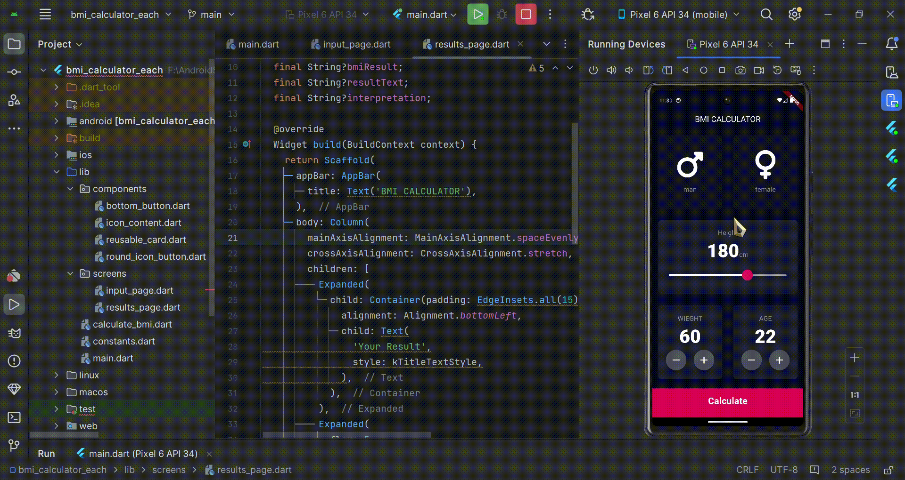

# 1

## EACH

今天早上是7:50起来的，还算不错，因为昨天是12:10睡的觉。早上有原生的课程，也就是AWS的LAb实验，我记错了时间，以为是9点，其实是10点,起床吃了个饭，实在是太饿了，做了方便面吃。也是和大爷一块儿上,坤坤和tylor还是起不来,我们两人就一台电脑,我不给他用(其实是要看文档)所有AWS教育的课程应该是结束了，然后大作业时间也是在12月的3号，还有一个月的时间可以好好准备一下，其他的实验也需要每周去补一补。

课程上，主要就是对之前做了一些总结，然后在LAB的细节上，老师给我们重点讲了讲computing,其他的也就没什么。然后督促我们要早点儿把LAB做完。这个其实一直是我的痛,上一次的lab实在是太多了，推进到LAB3还是有点儿问题。那个实验还得重新做，而且涉及到它最核心的computing的模块，估计得上两三天才能把它再完成了。下了课就去了Sainsbury。结果发现Sainsbury的牛排特别的便宜，四块儿才五英镑,我爱它,爱得深沉,以后Sainsbury就是我的初恋了。接着买了点儿茄子、青椒，回头做点儿地三鲜,因为冰箱里还有两块儿土豆.又去中超去转了转，任意消费就能送盲盒，还是很不错的。我开了一个,一般般,看Mandy老师那个挺漂亮的.

中午，因为实在饿的不行，所以就把那个牛肉切了点儿。下了点儿午餐肉豆芽以及最喜欢的大白菜,粉条。粉条之前有泡,在我出门的时候就已经泡上了,到回来大概有四个小时吧，炒了火锅底料，加了点郫县豆瓣酱，又撒了点花椒以及干辣椒。因为我们用第二个锅可以烧热油，所以这个比较可惜。上次是借昊玉的锅,但不好意思接着借，就没泼油,但照样不错，又切了点儿蒜末进去，非常的香，基本好吃。水煮肉片儿这块我是拿捏住了，因为用的是牛排的肉，所以只需要烫两分钟它就熟了,一次差点吃撑,出发前体重74.05吃完79.4,下次不敢这么报复性饮食了,毁我一周业力。


下午就接着去看computing的lab3部分,量还是大.再加上因为周五有点儿心猿意马，导致还是没有看完。晚上的时候去Google社区,论坛里面转了转，也没什么实际的收获，重点还是要看后面匹配的Flutter开发指南以及yu老师的课程。这两个结合起来看，我觉得效率还是比较高的。我的目标就是争取在下周,把yu老师的视频全部看完，因为现在a w s lab的实验可以往后再稍微推一下,统计斌并行再看一看，这个月应该还是要重点关注一下TIBS,考试快到了.


# 2

## Each

西巴!西巴!西巴!

先让故事回到最初的起点，早上8:40，我起了床，彼时的我还不知道接下来会面临一些什么，总之一切都很糟糕。这是我一醒来,就意识到的事情,可能是昨天睡的有点儿晚，等真正入眠都到凌晨一点多了。早上起来脑袋嗡嗡的，洗漱完之后毫无动力，什么都不想干，就搁那儿发呆,硬发呆。接着，本来是打算看yu老师的视频的，结果点开了B站就没了动力，告诉自己不如先娱乐放松一会儿。每一个视频都很无聊，但是不知道为什么，我就是一直在看，一直在看，把影视飓风从春季的视频一直看到了最新一集。

时间转瞬即逝,我没反应过来就到了11点.

麻木的看到了中午想着做饭扭转一下后昨天还剩了一些汤料，今天可以偷懒再复用一下，把剩下所有的豆芽和另外一半儿的午餐肉全部丢了进去，白菜也掰了掰，大概十个帮子，加了点儿郫县豆瓣酱，没有粉条，也没有牛肉，热了两个红薯。照片有点寒碜,就没po,看这架势,中午也就没有必要去午休了，大概两点半之后开始学习。大概学习了两个小时，手机就被源源不断的信息塞满了。

今天是BLG和T1的冠军争夺战，我想也是决定着未来联盟玩家基础的一场大战，但结果呢,阿一西巴，至于我的想法,请看VCR:

----------------------------------------------------------------------------------------------------------------------------------------------------------

**主播**：国足的这场耻辱性的大败，已经成为了这两天中国体育界最大的话题。我们来看一下前冠军硬币哥对此的点评。一向直性子的大币将军直言道，lpl这样输只怕是连面子都不要了。

**Doinb**: 你说职能部门，一届一届换了多少lpl教练了，改过吗？换汤不换药啊，人家朱开也有理由说的，我（曾经）带的是什么队，我带的EDG。你这批人是什么人啊？你叫我带？lpl现在什么水平，就这么几个人，你左手什么的都在打中路，他能打吗？打不了！没这个能力知道吗？再下去要输越南了，韩国队输完输越南，再输欧洲，接下来没人输了。

**记者**：从另一方面来说，LPL是备战S15世界杯最早的队伍……

**Doinb**：（拱手）哦哟，谢天谢地了。我已经说了，你像这样的比赛本身就没有打好基础，你能跟我保证在25年或者26年这样关键比赛他能赢啊？务实一点，我劝你们，我把自己战术打法，联盟的这个理念先搞懂。tabe（王柏勤）带的蛮好的，你把他去换了干什么你告诉我？你跟G2打个3比2，你倒告诉我怎么解释？脸都不要了！

-----------------------------------------------------------------------------------------------------------------------------------------------------------


这个耻辱性的大败。已经让人麻了，导致等到比赛结束之后，剩余的两个小时都是在磨洋工，毫无斗志，也什么都不想干，中途做的最正确的一件事情就是把联盟卸载了，把我的世界下回来,我现在是厌倦了打打杀杀，再也不想碰了,以后要还是直播我的世界吧,明天11:00点,直播间名字我都想好了:EachCraft,phton的光影是真好看,折腾了快2个小时才弄出漂亮的配置.

话虽如此,特性还是稍微看了一点Widget接口的内容的:

在 Flutter 里，这个 widget 的功能是“描述一个UI元素的配置信息”，就是说， Widget 其实并不是表示最终绘制在设备屏幕上的显示元素，所谓的配置信息就是 Widget 接收的参数，比如对于 Text 来讲，文本的内容、对齐方式、文本样式都是它的配置信息。 Widget 类的声明是这样滴：

```dart
@immutable // 不可变的
abstract class Widget extends DiagnosticableTree {
  const Widget({ this.key });

  final Key? key;

  @protected
  @factory
  Element createElement();

  @override
  String toStringShort() {
    final String type = objectRuntimeType(this, 'Widget');
    return key == null ? type : '$type-$key';
  }

  @override
  void debugFillProperties(DiagnosticPropertiesBuilder properties) {
    super.debugFillProperties(properties);
    properties.defaultDiagnosticsTreeStyle = DiagnosticsTreeStyle.dense;
  }

  @override
  @nonVirtual
  bool operator ==(Object other) => super == other;

  @override
  @nonVirtual
  int get hashCode => super.hashCode;

  static bool canUpdate(Widget oldWidget, Widget newWidget) {
    return oldWidget.runtimeType == newWidget.runtimeType
        && oldWidget.key == newWidget.key;
  }
  ...
}
```


- `@immutable` 代表 Widget 是不可变的，这会限制 Widget 中定义的属性（即配置信息）必须是不可变的（final），不允许 Widget 中定义的属性变化的原因的原话是:**Flutter 中如果属性发生变化则会重新构建Widget树，即重新创建新的 Widget 实例来替换旧的 Widget 实例，所以允许 Widget 的属性变化是没有意义的，因为一旦 Widget 自己的属性变了自己就会被替换。这也是为什么 Widget 中定义的属性必须是 final 的原因。**我的理解还是有些不明白,这个不允许变化是初始化就加载好的吗?到时候再品一品吧,脑袋有点不够用说实话.
- `widget`类继承自`DiagnosticableTree`，`DiagnosticableTree`即“诊断树”，主要作用是提供调试信息。
- `Key`: 这个`key`属性类似于 React/Vue 中的`key`，主要的作用是决定是否在下一次`build`时复用旧的 widget ，决定的条件在`canUpdate()`方法中。
- `createElement()`：正如文档所言“一个 widget 可以对应多个`Element`”；Flutter 框架在构建UI树时，会先调用此方法生成对应节点的`Element`对象。这方法是 Flutter 框架隐式调用的，作者说在开发过程中基本不会调用到。
- `debugFillProperties(...)` 复写父类的方法，主要是设置诊断树的一些特性。
- `canUpdate(...)`是一个静态方法，它主要用于在 widget 树重新`build`时复用旧的 widget ，其实具体来说，应该是：是否用新的 widget 对象去更新旧UI树上所对应的`Element`对象的配置；作者附言到:通过其源码可以看到，只要`newWidget`与`oldWidget`的`runtimeType`和`key`同时相等时就会用`new widget`去更新`Element`对象的配置，否则就会创建新的`Element`。

总之很麻,很麻,很麻,毫无效率的一天,就当是调整了(感觉最近借'调整'为名而休息的接口有点多),快快步入正轨,明天最后一天浪费了就真完辣! 另外我的世界这种无欲无求的玩完后应该不会有分心,至少种田游戏对我都这样,不会老想着,对马岛还是有点太兴奋了,以后周五休息的时候再玩.

最后这一首词字面意思还是有点契合我当下的心理:

> 不向长安路上行。却教山寺厌逢迎。味无味处求吾乐，材不材间过此生。
> 宁作我，岂其卿。人间走遍却归耕。一松一竹真朋友，山鸟山花好弟兄。


# 3

## Each

今天早上8点15起来的,很奇怪,房间太暖和,会有为太热迟迟睡不着,房间太冷,起来了老想往被窝里面缩,:confused:,一根筋两头堵,

早上坐了会儿,到大概9点半才开始学习,统计lab6的答案没下来,就决定全部学习flutter,结果这一整天学习效率简直爆表,还是应证了那句话"做自己喜欢的事情拥有无限激情",中途我就没有疲倦,非常快乐.重点学习了Flutter中的四棵树, 之前的日记提过,Widget 只是描述一个UI元素的配置信息，那么真正的布局、绘制是由谁来完成的呢？

诶,且听我细细讲来:
Flutter 框架的处理流程是这样的：

1. 根据 Widget 树生成一个 Element 树，Element 树中的节点都继承自 `Element` 类。
2. 根据 Element 树生成 Render 树（渲染树），渲染树中的节点都继承自`RenderObject` 类。
3. 根据渲染树生成 Layer 树，然后上屏显示，Layer 树中的节点都继承自 `Layer` 类。

真正的布局和渲染逻辑在 Render 树中，Element 是 Widget 和 RenderObject 的粘合剂，可以理解为一个中间代理。假设有如下 Widget 树：

```dart
Container( // 一个容器 widget
  color: Colors.blue, // 设置容器背景色
  child: Row( // 可以将子widget沿水平方向排列
    children: [
      Image.network('https://www.example.com/1.png'), // 显示图片的 widget
      const Text('A'),
    ],
  ),
);
```

注意，如果 Container 设置了背景色，Container 内部会创建一个新的 ColoredBox 来填充背景，相关逻辑如下：

```dart
if (color != null)
  current = ColoredBox(color: color!, child: current);
```

而 Image 内部会通过 RawImage 来渲染图片、Text 内部会通过 RichText 来渲染文本，所以最终的 Widget树、Element 树、渲染树结构如下图所示：


要注意的点是：

1. 三棵树中，Widget 和 Element 是一一对应的，但并不和 RenderObject 一一对应。比如 `StatelessWidget` 和 `StatefulWidget` 都没有对应的 RenderObject。
2. 渲染树在上屏前会生成一棵 Layer 树，这个作者说将在原理篇介绍，反正现在我只需要记住以上三棵树就行。

然后11:00-12:00,直播了一会儿,诶,好玩儿,就是为了找樱花离家远航,但遇到的两个村庄都有点不满意,一个在河流旁是挺好,但高低落差太大,在峡谷中,不适合建墙.另一个是沙漠,毫无景观,无趣.

午饭做地三鲜,啊,好怀念啊,地三鲜是去年我做的最频繁的菜,久违了.


感觉滤镜有点重,这个菜老抽上的色没这么重,还是很可以的,只是可惜不舍得放油来炸,茄子火候浅了点,这也是没办法的事,一个人吃太费油了,以后少吃.

起来后呆了一会儿,那就没必要去午睡了,然后看到直播界面,突发奇想,不如直播学习,心有所动,开始实践.开直播有一种奇妙的感觉,因为标签是自习室,其实没几个人进来打扰,偶尔有几个朋友看我开播过来发条消息,其他99.99%的时间都没有观众,但就是有一种监督学习的感觉,自己有时候也能自言自语,反倒挺沉浸的.之后可以一直开着自习直播的,这样效率超高.明天上完课改个名字,我都想好了:"Each的奇妙小屋".

下午利用时间在前1个小时把对话模块终于搞完了,最后的收尾很简单就是加一个第三方的`rflutter_alert 2.0.7`


毫无难度,接着想把yu老师放一下,开始复刻另一个开源项目: 国际象棋,这个老师的视频更快,视频都是加速的,就这也要1个小时,自己复刻估计得6个小时起步,说得也快,听英语就当是磨耳朵.

目前而言还是比较顺利,不过几个嵌套之后,部分地方走的比较快,还要到时候回过头来看看,目前完成了初始化和棋子的选择,1/3的进度吧,到时候给james和羊发过去,他们玩的多.我其实对国际象棋兴趣不大,目前只是觉得这个项目从思路到套件都比较理想,可以全部过一遍.

然后学到了一个很重要的`!` : Dart 语言中的空安全运算符称为“非空断言操作符”（null assertion operator）,
就是告诉 Dart 编译器你确信某个值不会是 `null`，哪怕编译器没法法在静态分析中确定这一点。

**使用场景**

1. **非空断言**: 如果有一个可空类型（比如 `String?`），想要把他视为非空类型（`String`），可以用 `!` 进行非空断言。

```dart
String? name;
// 可能会抛出异常，因为 name 可能是 null
String nonNullName = name!; 
```

`name!` 将会被视为非空，但如果 `name` 实际上为 `null`，则会在运行时抛出 `NoSuchMethodError`。

2.**从可空值获取成员**: 想从一个可空对象中获取成员时，可以用 `!` 进行非空断言。

```dart
int? length = name?.length; // 如果 name 是 null，length 也将是 null
int nonNullLength = length!; // 这里断言 length 不为 null

```

**注意事项**(文档)

- 使用 `!` 操作符要谨慎，因为如果你错误地断言了一个值实际上是 `null`，程序会在运行时抛出异常。
- 这个操作符提供了一种在不使用条件语句检查 `null` 的情况下，快速访问可能是 `null` 的值的方法，但必须确保你在使用它时知道该值在上下文中是有效的。

明天再去看看生命周期,今天效率是真高,真的爽. 哈哈

聚散匆匆不偶然。二年遍历楚山川。但将痛饮酬风月，莫放离歌入管弦。
萦绿带，点青钱，东湖春水碧连天。明朝放我东归去，后夜相思月满船。

# 4

## Each

今天8点40起来了,越开越晚了,需要有些行动重回7点,不然制定计划岂不是毫无意义,起来后由于没课,就按部就班,,看了看统计.没看完.

中午时间有限,吃了个 速食 流汁宽粉,不太流汁说实话.

吃完就去上课了,统计还是索然无味,周围他们都不怎么听,我也接着看我的项目.

结束了去queens buliding,想给电脑充电发现没带转换头,无果,只能用手机看文档.

看了资料,官方文档里并没有提如何使用win来构建ios版本,这是个大问题,我不知道谁有mac电脑,我只是想预览一下,头疼.

TIBS过于无聊,分配得组员也毫无生机.

下了课天已经完全黑了,真冷,感觉有一层水雾在空中漾开. 广场还挺热闹,搭的棚子和摩天轮,人来人往的,但太冷了,我只能夹紧衣服往回走.

牛排拆开了得吃,煎了一下,不错,我没有胡椒,就用盐腌了一下,煎了差不多4分钟,出锅时汁水充盈,很好吃.

晚上看了看文档,放松了一会儿我的世界.

无聊,望明天精进.

# 5

## Each

“**我不明白**，为什么大家都在谈论着flutter被裁员，仿佛这码云主战场，对于我们注定了凶多吉少。

七年前，我从开发者大会上踏上征途，开始了第二次革命，安卓,苹果,网页,客户端遂归于一统。**本公司本团队所到之处，民众竭诚欢迎，真可谓占尽天时。**

那种**勃勃生机、万物竞发的境界**，犹在眼前。

短短三年之后，这里竟至于一变而成为我的葬身之地了么？”

-----------------------------------------------------------------------分割线---------------------------------------------------------------------------

"先进行吧"我总是在想:"做错起码比什么都不做要强"

早上8点起的床,把lab3做完了,剩下了lamada还没有看,最后做完knowledge check就可以结束了,但还是要放在明天做.

困扰我很久的子网IPV4 DNS问题应该是chrome的问题,一来HTTP本身就不安全,chrome会直接拒绝,EDGE就是正常,二来可能同在chrome的环境下验证有问题,至少是解决了.

中午做了青椒鸡蛋和宫保鸡丁,红薯没有了,明天需要买一些,正好早上有课.醋放的比平常多了一勺,这个改进还不错,中庸一下,下次两勺半就更好了.鸡肉比想象中多,应该放一半的.


中午看到Tim离婚了,真是遗憾,我以为小鱼很久没出境是因为影视飓风要将重点侧重于公司业务和硬核运营,但没想到是这个结局.不过想想也合理,Tim在事业上升期,与小鱼一起的精力自然要压缩.真羡慕他们之前的模样,是我梦想的样子,祝他们都前程似锦. 

下午继续开始项目,发现fultter的项目创建还是有问题,我之前一直以为是文件夹大小写的问题,因为dart对这个要求比较严苛,但控制变量后还是有问题,doctor显示一切正常,查找半天,无果,只能手动创建,成功.

BMI工作量比我想象中要多一些,倒不是功能有多难,我是想做一个漂亮的,在UI部分下了不少功夫,另外看文档对一些特性有了一些新的理解,比如key在stateless中没有作用,只是个摆设,但是在stateful中可就有着举足轻重的作用,无论是删除,修改 还是重新排序,key都会绑定element,widget会通过key来匹配element中对应的模块.

另外还发现了一个老的特性:@required` 和 `required

在java中经常用,果然dart改了很多
**`@required`（注解）**

`@required` 是 早期版本中用于标记一个参数为必填的注解,通常用于函数或构造函数的命名参数，意味调用者在调用该函数时，必须为该参数提供值。

使用 `@required` 需要导入 `package:flutter/foundation.dart`

```
import 'package:flutter/foundation.dart';

class MyClass {
  final String name;

  MyClass({@required this.name}); // `name` 必须提供
}
```

**缺点：**

- `@required` 只是一个注解，它本身并不会强制参数为必填项，只是在代码中给开发者提供了提示信息。在运行时，仍然可以忽略该参数。

2. **`required`（关键字）**

2.12 引入的语法，用于标记函数或构造函数的命名参数为必填参数。如果没有提供该参数，编译时会报错。通俗的说`required` 是语言级别的特性。

```
class MyClass {
  final String name;

  MyClass({required this.name}); // `name` 必须提供
}
```


看完了,好累啊,我想赶快躺倒床上,慢慢的陷下去,随后溶解,蒸腾到天地.

`浮云出处元无定，得似浮云也自由`


# 6

## Each

觉是八点起的,人是9点走的,整个lab魂不守舍,还是昨天用力太猛,战果全部吐了出来.

lab周末补吧,下了课去tesco采购一番,买了苹果汁,红薯,一个披萨,中午加热吃了一下,怎么有种茄子包子的味道,谈不上喜欢,就是有一种''乡音''.

趁着吃饭和康康聊了40分钟,他忙了一个月,项目终于送审了,现在可以好好放松一下了,他们的游戏是cocos做的,我还真不太了解,不过cocos做2D很擅长,他之前不知道发什么颠,现在好多了,得知他女朋友在叠纸,闪耀暖暖的项目组,可以哇.也是留学生,法律专业硕士,目前是策划.果然策划总是千奇百怪的.他现在也转正了,一切都好就好.

睡了一阵,实在是扛不住了,下午moudle5,还是剩下了点边角料.总是写不完,明天最后一次,写不完直接放弃.剩下的时间就是看特性,今天的重点就是生命周期.

这里面要牵扯一个很重要的概念就是:`State`

一个 StatefulWidget 类会对应一个 State 类，State表示与其对应的 StatefulWidget 要维护的状态，State 中的保存的状态信息可以：

1. 在 widget 构建时可以被同步读取。
2. 在 widget 生命周期中可以被改变，当State被改变时，可以手动调用其`setState()`方法通知Flutter 框架状态发生改变，Flutter 框架在收到消息后，会重新调用其`build`方法重新构建 widget 树，从而达到更新UI的目的。

State 中有两个常用属性：

1. `widget`，它表示与该 State 实例关联的 widget 实例，由Flutter 框架动态设置。注意，这种关联并非永久的，因为在应用生命周期中，UI树上的某一个节点的 widget 实例在重新构建时可能会变化，但State实例只会在第一次插入到树中时被创建，当在重新构建时，如果 widget 被修改了，Flutter 框架会动态设置State. widget 为新的 widget 实例。
2. `context`。StatefulWidget对应的 BuildContext，作用同StatelessWidget 的BuildContext。


**生命周期**

肥肠肥肠重要,这和vue的生命周期钩子函数很相似,不能说一模一样吧,也得说一模一样:laughing:


- `initState`：当 widget 第一次插入到 widget 树时会被调用，对于每一个State对象，Flutter 框架只会调用一次该回调，所以，通常在该回调中做一些一次性的操作，如状态初始化、订阅子树的事件通知等。不能在该回调中调用`BuildContext.dependOnInheritedWidgetOfExactType`（该方法用于在 widget 树上获取离当前 widget 最近的一个父级`InheritedWidget`，关于`InheritedWidget`我们将在后面章节介绍），原因是在初始化完成后， widget 树中的`InheritFrom widget`也可能会发生变化，所以正确的做法应该在在`build（）`方法或`didChangeDependencies()`中调用它。
- `didChangeDependencies()`：当State对象的依赖发生变化时会被调用；典型的场景是当系统语言 Locale 或应用主题改变时，Flutter 框架会通知 widget 调用此回调。需要注意，组件第一次被创建后挂载的时候（包括重创建）对应的`didChangeDependencies`也会被调用。
- `build()`：主要是用于构建 widget 子树的，会在如下场景被调用：
  1. 在调用`initState()`之后。
  2. 在调用`didUpdateWidget()`之后。
  3. 在调用`setState()`之后。
  4. 在调用`didChangeDependencies()`之后。
  5. 在State对象从树中一个位置移除后（会调用deactivate）又重新插入到树的其他位置之后。
- `reassemble()`：此回调是专门为了开发调试而提供的，在热重载(hot reload)时会被调用，此回调在Release模式下永远不会被调用。所以只会在测试的时候,打印到控制台.
- `didUpdateWidget ()`：在 widget 重新构建时，Flutter 框架会调用`widget.canUpdate`来检测 widget 树中同一位置的新旧节点，然后决定是否需要更新，如果`widget.canUpdate`返回`true`则会调用此回调。`widget.canUpdate`会在新旧 widget 的 `key` 和 `runtimeType` 同时相等时会返回true，也就是说在在新旧 widget 的key和runtimeType同时相等时`didUpdateWidget()`就会被调用。
- `deactivate()`：当 State 对象从树中被移除时，会调用此回调。在一些场景下，Flutter 框架会将 State 对象重新插到树中，如包含此 State 对象的子树在树的一个位置移动到另一个位置时（可以通过GlobalKey 来实现）。如果移除后没有重新插入到树中则紧接着会调用`dispose()`方法。

Globalkey我看之后就会有,到时候再说.

- `dispose()`：当 State 对象从树中被永久移除时调用；通常在此回调中释放资源。

**要着重注意**：在继承`StatefulWidget`重写其方法时，对于包含`@mustCallSuper`标注的父类方法，都要在子类方法中调用父类方法。


算法!算法!算法! 之前总是打乱了,以前是我太大声了,现在30分钟总有吧,好歹看一看:worried:

今天网易给我推了<<生活的倒影>>,之前在宇宙探索编辑部里听过,是去年和<<归途有风>>并列我最喜欢的两首.

故地重游,不得不说苏运莹的声音真是天籁,这曲子再听,神了. 后来一查才意识到<<野子>>也是她唱的.

很喜欢`生活的倒影`里的歌词,用它来做结尾:

> 路 过 他 的 朋 友  
> 不必用怜悯 不必要问候  
> 也许还没等他回过神  
> 就又是一年春天过去  
> 风轻轻拂过半山腰  
> 他的眼睛总有些落寞  
> 云轻轻盖过他头崖  
> 他的眼睛总是有泪痕  
> 他在等什么 他在盼着 什么  
> 没有人知道他 他还 好吗  
> 为什么遇到的 总是苦难的呢      


# 7

## Each

早上起床稍晚,着实补充了睡眠,今天一整个下午效率不错,5个小时的coding,总算是完成了,但这都比不上早上的惊喜——体重突破67,达到66.80,我记得今年7月应该是65.80吧,目前BMI:22.1再接再厉

上午就是看文档,简单看了看第2,2,7章节,吧略有抽象,但好在理解了部分:

**如何在 widget 树中获取State对象?**

由于 `StatefulWidget` 的具体逻辑都在其 State 中，所以很多时候，我们需要获取 `StatefulWidget` 对应的State 对象来调用一些方法，比如`Scaffold`组件对应的状态类`ScaffoldState`中就定义了打开 SnackBar（路由页底部提示条）的方法。有两种方法在子 widget 树中获取父级 `StatefulWidget` 的`State` 对象。

**第一种自然就是通过context来**,`context`对象有一个`findAncestorStateOfType()`方法，该方法可以从当前节点沿着 widget 树向上查找指定类型的 `StatefulWidget` 对应的 State 对象.

一般来说，如果 `StatefulWidget` 的状态是私有的（不应该向外部暴露），那么在代码中就不应该去直接获取其 State 对象；如果`StatefulWidget`的状态是希望暴露出的（通常还有一些组件的操作方法），辣么就可以去直接获取其State对象。但是通过 `context.findAncestorStateOfType` 获取 StatefulWidget 的状态的方法是通用的，并不能在语法层面指定 `StatefulWidget` 的状态是否私有，所以在 Flutter 开发中便有了一个默认的约定：如果 `StatefulWidget` 的状态是希望暴露出的，应当在 `StatefulWidget` 中提供一个`of` 静态方法来获取其 State 对象，开发者便可直接通过该方法来获取；如果 State不希望暴露，则不提供`of`方法。听作者说这个约定在 Flutter SDK 里随处可见。以后可以多关注关注.

**另一种就是通过GlobalKey,前文有预告:**

Flutter还有一种通用的获取`State`对象的方法——通过GlobalKey来获取！ 步骤分两步：

1. 给目标`StatefulWidget`添加`GlobalKey`。

   ```dart
   //定义一个globalKey, 由于GlobalKey要保持全局唯一性，我们使用静态变量存储
   static GlobalKey<ScaffoldState> _globalKey= GlobalKey();
   ...
   Scaffold(
       key: _globalKey , //设置key
       ...  
   )
   ```

   

2. 通过`GlobalKey`来获取`State`对象

```dart
_globalKey.currentState.openDrawer()
```

GlobalKey 是 Flutter 提供的一种在整个 App 中引用 element 的机制。如果一个 widget 设置了`GlobalKey`，那么我们便可以通过`globalKey.currentWidget`获得该 widget 对象、`globalKey.currentElement`来获得 widget 对应的element对象，如果当前 widget 是`StatefulWidget`，则可以通过`globalKey.currentState`来获得该 widget 对应的state对象。

> 作者称需注意：使用 GlobalKey 开销较大，如果有其他可选方案，应尽量避免使用它。另外，同一个 GlobalKey 在整个 widget 树中必须是唯一的，不能重复。


中午没有午休,做了 粉条午餐肉白菜汤, 我现在也是午餐肉艺术家葛世贤 mini版,我对午餐肉也爱得深沉;


配着大饼,好吃,但辣黄豆酱快没了,抹的快见底了.事实上多了,最后红薯都没吃,明早吃吧.

下午马不停蹄开始推进MBI,不写完誓不罢休.最后效果还行:



接下来在进行国际象棋的同时就是要加入天气,把api一弄,后续的更新计划应该只会到本周末.剩下的时间就要开始准备考试了.国际象棋需要在本周全部做完,估计还得4个小时左右.希望成功.ios版没法打包这是种是个隐患,我不知道绘制的效果怎么样,虚拟机直接被ban了,黑苹果风险有点大,在国内无所谓,但现在电脑寄了就是真的寄了,到小红书去看看能不能租一个.

后面是打包:

1. 创建Flutter项目

   ```
   flutter create my_app
   ```

   这将创建一个名为“my_app”的新Flutter项目。

2. **配置Android项目**
   进入项目目录，然后打开Android Studio。在Android Studio中，选择“Open an existing Android Studio project”，然后选择项目目录。

3. **获取Android打包密钥**
   为了生成正式的APK，需要一个有效的Android打包密钥。可以使用Android Studio的[密钥管理](https://cloud.baidu.com/product/kms.html)工具来生成一个新的密钥。在“Build”菜单中选择“Generate Signed Bundle / APK”，然后按照向导步骤创建密钥。确保保存密钥的密码和私钥文件，以便将来重新导出APK时使用。

4. 生成调试APK

   要生成用于调试的APK

   ```
   flutter build apk --debug
   ```

   这将在项目目录下的“build/app/outputs/apk”文件夹中生成一个调试APK。

5. **生成发布APK**
   要生成用于发布的APK，需要先配置应用程序的签名信息。在Android Studio中，选择“Build”菜单，然后选择“Generate Signed Bundle / APK”。选择“APK”作为输出格式，然后选择密钥和密码。完成后，Android Studio将生成一个签名APK。可以将这个APK发布到应用商店或其他地方。

6. 测试APK

   要在设备上安装和测试APK，需要将设备连接到开发机器，并启用USB调试。然后，在命令行中使用以下命令安装APK：

   ```
   flutter install -t app
   ```

   这将把APK安装到设备上。可以通过设备上的“设置”->“应用”来找到并启动应用。


结语:本来是要看`首尔之春`的.可惜弄完都11点了,也好,明天再享受吧,**天无二日，我心中只有卡卡一个太阳**

# 8

## Each

**8**

事情的繁杂有些超出我的想象,这几日都很忙碌.先从8号8号早上开始说起吧，有一门云原生的课程。在这节课上，讲师正式说我们进入到大数据的模块了。事实上，我之前的都还没有补完，我想要用下一周一整周的时间去做这件事情。然后就是关于绘画模块，我实现了stability的API，目前已经整合完成了。我将后面对比一下他跟openAI的 API。孰强孰劣走着瞧，最后再做了一个简单的测试，总体来说他的绘画API还是比较贵的，但是绘画效果也比较好，并且选择的模板也比较多一些，动漫,数字绘画,油画等等,这些都是能在API上面清晰的看到。总体来说性价比不太高，但是质量还行。


中午回来就简单吃了点儿泡面，因为中间买了大白菜，在Sainsbury买了两份儿,四磅四块的牛排。这个牛排我觉得是最友好的，因为它很容易煎，比较薄。

其次呢，就是它切成肉片儿来烫也是一个不错的选择，加上豆芽儿，放点粉丝或者午餐肉就可以变成我最喜欢的水煮牛肉。这点还是非常棒的,性价比极高,在朗御有买两根大白菜。这两个大白菜就是我未来绿叶菜的重要补充来源了，之后再去买了一点果汁什么的，这些就够我吃大概3到四天了。蔬菜还是要经常吃，然后也买了香蕉。总体来说，还不错。然后，由于消费，他就会送一个临期方便面。我想既然临期的话，那今天就把它吃了。

后面的话，就是下午就开始整合我自己的一部分项目吧。把这个项目的文档重点看了看，然后准备要扩展成一个比较大的一个项目，就是做一个CHATGPT的一个模型。这个模型肯定就是用OPENAI的api，做成之后，就可以无限制使用高级模型，而且价格还非常的低廉。嗯，然后开始干了。总的来说，整个下午就是把API文档规范都看了一下，然后注册了一下平台，具体的框架搭建放到第二天。


西巴,郑雨盛的演技怎么这么好,`首尔之春`里演的是李泰臣原型是张泰琓,就是著名的**韩国载人航天**,黄政民把全斗焕的痞劲演出来了,五工还是太温和了.老朋友李星民饰演郑昇和,相当带感. 西巴,全是熟人,太好看了.


# **9**

## Each

第二天起来之后就去做整个项目，主要的目的就是把一部分的框架先搭起来，搭起来框架之后再往里面去填充内容。当然这个项目因为我之前就一直在做，这次就是总的来整合一下之前的那些零零碎碎的，全部需要系统化的合并。这样子的话，有一些旧的API或者抛弃一些旧有的功能，或是要更新。这着实花了一番功夫。这就像是大桥合并,有种莫名的使命感.

重点自然是`chat_gpt_sdk: ^3.1.2`,文档写的很清楚了,主要是完成一部分功能:

事实上这个还是有点问题,我准备到时候再发布翻译功能:

```dart
void _translateEngToThai() async{
  final request = CompleteText(
          prompt: translateEngToThai(word: _txtWord.text.toString()),
          maxToken: 200,
          model: TextDavinci3Model());

  final response = await openAI.onCompletion(request: request);
  
  ///cancel request
  openAI.cancelAIGenerate();
  print(response);
}
```

未来可能会考虑和FutureBuilder 一起完成

```dart
Future<CTResponse?>? _translateFuture;

_translateFuture = openAI.onCompletion(request: request);

///ui code
FutureBuilder<CTResponse?>(
 future: _translateFuture,
 builder: (context, snapshot) {
   final data = snapshot.data;
   if(snapshot.connectionState == ConnectionState.done) return something 
   if(snapshot.connectionState == ConnectionState.waiting) return something
   return something
})
```

这是一个升级的计划,我还没有想好,

聊天功能的调用很成功:
```dart
void gptFunctionCalling() async {
    final request = ChatCompleteText(
      messages: [
        Messages(
                role: Role.user,
                content: "What is the weather like in Boston?",
                name: "get_current_weather"),
      ],
      maxToken: 200,
      model: Gpt41106PreviewChatModel(),
      tools: [
        {
          "type": "function",
          "function": {
            "name": "get_current_weather",
            "description": "Get the current weather in a given location",
            "parameters": {
              "type": "object",
              "properties": {
                "location": {
                  "type": "string",
                  "description": "The city and state, e.g. San Francisco, CA"
                },
                "unit": {
                  "type": "string",
                  "enum": ["celsius", "fahrenheit"]
                }
              },
              "required": ["location"]
            }
          }
        }
      ],
      toolChoice: 'auto',
    );

    ChatCTResponse? response = await openAI.onChatCompletion(request: request);
}
```

输入图像也完成了,但考虑到多线程的问题,嗯,需要些时间.

多线程如下:
```dart
void retrieveThread()async {
  final mThread = await openAI.threads.retrieveThread(threadId: 'threadId');
}
```

这一步的检索线程并不能完全满足我的要求,或者说效率太低了,我考虑到时候initial的时候要不要多一些,或怎么着.


午饭就是牛排 西兰花 午餐肉 和 鸡蛋,健康,太健康了.我是流着泪吃完的.


中间和Mandy老师聊了聊,得知ART图书馆不错,之前的化学楼,一言难尽,而且会关门.之后就去ART,正好明天去那学习2小时,先试试水,但我忘记问有没有电源了,先带着吧. 之后交流了一些未来的计划和现状,看来大家都很忙,不过她说会凌晨回家,有点潜在风险,去年Julia就被骚扰了.昨天我应该跟她说和她朋友一起的,到时候找机会闲操心一下.

下午,release版本正式发布,暂时告一段落吧,忙到太晚了,发布后还调整了很久,虽然我的野心很大,但...时间不在我这边,我要放下了.我似乎接触到flutter的一点核心魅力了,它在吸引我,像个光源,但现在不得不忍痛割爱,DS,唉.

还是那个问题:为什么布里斯托不开计算机科学呢?


# 10

## Each

西巴,我才意识到没有更新Git.

但无妨,今天早上起来一称,嘿,您猜怎么着? **66.35**!


抚琴喧阗，以写欢娱。        

指挥拍毂，横槊赋诗，

参差草木，芳辰绮罗。   

花落花开，云卷云舒。   

乐游原上清秋节，咸阳古道音尘绝。

 

说实在这比我模块写好还高兴,意味着我向65开始发起冲击了.过了65应该会是平台期,看这个月底能不能稳在64,是个不小的挑战.

话收回来,可能是昨夜雨风忽骤,秋风半夜入眠,睡得相当舒服,而且高强度一周,心气有些泄了,一整天进度都有限,主要就是处理 统计的一部分知识,然后就是对一些内容进行回顾,没什么好说的.


午饭是白菜肉丝,他不是那种一般的香,是一种,乡音的香,这么说可能有点抽象,但我绝对没记错,这是我二姑做饭的风格.然后就是鸡蛋和胡萝卜,蘑菇,洋葱,西兰花,豆芽一烩,兼顾口味的同时,维生素拉满,但为什么又有口腔溃疡了啊,我i也没落下啊,尔康说口腔溃疡和维生素无关,红豆泥? 我持一部分保留意见.多补也没问题.

下午放松一阵,看了`狩猎`,郑雨盛,黄政民,李星民饰还是他们,只不过后两人是配角中的配角,我觉得他们参演的电影都很好看,从`铁雨`到`特工`再到`首尔之春`,简直了,而且是真的帅. 之后计划看`南山的部长们`或者`摩沙迪加`,不过最近韩片看的有点多.应该最多看一部,后面转`本杰明·巴顿奇事`或者`情书`,日剧嘛,太长了,我就想花2个小时,看完就行了.

今天有时间,早点睡,就这样,待会儿把日记一上传,有一些代码更新了.明天开始,新的起床战争.


# 11

## Each

早上8点半起来,最终体重锁定在了66.1,yes!

但还是那个老生常谈的问题,状态回升,我感觉这是一个循环,从周二开始回暖,差不多周五到达巅峰,然后周六滑落,周天下午就会开始匹配,整个周一加上课多就会没有精力.这一整天效率都很低迷,只能寄希望明天的改变.由于其余计划不会展开,实际上没有什么太多的爆点,就是上课和学习,很无聊.

早上简单看了看统计,有点头大,我需要在本周三预习完所有旧有的内容,挑战有点大.

中午把最后一包速食吃了,煮了点西兰花,然后煎了一块牛排,阿西,我写日记才回忆起来:我又忘买黑胡椒了...


健康就完了,配着凉皮吃了点,嚎吃.

中午就是上课,课上看了看文档,没什么新东西,就是这个英雄动画,非常nice,我一定要好好利用,现在心里异常火热,但一定要控制,干该干的事.

上完课后坤坤提议去吃香锅,是经常路过的重庆人家,香锅是正常水平,可能之前怀有一些对它的特殊期待吧,性价比还行,19.不过见面那个虽然价格是两倍,但份量是四倍. 夫妻肺片我最喜欢,里面的花生和黄瓜我是最爱,醋汁包裹下的异常嚎吃,而且我中午也吃过了,这些凉菜是我最喜欢的,营养又减脂,在口腹之欲和健康中间平衡.

期间聊了聊很多事情,约好了寒假出去玩玩,爱丁堡是个不错的选择,去年没去甚是可惜.

Art人有些多,可能是我来的不是时候,正值作业周,queens也是一样,这边图书馆占地面积不少,但自习室确实没多少,着实可惜.再找找办法罢,完全没位置.

昨天休息的不错,今天也是缓冲了,回暖一下,明天还有更多需要去做,加油吧.

`别浦鱼肥堪脍，前村酒美重斟。`

# 12


## Mandy
上课摸鱼中，更新总结一下近况，最近学业方面压力突然增大，我恍惚间突然意识到其实按部就班的上课并不是最适配我的方法，反而会迷惑上课很累，但实际什么也没学的我。所以最近一直在摸索到底怎么样才能平衡自己的生活和学习，但是最近应该是平衡不了了，因为突然发现自己之前落下来特别多东西，好在付出也是有回报，感觉课程内容逐渐越来越清晰了。

之前看csdiy的时候还在想我不太需要根据上面的自学课程来，因为我本身以及在比较好的大学学习了，但是事实是布布再好还是不如ethz的老师讲的清楚😥

经过差不多一周的高强度课后补课，感觉CA这门课还是逐步跟上了，但是回想我一整个周末就实现了一个功能，还发现不如直接写最简单的功能。。。心累。。当时写的时候搜了半天都说用mux和decoder的方式比直接写LUT要好，是优化版本，结果好不容易写完之后发现，人家项目写了说present加密是轻量级算法，要求不仅要功耗小，还要面积小，但是mux和decoder的方式虽然速度快满足了一点，但是另外一点却是背道而驰。发现这一点的我已经是周日凌晨了，我就这样水灵灵的虚度了我美好的周末🥺果然验证了一句话，先把程序跑起来在理解他为什么这么写，我最开始应该把整个项目都实现在想优化的问题才对，导致现在还是要加班加点把后面的模块都实现了再说。不过这也是我第一次写这种像项目一样的作业，也算是涨经验了。

现在最后悔的事情就是今年暑假没提前预习课，如果当时哪怕先学了一部分c，现在压力都没这么大，圣诞假看来要好好规划把下学期的课学掉，这段时间都没做饭了，特别想吃牛肉滑蛋饭，自己做奶茶，希望圣诞假快点来🥺

ps：谢谢逸老师的帮助以及我凌晨回去都是和我朋友一起的所以还好，并且刚好回去的那条路没有酒吧，所以还算安全，等度过这段强度补课时期就不会那么晚回了。


## Each

> 嗯? 我昨天push 被 reject了,没看直接关机了,我的ssh输对了啊🤨.

早上7点半起来的,感觉还好,但又不好.主要问题是,怎么这么冷?

早上起来没干什么,接着看Moudle6,今天跟他拼了,必须弄完,其实主要的矛盾点实际上集中于**Lambda** 和AWS

Elastic Beanstalk,这着实耗了我不少的时间,我原先的认知是错的,我以为它跟logic app差不多,但实际上差的很远.

**AWS Lambda** 是一种*无服务器计算服务*，它是允许用户运行代码,同时不需要预置或者管理服务器。也就是说我只需上传代码，Lambda 就会自动处理底层的计算资源管理。它非常适合*事件驱动*的任务，就比如处理文件上传、响应 API 请求或数据流处理。

而这个**Logic Apps** 则是一种*工作流自动化服务*，专注的点是通过*可视化设计器*构建和管理业务流程和工作流。它用于集成不同的服务和应用程序，适合那种无代码或低代码的*工作流和应用集成*场景，比如处理复杂业务逻辑或跨多个 SaaS 和企业应用的自动化任务。

Lambda 是基于*代码*的,python node,java都适配,里面甚至内嵌vs，用户需要编写并上传代码；Logic Apps 则是基于*可视化界面*和配置的，主要用于构建复杂的业务流程,代码基本不需要。

这两个都可以在无服务器计算和自动化流程中发挥作用，但具体使用取决于项目需求和技术偏好.

我是对Azure更熟悉一些,就先入为主了,实际上这个也很好用.不管怎么说,起码是攻克了,现在就是啃模块7,本周必须把所有AWS内容补完.

中午时白菜和蟹棒鸡蛋,因为下午有组会.

会上也没说什么,30分钟完事,教授跟我们说ddl之前要提前交,这点确实,春天lan教授的作业我就差了1min,人家专门给我开了个口子,哈哈哈哈,这次紧前不紧慢.丹尼尔教授还问了我拿到degree的计划,我肯定是回国啊,英国已经待的够够了,我要回家😭.

去陪坤坤吃饭,鸡排快馋死我了,我就吃了点红薯薯条,甘梅味的,没有正新的嚎吃.

然后就是去图书馆,art人比较多,我们就去了tower,我以前一直以为这里的唯一目的是要交钱去顶楼参观,没想到竟然有图书馆,还是刷小红书知道的,里面充满了我对哈利波特中英伦的想象,美轮美奂,非常古朴典雅.像是下议院,哈哈.

在那里看到晚上,然后就回去了.真冷啊.其实今天就是对模块6收尾,彻底解决就能进行下去了,一鼓作气.

明天加油.


# 13

## Each

谁说这手机老啊,这手机太棒了😅.

昨天好不容易11点睡,早上闹铃没响.

8点半"自然醒",去merchant上课,本来应该是统计的课程,但考虑到AWS的优先级,就就看模块7了,
对第一部分`EBS`进行了初探,mazon EBS 提供持久性块存储卷，供 Amazon EC2 实例使用,这个持续性就是设备断电后还会保留数据的存储设备,有时候也叫非易失性存储.

它提供块级存储，其中其卷在其可用区内自动复制吗,非要类比的话就是类似于外部硬盘,可以随便"拆卸""转移".关于成本的话就是**`Volumes`,`IOPS – I/O`,`Snapshots`,`Data transfer`**这四种,Amazon EBS 本身提供三种卷类型：通用 SSD、预配置 IOPS SSD 和磁性卷,成本都不太一样,到时候还是看自己的选择.

这一部分真是难啃,因为之前没有对应的概念,看起来尤为吃力,最后还是发现,一边翻译,一边在MD中总结这种效率最好.  
好消息:找到高效率的方法了  
坏消息:前面还有6章没理清      
不过这个给了我一个思路,未来的发展不一定是数据分析这种"含金量不高"的工作方向,大数据 云计算也不错,而且这个更契合我的风格,更"技术"一点,我也需要在寒假好好考虑一下这方面.

因为这周是死线.我的想法是 能否在周五把所有AWS教育全部完成,然后周末全力去做作业,大作业快快完成,但这有个前提条件,就是明天,如果明天没有起来,得,全部完蛋.而且我今天调整的不错,我想状态已经足够达到峰值了.

说到调整状态,最近睡眠不足我发现了,不是我本身状态有什么连带,而是少糖,额 是的 就是糖分摄取太少了,导致我很容易困,每天没有精力,昨天晚上尤为严重,我赶紧炒了点糖色,把最后一包绿茶放进去了.效果有限,今天感觉还是要从粗粮中摄取一部分. 赶紧给自己蒸了点米饭,哇,真的香,我有一周多没吃米饭了吧.

经典的水煮肉片,不过这次终于买到黑胡椒了,加了点,出锅前溜一趟锅边醋,这里是仙境吗?

由于少盐,淋了点老抽,颜色显得深一些.


偶尔还是需要摄入点糖分的,不然将面对是精神和肉体得双重打击.

下午,就是看Amazon S3和EFS,补充了点Glacier.
S3将会直接影响到我的项目部署,我的计划是未来的网站直接挂靠到AWS上,不过国内就无法访问进来了,这是个问题,国内的域名注册和申请着实麻烦,这边要不先无证上岗一个?到时候copy一份去阿里云,博客的计划是一拖再拖,现在实在是没时间,到时候说吧,反正ChatGPT国内也访问不了.

Glacier,如其名就是封存,这个适合一些大型的不用的存储项目,存储在 Amazon S3 Glacier 中的数据可能需要几个小时才能检索，这就是它适合存档的原因。分为三种选项:**Expedited** Retrievals(**加急检索)**通常在 1-5 分钟内完成（费用最高）,**Standard** retrievals 通常在 3-5 小时内完成（比加急检索时间短，比批量检索时间长）,**Bulk** (批量)检索通常在 5-12 小时内完成（成本最低）。

另外这个生命周期也很有意思:S3Standard在许久不用(1 month)后,转到 Amazon S3 Standard –Infrequent Access，最后移动到 Amazon S3 Glacier 中，然后删除。假设用户将视频上传到应用程序，并且应用程序生成这个视频的缩略图预览。此视频预览存储到 Amazon S3 Standard，因为用户很可能希望立即访问它

大多数缩略图预览在 30 天后都无人访问。生命周期策略会在 30 天后将这些预览移至 Amazon S3 – Infrequent。再过 30 天后，预览不太可能再次被访问。然后预览将移至 Amazon S3 Glacier，并在那里保留 1 年。1 年后，预览将被删除。重要的是，生命周期策略会自动管理所有这些移动。帅!

刚才看了看 影视飓风和极客湾对MAC mini的评测,疯狂心动,无耐囊中羞涩.

有个大笨蛋说Mac不能用来编程,简直离谱,后面还有324个小笨蛋在点赞. 评论区两个大聪明也不遑多让.

我说一个数:7,明天做不到,可以卷铺盖回家了.

`蝴蝶不传千里梦，子规叫断三更月`周五跟老妈打个电话.


# 14

## Each

古德,今天7点二十起的床,总算早了一回,考虑到昨晚又是凌晨睡觉,倒也不必勉强7点整,今晚再试一试吧,希望11点能睡下.

不过指望7点就能投入学习还是有些难,清醒就到8点了,早上的效率可谓是一骑绝尘,正好解了今日的任务繁重,早上就先从第八模块开始,这一章是`Database`

主要就是了解云中的不同数据库服务,看一看非托管和托管数据库解决方案之间的差异,涉及到结构化查询语言（或 SQL）和 NoSQL 数据库之间的差异,我怎么感觉整个大学都在反复学习noseq和seq,各个模块都统合不起来,亦如计网.最后是替代数据库解决方案的可用性差异.

AWS 解决方案通常就分为两类：非托管或托管。非托管服务通常按用户指定的离散部分进行配置,也就是说必须由我来管理服务如何响应负载变化、错误和资源不可用的情况.

托管服务则需要用户进行配置。举个栗子，可以创建一个 S3存储桶，然后为它设置权限。但是，托管服务通常需要较少的配置。假设咱们有一个静态网站，托管在基于云的存储解决方案（就比如 S3）里。静态网站没有 Web 服务器。但是，由于 S3 是一种托管解决方案，因此 S3 会自动内部处理扩展、容错和可用性等功能。

而Amazon RDS就更厉害了，可以管理应用程序优化。AWS 管理操作系统的安装和修补、数据库软件的安装和修补、自动备份和高可用性。帅!

`Amazon DynamoDB`,额 我老是和`redshift`弄混,`Aurora`是与 MySQL 和 PostgreSQL 兼容的关系数据库，专为云而构建,是一项完全托管的服务，它的目标是在自动执行耗时的任务，比如配置、修补、备份、恢复、故障检测和修复。

这几个有点相似,看了足足一个上午,人简直都要看麻了,中午吃饭.

昨天的水煮肉片,热一下,切了点白菜,一半的午餐肉进去,嚎吃,我现在打字手都在抖,但热量太大了,晚上还是不能吃饭,看看远方的红茶吧,家人们.

吃完饭消食,刷到了付航在一个比赛的视频,哈哈,我就说它怎么不更新了,我没关注他,但每次都推,上个月就不怎么出现在我的首页了,这个视频足足900多万播放量,我真的惊了.里面的梗甚是有趣,我看大部分观众都是路人,不怎么看脱口秀,也是,国内的受众不是特别多,就在这样的条件下,拿下这么高的播放量,实力可见一斑,我上一次看的脱口秀节目还是今晚80脱口秀,和老妈一起,我小学好像?好久远的回忆啊. 不过没推给我应该是用念慈庵的官方号投的吧,我跟这类产品没交集,现在刷到也很合理.

下午就是Module 10,这令我万分困惑,内容为:`Automatic Scaling and Monitoring`,这个说监控也不监控,说扩散也不扩散,属于那种夹在两个中间,既要看一点,又要动手操作一点的那种.

总之就一个主旨:我,亚马逊,很厉害. 你滴,快用CloudWatch.

用的头昏眼花,感觉到时候还得回过头来再看看,周末吧,在整理一下,顺便只拿了20分,还差5分.

我手怎么这么抖,键盘全是错别字,低血糖的时间不对吧,怎么来的这么晚.

大概7点末,基本弄完了,强度有点高,剩下的明天再看,我感觉不休息一下就得嘎了.赶紧把最后一部`南山的部长们`看完了,这一下,第五共和国的时间线就串起来了:

- 南山的部长们（朴正熙被刺杀，1979年10月） 
- 首尔之春（全斗焕军变，1979年12月） 
- 华丽的假期（光州事件被镇压，1980年5月） 
- 出租车司机（光州惨安证据的保存与曝光，1980年5月） 
- 狩猎 (猎杀全斗焕 80年代)
- 辩护人（律师们辩护釜林事件） 
- 1987黎明到来前的那一天（明珠化浪潮）
- 请回答1988
- 特工(20世纪90年代中期)
- 铁雨(架空 2015左右)

包含了一部分韩国第三、第四共和国时期以及第六共和国卢泰愚政府、金泳三政府时期的剧情,以及架空题材。

我认为评价最高的是`特工`,也是真正意义上的韩朝和解,里面演技爆炸,且对国内的评价最为客观,节奏最好的是`首尔之春`,太带感了,`铁雨`是最搞的,第一部勉强能达到T2水准,但第二部直接哈哈了.

应了衣戈猜想的那句话 "二战之后的韩国民众更关心对军政府的讨伐而无心创造历史".

周末有时间的话看`情书`,希望有时间吧,这周基本把AWS的大作业弄完,不要拖了,明天早点去,然后回来的时候去坡下的朗御,那边货全一点,多买一点速食,这几天就靠他们了.

祝大家健康常胜(bushi)


# 15

## Each

又8点半,朗御没开门,太多写不下去,进度卡在第一部分,口腔溃疡,没精神,累了,毁灭吧.


# 16

## Each

孩子们 我回来了😃.

变革文档,谈何容易😡,这又是一场战争😔.这些事情,你们去办,我的事多😤,我要把精力放在作业上面🤓.

--------------------------------------------------------分割线------------------------------------------------------------------------------------------

是的,我昨天是11点30躺下的,但再乌漆嘛黑的房间里,瞪了1个小时的大眼.睡不着,根本睡不着,我也不知道为什么,就是睡不着,起来看最近关注的up主`温竣岩`的视频,抢救海航与瓦良格号,两者都在1小时左右,长篇累牍,效果立竿见影,更睡不着了.索性看些`令宇`的我的世界视频助眠,大概到3点半左右,睡意才一层一层涨来,后面的事情,记得不多了,反正8点半打的卡,醒来后才发现Mandy老师是2点半睡得,免打扰没看见,还是稍逊我一筹.

但稍后数封消息接至,tylor告诉我他是5点,还有高手.

这就造就了一个问题,我的记忆是从朗御开始的,当然没有这么夸张,但我现在也是头痛欲裂,会议不起来细节了.

朗御买了什么呢,我想想,大白菜,保留项目. 一袋火鸡面,一袋香辣牛肉,都是5pk,然后拿了两包辣白菜.辣白菜临期,买一送一,한국어로 말하자. 

最惊喜的反而是,送的馒头,距离保质期才过了4个月,1/3,布什 哥们,这个也是能送的吗? 这放去年你告诉我,我都以为壹口鲜老板疯了.

然后又溜达了回去,怎么回去的,希腊奶.

还是有点亢奋,后遗症,我打字手怎么又在抖,熬夜不好,熬夜伤身体.

中午,啊,我想想.

对,打了个电话,给父母,一切安好,太棒了.

中午吃的什么,,,,,对 ,是什么,是剩下的蛋炒饭,一点泡菜,考了3个串,3个天妇罗的炸虾.

好吃的,但好像没拍照片.打电话也没法拍照片.

泡菜就属于那种,吃一点,还算好吃,但凡超过五片,嗯,就有些变质了,溜了点馒头,惊喜╰(*°▽°*)╯

中间睡了会儿,大概到3点? 记不清了,反正就是整理文档,把第一 和 第二模块整理了,然后看了看作业要求,明天就可以做了,争取下周五之前全部做完.第二模块非常可恶,全是广告,全在宣传自己的AWS有多么多么的厉害.

看得头晕,又要点吗?似乎还真整理不出来,因为都是概括性的,明天才是重头戏.

中间洗了衣服,这次烘干了1个小时就好了.可能因为薄吧,现在就在我手边的暖气上挂着.

今天有点亢奋,脑子不够用,现在依然是.

待会儿去洗漱一下,赶紧睡,明天的计划就不列出来,先调整吧,还是不能熬夜,熬夜天旋地转,整个生物钟就被打乱了.

所以哪里出了问题呢?昨晚我为什么这么焦虑呢.

哦 汇率终于9.16了,西巴.学经济反正别来英国,以💩为鉴.


# 17

## Each

> 嗯?为什么push又被拒绝了,是ssh的问题吗? 我还是换回http吧.

项目的推进不很理想,准确的说是很糟糕,目前我没有什么好的办法,一点头绪也没有,这让我有些疑惑,要求比较笼统,我原以为依靠我之前的学习,至少可以起个好头,看来有些理想了.

事已至此,先洗被子吧.

已经过了一个月了,该洗了,我这个房子最大的问题就是没有太阳,洗完无法拥抱阳光了.

中午吃的是醋溜白菜,蟹棒鸡蛋,烤了点红薯,配合着思密达泡菜以及3根香肠.营养很均衡,除了亚硝酸钠.


剩余时间就是做整理,其实也没什么好整理的,只是AWS资料获取比较有门槛看一看,到时候发到学习资料上,说不定未来Mandy也有机会用到.

烘干机用了太久了,歇一歇,袜子明天再洗,周末看有时间再整理一下房间.灰尘在地板上积累了一层,亦如作业蒙在了心头.

最大的变数就是那天晚上(见 24.11.16),而我在下午的目的就是消除这个影响,至少不能扩散出去了.于是就早早运动然后洗漱睡觉了.

btw,考虑到饮食的过度轻断,我可能要在66维持一段时间再考虑向65过度,毕竟这也是导致我学习效率低下的一个原因,尤其是在考试周这样的情况下.

总的来说,没干什么,就是整理一下,重置自身.期待下周的井然有序.


# 18

## Each

可算是调整过来了,不容易,今天8点半,我有种强烈的预感,明天,会是我的巅峰时刻.

早上就是一段宁和的序曲,拉开了新一周的大幕.有什么可说道的呢,想了想好像没有,这就是不做开发的坏处,很不爽,导致我发现不了生活中有意思的东西.反正就是呆在屋子里,捣鼓.

中午吃了火鸡面,是一个辣白菜风味的,吃着韩国火鸡面,配着思密达泡菜,再喝一杯烧酒,这辈子就有了.可惜我没有烧酒.但最近确实想喝醪糟了.

下午去了塔图书馆,学了大概3个小时,主要就是对`Module 4: AWS Cloud Security`进行了收尾,

主要内容是:

- AWS 共享责任模型
- AWS 身份和访问管理 (IAM)
- 保护新 AWS 账户
- 保护账户
- 保护 AWS 上的数据
- 努力确保合规性
- 其他安全服务和资源

这里比较重要的就是IAM,它的策略的话就是有两种类型。**Identity-based policies**是可以附加到主体或身份（例如 IAM 用户、角色或组）的权限策略。基于身份的策略可以再细分为：

- **Managed policies** – 基于身份的独立策略，可将其附加到 AWS 账户中的多个用户、组和角色
- **Inline policies **– 创建和管理的策略，直接嵌入到单个用户组或角色中。

整体而言就是加了一些管理,但也强调不要用**root user**进行管理,这是最后最后的手段,IAM还是一个全球性的政策.


诺,案例就长这个样子,是json格式的.

我老感觉塔有股腐朽味,不只是心理还是物理上的.

完了就去和tylor会面,他很饿,我完全ok, 然后去了重庆人家,他点了板鸭米粉,我就点了板鸭炒河粉.听他说宁波是叫干面还是干线.

还有一份猪蹄,这主题刚上来我还以为是干锅,不过确实是干锅的味道就是了.


这广角是有畸变吗,好奇怪.

总之就吃了,我从来没吃过猪蹄,这是我第一次吃.吃起来就像tylor说的,充满了胶原蛋白,我原来看 了lin林 做饭,以为是红烧肉那肥肉的口感,看来完全不是,我就吃了一个,不太习惯,而且感觉会很罪恶,毕竟晚饭还是不吃为好.

一直在下雨,回去淋了个落汤鸡,赶紧烘干一下我的白衣服,哦,我一向不怎么穿秋裤,今天破天荒穿了,嘿,不冷,一点也不冷,tylor冻得直打颤,嘻嘻.

晚上会来继续`Module 5: Networking and Content Delivery`

但整理了一般时间就不够了,只对VPC进行了大致的梳理.

我的计划是这样的,明天上把5和6梳理完,下午就开始做作业,然后周三看,根据进展,如果大数据还算顺利,那就一股气昨晚,反之,先紧着统计做完,然后一交.

嗯,就先这样安排,然后这两天11点睡是可能了,倒过来后plan就严格遵守,否则老完不成不了就没有制定plan的意义了,给自己各项都放宽一点,宁可提前完成也不要超出,这样太打击.

刚才还看到了无限暖暖定档12月5日,这我肯定要帮帮场子,正好那段时间没什么事,休闲就完事了.

明天7点,奥里给,干了.


# 19

## Each

Well well well 赢完了 我们的日子正在蒸蒸日上🤩

早上8点起来的,差一点就能进7,不过最近是稳定下来了,非常古德.

起来后,去把module6整理了, 这么一来除了第九部分其他都整理完了,一共9万8427字

amazing.第六部分是**Compute**,重点自然就是`Amazon EC2`,`AWS Lambda`,`AWS Elastic Beanstalk`

其实这一章说实话挺核心的,主要内容就是对各类计算服务进行一个概括,分点详述上面三类,

**Amazon EC2** 的话就是一个提供虚拟机的服务，这是一个基础设施即服务 (IaaS)。IaaS 服务有一个特点,那就是提供灵活性，并将许多服务器管理权限交给咱们了。可以选择操作系统，还可以选择要启动的服务器的大小和资源功能。只要是有本地计算经验的人，虚拟机那绝对绕不开。

**AWS Lambda** 是一个零管理计算平台。AWS Lambda 不需要配置或管理服务器就可运行代码。只
需要为使用的计算时间付费。这种无服务器技术概念,嗯,有点新。AWS说目前越来越流行了，因为它支持云原生架构，跟全天候运行服务器以支持相同工作负载相比，它能够以更低的成本实现大规模可扩展性

最后，就是这个**AWS Elastic Beanstalk** 提供平台即服务 (PaaS)。它通过提供所需要的所有应用程序服务，帮助开发者快速部署创建的应用程序。AWS 管理操作系统、应用程序服务器和其他基础设施组件，以便用户可以专注于开发应用程序代码。

下面是对大作业的Section1写了一个初稿,还需要对网关等添加一些细节,不过正如24.11.18日所言,我需要先放下大数据转而对统计进行加急.明天就开始,先把A完成,然后看一看B,C的话要在本周完成.

冬天的第一波雪也是来了,开一点窗户(再开也开不大),待在暖和的房间里,抿一口热茶,真舒服啊.看着落地窗外的鹅毛,明亮而纯洁,那一刻无比的幸福,感觉一切压力都消解了.


中午就吃了点烤白菜,牛排以及泡菜的组合,已经成思密达的形状了.新买的辣椒是相当相当的香啊,之前那个纯工业,受不了,自然也不错,说不定过两天可以烤猪排? 似乎是个好主意.拌了点黄瓜,牛排的汁还挺不错,这种做饭很快.


中午休息完了,看到了一封信,本来还以为是Student Roost发的,结果是转自Ulster的邮箱,内容是入选了院长优秀学生名单,邀请去Merchant Hotel,Monday 9th December 2024 starting at 9:15am. 跟院长一起吃个早餐.

嘿🤓☝️,我说一等学位有用吧,还能蹭一顿,听说还颁发什么奖状.这我必须得帮帮场子,不过这个时间有些问题,这个点我得给TIBS做准备,而且不知道住哪.到时候看,反正年末之前正好也要回去一趟,不是这次就是年底.下周跟坤坤商量一下.

下午就是完善Section1,做着做着发现表格有限制,之后还是白嫖7天吧.正好也先放下,毕竟section2如果不做完就会一直扣钱,instance terminal我也不放心,50刀啊.

晚上就是看了看统计的section A,A还行,B就要过程了,C是关于机器学习的,西巴,去年我没报数据分析,我是计算机视觉,还考了60,真不如去报jin zheng的课,后悔啊,后悔.

总之,看着似乎是好起来了,今天应该是plan全部完成的一天,爽.

明天冲到7好吧.


# 20

## Each

不应该 不应该,昨天又冲到了12点.

果然今早就8点20才起,收拾了一下就去merchant了,跟坤坤见面后拿到了剪刀和推子,周五让博钧给我理一下,实在是受不鸟了,头发成鸟巢了.

上完课跟坤坤去了趟商场,他想买一件羽绒服,依旧是他最爱的Zara,防寒一口气买了三件,都挺好看的,有两件外面是有一层厚厚的毛绒,一件rua起来像是金毛,一件还是像金毛.表达了作者的思想之情.

还有一个外面是皮质的,挺坤坤说Zara是韩国品牌,果不其然,郑雨盛之前就穿过类似的.

因为我买了一些洋葱圈,再不回去就化了.

中午跟Himanshu扔了垃圾,明天还得扔一下. 昊煜说我这打扮很潮,这已经是他第二次这么说了,他没看出来我永远就这一身么,外套我只有一件棒球服😅.不过看镜子里我,感觉好呆,是这个圆眼镜的问题么.到时候理成秃头就精神了.说实话夏天我还真有可能这么干,但冬天确实有点冷.

中午就是吃午餐肉大白菜,卷饼吃洋葱圈和鳕鱼.❗️大白菜库存告急!❗️**这已经不是一般的情况了,不要犹豫了,必须出重拳!**


周五去坡下抬3个罢,正好买一些鲜虾鱼板面,香菇炖鸡面这种少油水的.

下午就是全力开始我的SectionA大业,虽然经历了一些波折,但还是在23:00写完了,全部实现,帅.
明天就是要考虑Section B了,那将是一场攻坚战,所以我打算用一整天来完成,然后至于SectionC 棘手中的棘手,我要用3天 一直到周末 来解决这个.

内容没什么好说的,贴上一些成果吧.


早上Kraken报错图片路径有问题,应该是这个原因,在我强制关闭后好几次没更新git,这下全都修复了,明天就不奢望早起了,现在已经23:38了,8点半起来就算胜利.

`青山遮不住，毕竟东流去`
