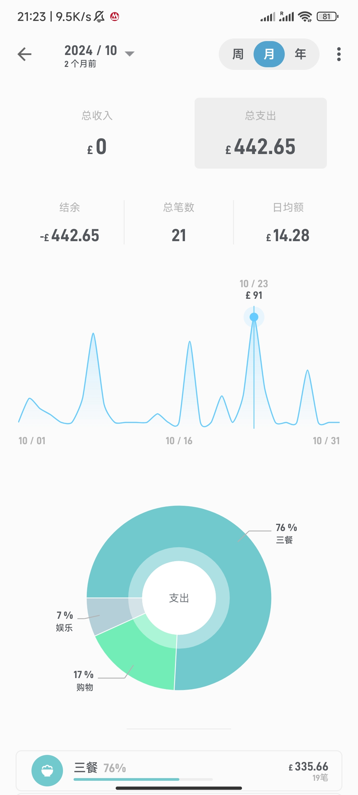
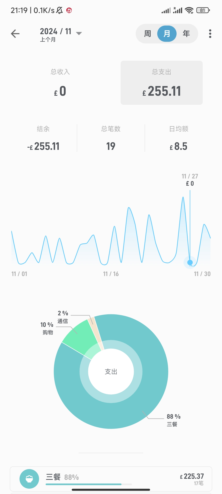
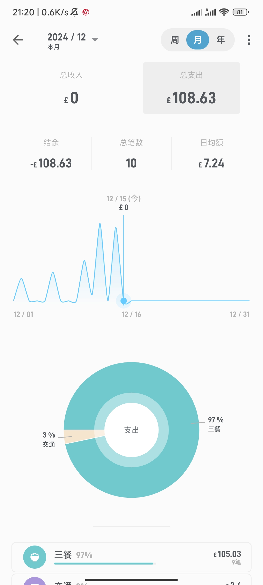

# 2

阿一西,终于是把Large-Scale Data Engineering 2024弄完了,这个AWS的复杂程度稍微比我想象的要多一些,主要是再Cloud Watch链接Group那里出了问题,必须先要创建一个壳,然后借壳上市. 不然不显示,简直离谱,好在顺利跑完了,这几天都是和坤坤吃的外卖,那个赛百味之前吃的都不好吃,这次肉丸的还行.他在国内的情况似乎不太好,也是,定价那么贵吃草料,不符合国情.

作业的事情不想多说,实在是困死了,熬了个通宵,我需要睡觉...

附上去见面吃的盒饭,好吃量还大,太棒辣!


# 3

起来就挺晚了,但为了倒时差,我感觉我还得睡,不然就麻烦了,今天再倒一下,之后就要开始TIBS的大战了,今天草草做了麻婆豆腐,盖到饭上,爽.


顺便烤了点炸物,抄了个鸡蛋,赶紧睡觉.


# 4

满血复活!

但还是简短的说一下,因为待会儿要去打扫卫生,早点休息,今天复习了TIBS一部分,明天专注好吧,这两天的记录还是以视频格式存储到三星硬盘中.


# 5

今天早上是8点多起来的，但真正清醒都9点多了，目前的问题就是在反复折腾之后效率迟迟上不去，等刚进入状态没一会儿就又到吃饭的时间了，我也就简单的整理一下，实际真正干的活很有限。

中午就是吃了之前买的饺子，然后搭配着凉皮一顿得了，酸汤饺子听起来不难,酸汤+饺子对吧?但实际上大有学问,比如下锅了饺子,可以准备了,准备个碗里,里面最好有虾皮+紫菜,这样会有鲜味,最好放一点白芝麻,一点香油,配合着些许香菜葱花打底,醋和油泼辣子必不可少,但油泼辣子切忌不能喧宾夺主,酸汤讲究的是个酸,辣子到底只能是个底边,盖了醋香那就太失败了,快要出锅了,先把饺子都捞出来,然后往碗里浇上原汤,棒极了,冬天一捧暖流下肚,酸汤混合着些许辣以及羊肉的香,映衬着闲鲜,别提有多么舒服了袁枚的随园食单和于谦的小菜没有记录简直遗憾,这是老妈一直以来的做法.

最近倒是有时间做饭，慢慢的兴致也都回来了。不过还需要一点时间，明天是最后一次课，去看看,完了路去大爷那边看一看，这个tibs确实比我想象中要复杂一点儿，关键是他不给例题，我也不知道他考什么。到时候就搁那儿框框写，而且我从大爷那儿才知道那个考场真远，得快3km? 我勒个去，不知道为啥要把那个地方安排在那儿。明天跟大爷商量一下，看看是咋吃，去外面还是自己做饭，这个月就省着一点儿，毕竟后面要花钱的地方还多，到时候省点儿钱多出去吃一吃，能自己做的就自己做吧。但我估摸着明天跟他一块儿商量去做讨论，没空做饭，这是个问题，到时候再看吧，这都有点儿远了。

中间休息原本的打算是玩一会儿暖暖，结果发现什么玩意儿啊？根本就进不去。首先客户端生成的有问题，我如果全屏开着，点开始游戏根本就进不去，会被卡死,只能缩小放一半,我估么着她是把这个登录器做成一个游戏进程了。但是进了游戏呢注册首先就是个问题，playsation的账号不知道为什么因为频繁的重定向导致他给我设了限制，所以我短时间内不能重新登录。最后还是用手机号登录，其实我不太想把我的手机号绑定的太多了，毕竟以后要换得，而且也不是自己名下，折腾了一通可算进去了，结果好像获取不到服务器,这个机制它还是跟原神那种类似，是分各个区的。但在这里不能获取到国内的网络。太失望了，我对这个游戏一直期待度爆满，现在是玩不了，等后面更新驱动吧。而且更新了也不一定能玩到，因为看第一批人说似乎并不是非常的流畅,毕竟是基于虚幻引擎的，这年头虚幻引擎出来的没几个能流畅运行的。

接下来就是正儿八经的开始学习了，主要是对0周内容进行一个梳理，任重而道远，接下来我得每天看至少三个章节，我都感觉时间根本不够用,能看一点儿是一点儿吧。

对于光环效应我倒是之前了解的比较少，我原本以为这门课是水课，当然我现在还是持怀疑一半儿的态度。但总体的梳理下来还是发现有不少可取之处的，毕竟对于这种西方发达国家，他们对于某一些进程还是非常了解的，有些公司的决策是我们还没有经历的。他们已经度过了这段时间，我们正在起步，他们提前将暴露的问题分析出来，肯定是有一些可取之处的，国内在文化建设和架构管理这边还是有些落后，但我想未来肯定也会主动发展，毕竟随着国际化和大公司改革更加体系化，架构化，大企业是需要有自己的一套理论基础来满足非常庞大的业务需求，必须要规范化，第一章内容提到了一个观点，就是在于很多大型的企业他们受制于政策的惯性也好，还是管理层架构的僵化都会导致他们在发展的中间会出现被小型企业颠覆的情况，这一点在于一些新兴的企业会聚焦那些大企业所关注不到的地方，也就是我们所说的底层领域。大企业他们为了追求高利润往往会倾向于关注大用户或者中高端市场，而忽视一些下沉市场，但作为小型企业或者新兴企业，他们竞争的点自然而然是这种偏低端的市场，通过低廉的价格以及进步的产品俘获大众的芳心。等到大企业反应过来时就会发现他们已经发展了相当庞大的一股势力，所以最好的方式就是大企业应该设立单独的事务部，用来培养那些能够脱离于固有架构的小部门专门做创新，事实上腾讯是一直这么做的，他们会不断的分一些小的企业和部门，因为他们比任何人都要懂市场检验和创新的作用性，尽管他们并不是以创新闻名,我感觉这有点儿像是在阴阳他们，但这是事，腾讯他自己分出了很多的部门。也就是我们俗称的养蛊，并且有很多小型的工作室，腾讯给我们的感觉就是财大气粗，或者说只懂得撒钱，并不懂得创新，但是这两年他们在面对竞争压力的时候，越来越表现出需要创新的一面。同时也能够看出他们在各处开花播种的一些初步结果。一些小工作室其实做的还有模有样的，这也算是这一点的初步展现吧,我一直在骂腾讯,但这两年不得不说欧美越来越"进步",论效率估计还真不如腾讯,凡是都是对比出来的.还有,switch停服了,企鹅罪恶滔天,搞得百姓们怨声载道!

总之经历过一波三折，现在精力中也在慢慢的恢复吧，我感觉正式的做事儿还是得要等到寒假了，我已经迫不及待的要开展我的宏图伟业了，但先把这个事儿度过吧，能不能及格都是个问题。双城之战最近很火,借用杰斯议员的一句话

`为美好的明天而战`

好中二啊,但又有点cool


# 6

今天调整变得好了很多，主要问题还是在于上午不知道为什么闹铃没有把自己叫起来，9:00 才起来。把我吓了一跳，平常10点有aws,这时候过去已经来不及了。但仔细一看calendar才知道，我只有一个统计的课，是在12点，所以早上起来之后整理了一下昨天的情况就去上课了，统计也只是签个到。之后跟大爷约好，本来不是说要去他那边么,但现在看来是不可能的，大爷想要买一些笔，过两天不是要考试。虽然我有笔，但是多备一下还是挺好的。于是我们就先去一个叫什么tk的超市，市中心那块,那个超市我还从来没去过，里面的笔全是铅笔什么的，不好用。然后就去了一元店,但里面机器坏了还是怎么了的，不知道啥情况，排队排了好久，买了六支笔，三个为一袋，单袋是75p，还挺便宜的，而本子就贵多了，选了一个最有性价比的，两磅.我就不用了，大爷买纸就行了，我用pad就完全可以应付了，所以这就是整个早上的内容了。

回来不太饿，所以就没做午饭就开始写了，一直写到了刚才，本来是打算把第三章也弄完的，但是只进行了两章，还是杂七杂八的事情在影响，明天必须7点起来了，不然真就完犊子了,我没有想到第二章的内容还是跟第一张差不多，因为第一张主要是起一个铺垫的作用，所以第二章还是集中讨论了企业的颠覆性，不过引入了持续创新的这一个概念。差不多下午7点吧就去吃饭了，我原本以为一直点外卖会导致减肥失效，结果没想到可能是天天吃方便面的缘故吧。我体重前两天称还是66.2，反而维持了一个不错的状态，我也不知道为什么，但感觉脸还是很大，很奇怪，都这个体重了，为什么脸还是显大？估计真得降到65以下骨架才能瘦削些。晚饭自然而然就是粉条，午餐肉配白菜，小小的一个白菜没想到还那么多。


因为全是汤汤水水的，吃起来还是非常舒服，我中间因为在sainsbury买了一些东西，不得不说里的胡萝卜是真不行,小小的，然后价格也很一般，那个苹果汁更是极品，完全贵的离谱，比别的要贵了一半的价格,早知道就去tesco了，但圣诞节快到了,tesco这种大超市人很多.

话说回来，因为吃的比较健康，所以也没有什么好说的，就跟平常一样，但是白菜没了。明天如果有时间估计得出去买一买，或者明天就是去吃咖喱，因为我今天买了土豆和胡萝卜配合着咖喱吃，非常的棒。

# 7

今天凑合吧，早上8点多醒的，因为一醒来不可能立马投入到学习当中，等正儿八经清醒了都到9点多了，所以最好的方法还是7点醒，然后8点就可以正式开始，不然的话9点多再稍微整理一下就到10点，然后过不久又要吃饭，节奏就被打乱了。感觉越来越好了吧，昨天虽然睡得晚，但是今天状态相较以往还是可以的。

其实我本来以为是下周二开始考试，结果发现我看错了，是12月12号周四，所以我的时间就能多一点儿，再加上前几周其实信息量密度比较大，所以我就能稍微松口气，然后花费较多的时间把前面这块儿的基础打好吧。本来原定计划是一直推进到第三周，但是今天突然临时改变一下主意，决定就直接把第一周就弄完就行了。这章重点就是对christin博士进行了一些反驳，因为kristen博士之前不是说了吗？他对于可持续性创新是比较持认同概念的，他反倒是认为大企业对于颠覆性创新的应对往往是不及时的。不过leopora女士说了一个观点，那就是并非所有的传统企业都会受到影响，相当一部分新型企业吃到科技进步的红利的同时并不能很好的把握，他们不如那些大企业里面有深厚的基础去持续发展，所以很多小的企业都会逐渐泯然众人，而大企业往往拥有足够的试错成本以及深厚的行业基础，他们尽管可能在面对新技术的第一时间无法做出及时调整，但随着科技的进步以及管理层的注意，他们也会将精力集中于新兴的企业，最终完成改革，这是小企业很难做到的。

birkinshaw不是又在此基础上加了一个新的观点，那就是长期以来。克里斯坦森的这种观点在数字时代是被夸大了的，许多传统的企业面对新技术和商业模式的时候，它的韧性和抗风险性其实是很强的，企业它不仅能够存活下来，而且他还会通过数字选转型以及内部的创新，进而取得非常显著的成功，还是回到沃尔玛，就在亚马逊崛起的同时，他也提高了自身的电子商务能力和整个渠道的零售战略，保持了在零售市场的一个主导地位，并没有因为亚马逊的突然袭击而导致自身的陨落。而微软则是从单纯的产品销售变成了云服务的领导者，他重新定义了自己的业务模式。不过我认为在不同的国家，不同的国情下其实是不一样的，欧美我们可以看到亚马逊的崛起后，沃尔玛也能跟他分庭抗礼，但是在国内却无法很好的平衡到这一点，觉得还是受限于不同的贸易体系。以及商业模式在国内的一些方法在国外不一定行得通，而国外的方法有可能在国内也会受到阻碍。另一点就是颠覆性影响，他的创新其实是被夸大了的，他对于传统企业的威胁并不是原来理论中描述的那么普遍。因为更常见的情况下是传统的企业它会同时适应。然后新兴企业的失败率其实是相当高的，这就跟前面那位女士的观点达成了一致。而通过内部创新战略转型以及最常见的合作并购，很多的大型企业是能够完成新一级的跳跃，完成技术的迭代的，比如说传统的汽车制造商，他们尽管不擅长于做自动驾驶，但是也可以通过与其他公司的合作而完成这一点，例如国内的华为,大疆就作为技术的创新者，然后会有奇瑞,或者吉利那类企业去选择，两者相互配合，传统企业只需要扎根于自己的基础核心用户，而面对新兴的一些技术可以通过第三方合作进行快速的升级，在这里Birkinshaw 强调了数字技术的普及,其实为传统企业提供了更大的灵活性，而不是风险。它在数字驱动的决策网络效应以及规模化的优势还是比新兴企业要强大的多的多。

说的多了，这其实是一整天的内容啊，然后就来说一下中午的吃饭吧，中午就是做了咖喱，因为我选择的是日本的咖喱，那个更辣味更重一些，这边的咖喱我感觉其实味道真的很一般。印度的咖喱不太适合我，还是东亚这种辣口的更符合我的口味吧.


我勒个去,怎么这么难看,面相太失败了.无语


虽然知道时间延长了一部分，但还是不能松懈，还是需要再去仔细的提升一下，前面难是正常，前面走的慢也没有太超预期，目前我的目标就是明天至少要推进到第五周的内容,这样才能让时间保持一个比较合理的预期，才能在12号之前把所有的完成，其实我更希望能在11号还有一天的总复习时间，嗯，就这样吧，明天早起。


# 8

今天早上是7:30起来的，但是我忘记了打卡，等反应过来已经8:30了.所以算是一个比较好的开局，希望明天依旧能够7:30起吧，因为7点我是不想了，能多睡一会儿，睡一会儿。7:30是一个挺不错的时间吧。早上起来就有些是对第一周的内容进行了一个总体的梳理，其实也就没有啥,我发现2 3是不是高度相似？第三周的量其实本身比较少，因为它每一周的编号和每节课是差了一个的。就比如说他的课件是从零周开始的，所以实际上第二周其实才是第二章，也不知道他为啥搞得这么怪，第一周简单整理一下，后面第二周就是围绕着他继续来做一下，里面的内容说了是高度相似的，把关键的名词翻译一下，到时候考场上就用关键名词来回答，按点得分吧，也不知道为啥非要设置这个考试真是够拧巴的。

中午就是吃了炒饭，不知道为啥最近老是想吃米饭，做蛋炒饭也是最省时省力的, 放了三个蛋,我感觉两个翻不起什么花,一根小葱,半根大葱,加了两根胡萝卜和半块午饭肉,15min搞定。但心仪的蒜不太好买,lidl tesco都太小了,鼎城的要满5磅才能刷卡，这已经好久没有吃到蒜了，到时候去采购一下。今天做完饭还挺头疼的，我打算明天重点去买一点儿做面相关的，大白菜我最钟爱,但朗御太远了,还是等到12月12日之后吧。那个时候有信心了，再慢慢去琢磨厨艺,而且自己做总是不划算,去谁那一块儿做饭性价比其实会更高一些.


下午就是老生常谈的第一章的内容,那一点儿还没有整理完，结合着明天仔细去弄一弄。最近还发现有个坏习惯，就是一直在看Vtuber，把声音当背景音,不知不觉间也耗费了不少时间，哎，从明天起不能再看了，不知道什么时候养成了这个坏习惯。太可恶了。

结束了刷手机,朋友圈里之前那个蝎子莱莱和认识的那个女生，没想到竟还真走到一块儿了。我当时就在想，他们都是谢飞的，说不定未来真的有可能，唉，祝福他们吧。

希望明天能够继续坚持这样子的作息，尽快起来吧。

# 9

## Each

不行 事情太多了,先临时跑路到12号,今天的录像请转到24.12的文件夹下,ondrive和k60会同时保存该视频日记,最终备份会在三星硬盘.


# 13

哎，这总算是考完，终于能够放松一下了，之前没日没夜的搁那儿干，简直累麻了。

希望都能过，要是成绩能稍微高一点儿就更开心了，感觉应该没有啥太大问题，昨天去那儿考试，那考场简直跟监狱似的，反正比在教堂里面考要好。目的要几公里远，这是我第一次在布里斯托走那么远。

昨天12点多考完的，然后一块跟坤坤和taylor他们去见面庆祝了一下,回来了之后要倒时差，考试前我只睡了四个小时，光一个早上奋笔疾书还好,下午状态可太糟糕了，但是我不能立马睡,不然就完犊子了，所以我就一直刷视频。也不敢打游戏，手都是抖的，没状态，坑了别人就不好了。一直坚持到了差不多晚上10点那会儿，实在是撑不下去了就睡了，然后今天早上也舒舒服服的到了9点多，快10点才起来的，这样一来的话，起码状态全部就倒回来了。

之后就学了会儿，本来是打算继续我那个天气系统的项目，它就可以整合到我到最后的项目里面了，我打算最终那个项目里面就是集合mbi的测量,自动绘画还有天气系统这几个模块儿应该就能让它丰富一些了，毕竟如果光是一个记账的话，它的功能比较单一加点小的东西也不太影响性能，因为毕竟咱们是独立开发，也不是为了什么商用，所以反应速度应该是挺快了的。

至于之前那个AI，我是打算再等一等吧，因为这两天得从头去看一下我当时是怎么写的，我都完全忘了。然后把基础的去弄牢固一点儿，但是因为今天其实状态都不太好,虽然学了一会儿但还是不断被打断，就关于council tax的那个问题，我现在去递交了我的豁免申请。就看他是怎么回复了吧。杂七杂八的处理下来就导致今天这一天比较的一般，反正效率不是很高，这也正常。所以后面就放松一下，跟朋友们玩儿一玩儿，明天的话就是看状态吧,因为我们正好整整一个月之后才开学，所以这段时间时间还比较长，先进行个起步，明天的话基于状态再去学一学，不过希望明天能尽早调回来吧，因为越早越好,还有很多事情需要做，然后明天去把中留服认证一下，跟lin姐说一下近期回贝法。去见一见james，至于后面的重点，打算集中起来去做算法之类的，因为这个是个重中之重，得系统性的整理一下,至少得花两个月去构建一下，到时候春招实习啥的也都能用上。

反正大体就是这样子，整体我觉得恢复状态起步至少还需要三天，慢慢来，因为现在没有别的压力了。就专注于做项目就可以了，然后多去学一学。

# 14

今天摸得真开心,嘻嘻.

我感觉我已经原地复活了,明天项目开始好吧.


今天的健康饮食作息也很成功,明天去认证一下.


# 15

今天是非常棒的一天,由于昨日早早睡觉(22:39),今天8点就起来了,当然了 我的希望自然是7点,回过头来审视发现定的有点高,明天8点起就好,睡9个小时也能防止呆呆地.

早上起来本来是打算直接看项目的,但一想到好久没碰了,就看了看文档,大部分内容乏善可陈,毕竟以回忆为主这里就不展开了.

中午是要讲剩下的火鸡面吃完,但光一个火鸡面量有点少,就煎了点培根配合着大饼一起,肥肠好吃.火鸡面很辣,感觉好久没吃辣都有点不适应了,用冰苹果汁解了解,还是很好吃的,但学业既已结束,还是要多做些好吃的,明天的食谱我都想好了,麻婆豆腐盖饭或者宫保鸡丁,我不知道为什么最近特别喜欢吃米饭,明天大快朵颐好吧.

中午简单休息了一下就开始项目了,没想到这是拉开了一条大幕,一条大幕横亘在我和GPS之间.

首先是引入引入`geolocator 13.0.2`这个包

获取位置的定义如下:

```dart
import 'package:geolocator/geolocator.dart';

final LocationSettings locationSettings = LocationSettings(
  accuracy: LocationAccuracy.high,
  distanceFilter: 100,
);

Position position = await Geolocator.getCurrentPosition(locationSettings: locationSettings);
```

这本来都没什么,全程也没什么问题,IDE语法正常,但在运行后提示:

geolocator需要kotlin在1.9.0以上,查了查我是1.7.0,好吧,那就需要更改,但查了查,发现有说在setting.gradle里直接改`ext.kotlin_vsersion`的,还有要改`gradle.properties`以匹配版本的,以及最广的在build.gradle里添加信息的,都不行.

查了半天资料,问chat都无果,没有一个解决办法,只好自己找.因为flutter社区在国内不大的原因,所以随着版本的更迭,很多旧有的教程都失效了,无独有偶,国外的社区作者也在吐槽这一点,随着flutter的升级,原先的都废掉了...

最终只好一个一个试,删除缓存,重新导入依赖,对gradle升级,蓝屏,降级.强制使用1.9.0版本,无果,删除缓存,蓝屏.

就这么拉扯了1个小时,终于让我明白了该在哪里升级,那就是在setting.gradle里面的

```dart
plugins {
    id "dev.flutter.flutter-plugin-loader" version "1.0.0"
    id "com.android.application" version "7.3.0" apply false
    id "org.jetbrains.kotlin.android" version "1.9.0" apply false
}
```


中直接指定版本为1.9.0,诶也许多年后你看到这里会疑惑,为什么这么简单写着kotlin版本都发现不了?

事实上不是发现不了,是由kotlin版本的地方太多了,更别说一开始我怀疑的焦点是gradle,后面误会解除,发现指定的地方太多,统一修改报错,清除缓存也报错,所以拖了半天.

在指定完正确的版本后,诶,又来了:smile:.

您猜怎么着?Java版本出了问题,真是见了鬼了!这玩意儿怎么出问题?搁哪放了两年没动过能出什么问题...

静下心来,刷会coser平复一下心情,看看报错发现是jvm的问题,事实证明,jdk没有影响,22版本有影响就怪了.

看了看文档,这个简单,在build.gradle中修改:
```dart
compileOptions {
        sourceCompatibility = JavaVersion.VERSION_1_8 -> 17
        targetCompatibility = JavaVersion.VERSION_1_8 -> 17
    }
```

底下的也保持17就行,确保对其颗粒度

```dart
kotlinOptions {
        jvmTarget = "17"
    }
```

改完这两个,关于gps包的设置就完成了不少,然后是对函数回调的测试

结果发现GPS无法开启,这个好说,跟网络连接不上是一个道理,看文档只需要在`Manifest`中加入

```dart
<uses-permission android:name="android.permission.ACCESS_FINE_LOCATION" />
<uses-permission android:name="android.permission.ACCESS_COARSE_LOCATION" />
```

ACCESS_FINE_LOCATION和ACCESS_COARSE_LOCATION的区别也就是精细度,我感觉用后者就可以.

在设置完GPS许可后理论上我的程序运行是没问题的,结果发现点击获取位置后没有反应,打印控制台,告诉我是没有获得许可,emm,因垂丝汀,那么我该怎么获得许可呢?

不知道,查呗,理论上我在开放GPS后是直接能升级的,但可能是(猜想,目前还没完全看懂源码),由于安卓增强了安全性,所以需要手动获取权限,这一步骤就是用户点击允许GPS访问,ios由于高度的集成化,会交给系统自动弹出对话框以激活GPS,但安卓需要手动去写一个获取对话框以发送request.

至此,短短的一个GPS花费了我一下午的时间,而此时我还要赶紧递交留服认证,只能匆匆在实现定位功能后就收尾了.

最后来看一看结果,感觉还是很不错的


这样用户就可以授权给app了,至于是一次还是当运行时,都只看用户自己的选择了.

今天挺失败的,真正有进步的就这一个,起步难,希望明天能顺利一些吧.

`纱窗外、斜风细雨，一阵轻寒。`


诶,刚提交忘了很重要的内容:

由于考试周没时间汇总账单,9月份的如下:
<div style="display: flex;">
    
    
    
</div>

 10月支出机器恐怖😱主要还是在于请客,随着9月的安定,许多朋友就前来联络了,几个重量级的都是去餐厅.

11月就回归了,大头是做饭,买了以件衣服,花费2%,这个就正常多了.

12月截至到今天正好一半,可以来个前瞻,一共花了108,稳中向好.

至于12月为什么要前瞻,那就是下半个月支出就要暴增了.

临近英国最热节日圣诞节🎄,太美丽了家人们😆,还看看上半个月的账单吧😭.


# 17

我昨天没有写日记吗(・∀・(・∀・(・∀・*)? 我怎么印象里我写了啊.

算了看看今天的吧:

早上7点半起来的,结果一到假期就被各种中断,kai邀请我去打羽毛球,ben问我lpl的战况.等回过头来留给我看算法的时间就不多了,简单看了看,就到中午的吃饭时间了,溜了点馒头,炒了点新的鸡肉加入到昨天的宫保鸡丁.


昨天的照片,今天的没拍,但也差不多.

吃完午饭去更新了暖暖,还是登陆不了,真👍,cn客户端直接锁了国外区域,连都连不上.

卸了后去yutube上看了方舟的新作:终末地,我之前只看昭然玩过前作,是塔防类型的,我不喜欢,但UI是真的不错.这次的终末地摆脱了我对死亡搁浅的刻板印象,变成"幸福工厂"了,哈哈哈哈.

谁说共和国风不是国风? 那几个竖直的机关牌子节目效果爆炸,配合着"绿水青山,科学发展"兼职帅炸了.

这种国风的新式创新非常棒,一提到长安 金陵的是古风,但长期被以偏概全成为了国风的全部,鹰角这次是把差异化打出来了.如果是单机就好了,25年出来了我一定要去尝试一下.

看完各主播的reaction后又去看了一下东盟的历史,反应过来又过了1个小时,赶紧去推进天气模块,今天主要的内容就是对异步处理花了一些功夫:

这一部分主要有两个重点:
首先是`Future`
它是一个 **异步操作** 的结果的容器,意思是一个任务会在未来某个时间点完成

三种状态：

1. **未完成（uncompleted）**：没开始执行
2. 已完成（completed）：完成了但是还包含两种结果：
   - **成功（value）**：完成然后返回一个值。
   - **失败（error）**：发生错误。

这个一般是用在:网络请求,读取文件,SQL,还有一些定时任务
回调（then 和 catchError）就是当 `Future` 完成，通过回调函数来处理任务的结果或肯能的错误。

`async` 和 `await`是另外两个很重要的概念

这两是用于处理**异步**的关键字，帮助编写和理解异步代码变得更加简单和清晰。

- **`async`**：标记一个函数为异步函数，表示这个函数会返回一个 **`Future`**。
- **`await`**：暂停函数的执行，直到 `Future` 完成，然后继续执行函数中的代码。

而第二个就是future的延续,之前的项目里没怎么用try catch,曾经的我还是很自信啊.

但现在项目量大了上来,try catch就得多用了,论try catch为什么是好文明.

希望明天能继续早起吧,加油.


# 18

为什么我的这个键盘弹道偏左?

明明之前都还好好的,但今天用起来感觉格外难用,大字一多就会有延迟,而更恐怖的是,我不太清楚到底是键盘的问题还是系统的问题,我测试了一下,在笔记本上好像也是这种情况,到时候再看看是哪里出了问题,这个其实就是很烦,因为一打字就没有反应,这对coding来说打击是致命的,整个连贯性就受到了影响,太难受了.

明天去处理一下,现在我这打字都难受的很.

好的 先从今天早上说起,起来是7点,但是清醒完了之后看文档发现打字有问题,页面都没啥,视频播放也正常,但就是打字反应慢半拍.一直保持狐疑态度到了中午,意识到家里的储备不多,然后就打算去一趟tesco,正好想到bran回国之前,跟我说他的那一栏放久了也是浪费,那我就正好用火锅一并处理掉.

出门买了25磅的食材,包括了蟹棒,午餐肉,打折的罗马生菜等等,顺便看到了香油,调一个香油料碗,我原先是芝麻酱的铁杆支持者,现在怡然,但正如慢煮生活所言,口味杂一些,我在去年吃了油碗之后惊为天人,发现有一种别样的口感,这跟小时候的记忆对不上,想来是香油劣质的缘故吧.

回来之后实在是饿,干脆剩下半天就--享乐吧!


事实上这两天状态已经恢复了颇多,本来有两个可能被打断的计划分开来说

第一个是回贝法,我看了一下机票,往返200磅,无敌了孩子,所以可能回去的时间定为1月份吧,那个时候价格能便宜一些.

另一个事情是跨年,tylor要和朋友去杜伦,坤坤和他的异性朋友,羊不想出去.

所以这么一来就没有什么要影响的了,专心干我的事情,顶多就是跟Kai去打羽毛球,跨年看谁还在布里斯托或者想去周围的可以叫上,在附近一起聚聚.

所以明天要严格按照timetable来了,感觉恢复的有60%了吧.至少很有活力,除了打字这个事情很令人沮丧,不然80%都有了.

这两天在家里感觉有点闷,到时候换换脑子,听Mandy说wills人不多,最近可以去那里学习,换个有氛围的环境也好.

今天早睡,明天开干,干干干!


# 19

干崩了我的朋友.

早上一上来就整了个大的,早上11点起的床,醒来我感觉今日的阳光额外刺眼.

这个点起来那说明一天算是废了,醒来后等了一会儿就去吃午饭,昨天火锅剩下的食材没有吃完,今天全部吃了,结果没想到罗马生菜还有的剩,豆腐能放到29号,还不急,明天吧剩下的鸡肉跟生菜一吃,好久没有吃东东包版的生菜了,鸡肉就辣子鸡吧,剩下的小米辣和青红椒一并抄了,再不能放了.

吃完还是不能忍打字的问题,我尝试了除静电也没招,先是去微软官方论坛看看,确实不少人遇到了,但给出的回答也是很官方,修改设置然后重启,没用.

然后我怀疑是电池的问题,因为电池有时候在预设值以下就会低功耗运行,进而影响响应速度,之前没插电打字就卡.

我在控制面板里面把最大电池和最低电池使用都设置了100%,又下载了华硕电脑管家,将电源的保养策略从60%最佳常态改为了100%,结果还是不起作用.

这时候我就将注意力放在内存上了,但我24G内存肯定不会爆掉,所以Chrome令我疑窦丛生.但测试了多个标签页,始终维持着40%-50%,难道是内存频率? 3000的高位已经足够维持性能了.

至此我的所有思路全部验证失败,谷歌已经无法为我带来新的方向了.

我就去B站看了看视频,大部分是关于word下打字卡的内容,这个无解,word就是这么辣鸡.期间测试延迟让我跃跃欲试,但一想应该不是输入延迟的问题,我目前面临的事周期性.

我在一个角落看到<<ROG幻14键盘太卡>>,想到产品名一样就去看了看,结果在评论区里看到一条与我的情况类似,也是输入后延迟秒出来一大串,地下多人共鸣且询问,楼主回答:卸载奥创.

那一瞬间一道闪电劈过心间.我赶紧卸了奥创,果然.借用最近很火的"加纳"视频

-------------------------------------------------------------------分割线-------------------------------------------------------------------------------

吹牛币呢
你用过吗?
这叫奥创中心armoury-crate!
外星人咋滴?
外星人你也玩不到!
吹牛币
你只能看着你ROG哥霍霍!
这叫关心用户
懂吗?
加纳!

-----------------------------------------------------------------分割线---------------------------------------------------------------------------------

真的 这万把块买的真是不值,除了轻便一无是处,我感觉成本就是5000的电脑溢价两倍,4年前我是真无敌了.

要技术没技术,要实力没实力.冲着奥创来发挥性能结果一无是处,我印象里还卡了3 4次.无敌了只能说.

下午没什么建树,全废了,指望明天了,按时起来最重要.

散会!


# 20

今天是早上8点起来的，算是一个比较不错的开局，总的来说感觉状态回暖到七八成了。在上午的末期感觉已经能够触及到八成那么一个水平线了，我感觉还是一个非常不错的一个进步吧。

先从早上来说，具体任务是对文档进行了一个细致的复盘。主要问题就是之前说过GPS模块儿存在的一些问题，然后之前的项目模块跟GPS模块中间隔了一个考试月，所以我怀疑会有一些"暗伤"。为了彻底的解决并且回顾往期的内容，所以我把1,2章整个的串了一遍。目前的进度是第三章，第三章的话预计会在明后天全部看完，总的来说还需要去在md文件里面梳理一下，有一些地方感觉还是要自己手动整理才能加深记忆力。

中午就是炒的罗马生菜,用的是东东包的那种生抽的做法,非常的香，我加了一些干辣椒段儿这样子,它的风味就更立体了。但还是遇到了一个问题，那就是油放的有点儿多，感觉到最后还是需要把油量再控制一下。我下的时候有点儿水，导致在炒的过程中受热不均匀，所以我想加一点儿油去中和一下，结果没有想到加多了按理来说这已经做了很多次了，但是没料到罗马生菜在是放在冰箱里的，有一些冷凝的水。

本来还是想打算做鸡肉的，结果发现肉类那种不能放,已经过期了，能够明显的闻到有酸味儿，可惜只能全部扔掉了，之前做辣子鸡的想法也告破，明天的话就是打算处理豆腐，麻婆豆腐盖饭，米饭也好几天没吃了，正好大快朵颐。豆腐有两块,就隔天来吃。

下午则是对项目进行了推进，背了会儿单词,天气系统这块儿因为涉及到了继承以及异步的一些其他细节,导致我今天看的确实得速度并不是很快,平心而论，算上这两天状态的回复，乐观估计的话需要花费至少半周的时间才能做完，但好在目前的这个回暖看起来正在加速的这个过程。

算法还是没有激情,我原本的打算是想邀请Mandy老师一起学习,一来她也需要算法学习,二来这样进度就可以可视化,互相学习同一个目标提高效率,但没有想到她的mac出问题了,这样就有点难搞.等她电脑有下文了尝试去邀请一下.

待会儿打算去锻炼一下健身，然后洗个澡就可以睡觉了。

因为以后都是8:00起床，所以我想可以12点再睡，毕竟晚上的时间还是很幸福的，如果不用来干些什么，说实话有点儿暴殄天物了。
